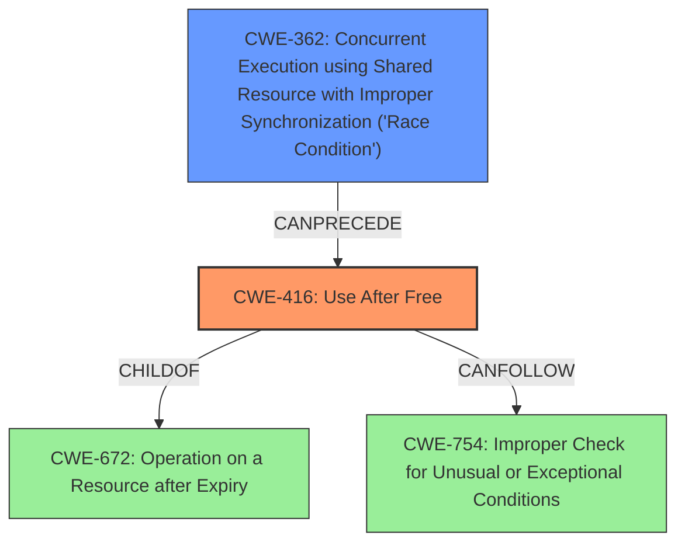

# Final Resolution for CVE-2022-3038

# Summary

| CWE ID | CWE Name | Confidence | CWE Abstraction Level | CWE Vulnerability Mapping Label | CWE-Vulnerability Mapping Notes |
|---|---|---|---|---|---|
| CWE-416 | Use After Free | 0.95 | Variant | Allowed | Primary CWE. The Network Service in Google Chrome reuses memory after it has been freed, leading to heap corruption. |
| CWE-362 | Concurrent Execution using Shared Resource with Improper Synchronization ('Race Condition') | 0.3 | Class | Allowed-with-Review | Secondary CWE. May be present if the free and subsequent access occur in different threads without proper synchronization. |

## Evidence and Confidence

*   **Confidence Score:** 0.9
*   **Evidence Strength:** MEDIUM

## Relationship Analysis
The primary relationship is that CWE-416 (Use After Free) is a variant of CWE-672 (Operation on a Resource after Expiry). Also, CWE-416 can be preceded by CWE-362 (Concurrent Execution using Shared Resource with Improper Synchronization ('Race Condition')). The initial analysis correctly identified CWE-416 as the primary **WEAKNESS**. The criticism suggested exploring concurrency with CWE-362, which is a reasonable consideration. The abstraction levels influenced the selection by favoring the more specific Variant level (CWE-416) over the Class level (CWE-362) unless there was clear evidence of concurrency.

## Vulnerability Chain
The vulnerability chain starts with a potential race condition (CWE-362) or another type of coding error, leading to memory being freed. Subsequently, the program attempts to access this freed memory (CWE-416), potentially leading to heap corruption. A crafted HTML page can then exploit this heap corruption to gain remote code execution.

Missing links: The exact mechanism by which the crafted HTML page exploits the heap corruption for remote code execution is not specified in the description, but this is outside the scope of CWE mapping for the root cause.

## Summary of Analysis
The initial analysis correctly identified CWE-416 as the primary **ROOTCAUSE**. The criticism raised valid points about potential contributing factors and consequences. While the vulnerability description explicitly mentions a **use-after-free**, it does not provide enough evidence to definitively conclude that a race condition (CWE-362) is involved. Therefore, while CWE-362 is a plausible secondary CWE, the confidence in its inclusion remains low (0.3).

The decision is primarily based on the vulnerability description: "Use after free in Network Service in Google Chrome prior to 105.0.5195.52 allowed a remote attacker to potentially exploit heap corruption via a crafted HTML page." This statement strongly supports CWE-416.

The relationships between CWEs influenced the analysis by highlighting potential contributing factors (CWE-362) and consequences (CWE-754), but only CWE-416 is directly supported by the provided evidence as the **ROOTCAUSE**.

CWE-416 is at the optimal level of specificity (Variant) because it precisely describes the **use-after-free** condition, which is the core of the vulnerability.