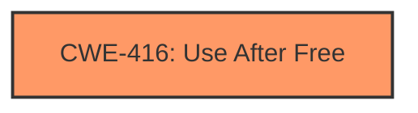

# Final Resolution for CVE-2022-3040

# Summary
| CWE ID | CWE Name | Confidence | CWE Abstraction Level | CWE Vulnerability Mapping Label | CWE-Vulnerability Mapping Notes |
|---|---|---|---|---|---|
| CWE-416 | Use After Free | 1.0 | Variant | Allowed | Primary CWE. Mitigation involves automatic memory management or setting pointers to NULL after free(). |

## Evidence and Confidence

*   **Confidence Score:** 1.0
*   **Evidence Strength:** HIGH

## Relationship Analysis
The primary relationship considered was the potential for **CWE-416 (Use After Free)** to lead to other issues like **CWE-787 (Out-of-bounds Write)**, but without explicit evidence of the latter, it was deemed more accurate to stick with the primary **WEAKNESS**, **CWE-416 (Use After Free)**. The abstraction level (Variant) of **CWE-416 (Use After Free)** is appropriate as it's a specific type of memory safety issue.

## Vulnerability Chain
The chain begins with a **ROOTCAUSE** where memory is freed but still referenced. This leads to **CWE-416 (Use After Free)**, where the freed memory is accessed again. The impact is heap corruption, as stated in the vulnerability description.

## Summary of Analysis
The initial analysis correctly identified **CWE-416 (Use After Free)** as the primary **WEAKNESS**. The vulnerability description explicitly states "Use after free," which aligns perfectly with the definition of **CWE-416 (Use After Free)**. The confidence score of 1.0 is justified based on this direct evidence.

The criticism considered potential related CWEs, such as **CWE-787 (Out-of-bounds Write)**, but correctly concluded that without specific evidence of an out-of-bounds write, it's best to stick with the primary **WEAKNESS**, **CWE-416 (Use After Free)**.

The selection of **CWE-416 (Use After Free)** at the Variant level of abstraction is appropriate because it provides a specific description of the memory safety issue. The evidence, the relationships considered, and the abstraction level all support the final determination.