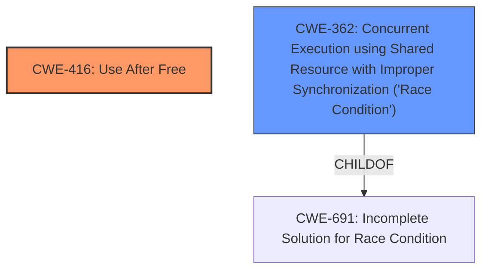

# Analysis Report for CVE-2022-3041

# Vulnerability Analysis Report: CVE-2022-3041

## Description

Use after free in WebSQL in Google Chrome prior to 105.0.5195.52 allowed a remote attacker to potentially exploit heap corruption via a crafted HTML page.

## Vulnerability Description Key Phrases

**Rootcause:** use after free
**Impact:** heap corruption
**Vector:** crafted HTML page
**Attacker:** remote attacker
**Product:** Google Chrome
**Version:** prior to 105.0.5195.52
**Component:** WebSQL

## Analysis (with Relationship Data)

# Summary
| CWE ID | CWE Name | Confidence | CWE Abstraction Level | CWE Vulnerability Mapping Label | CWE-Vulnerability Mapping Notes |
|---|---|---|---|---|---|
| CWE-416 | Use After Free | 1.0 | Variant | Primary | Allowed |

## Evidence and Confidence

*   **Confidence Score:** 1.0
*   **Evidence Strength:** HIGH

- **Analysis and Justification:**  
  - *Explanation:* The vulnerability description clearly states a "**use after free**" condition in WebSQL within Google Chrome. The CVE Reference Links Content Summary reinforces this, explicitly stating "The vulnerability is a use-after-free error in the WebSQL component of the Chromium browser." CWE-416 (Use After Free) perfectly aligns with this description: "The product reuses or references memory after it has been freed." The impact, heap corruption, is a typical consequence of a use-after-free. The Retriever results also strongly suggest CWE-416 as the primary candidate. The MITRE mapping guidance for CWE-416 indicates this is ALLOWED for Use After Free vulnerabilities.

  - *Relationship Analysis:* There are no direct relationships indicated in the provided data that influence the classification of CWE-416.

- **Confidence Score:**  
  - *Example:* Confidence: 1.0 (Direct and explicit evidence from the vulnerability description and CVE reference.)

## Criticism of Analysis

Okay, I've reviewed the analysis and the provided CWE specifications. Here's my critique:

**Overall Assessment:**

The analysis is generally strong and correctly identifies CWE-416 (Use After Free) as the primary vulnerability. The justification is clear, well-supported by the vulnerability description and CVE details, and aligns with the CWE's definition and mapping guidance. The confidence score of 1.0 is appropriate.

**Detailed Review:**

1.  **CWE-416: Use After Free - Correct Mapping and Justification**
    *   The mapping to CWE-416 is accurate. The description explicitly mentions "use after free," which is the defining characteristic of this CWE.
    *   The justification is well-articulated:
        *   It references the vulnerability description and CVE summary, which both highlight the "use after free" condition.
        *   It connects the impact (heap corruption) to the typical consequences of a use-after-free vulnerability.
        *   It notes that the Retriever results support the selection of CWE-416.
        *   It correctly states that CWE-416 is ALLOWED per MITRE's mapping guidance.
    *   The "Relationship Analysis" section is accurate; there are no direct relationships that change the classification.

2.  **Retriever Results Analysis:**
    *   The Retriever results show that CWE-416 is the top combined result. This further supports the chosen CWE.
    *   The other CWEs listed in the Retriever results, while not the primary vulnerability, could potentially be related or contributing factors in specific instances. For example:
        *   **CWE-366 (Race Condition within a Thread) and CWE-362 (Concurrent Execution using Shared Resource with Improper Synchronization):** Often, use-after-free vulnerabilities can be triggered or exacerbated by race conditions. A race condition could lead to a resource being freed prematurely while another thread is still using it. While not the root cause in this *specific* vulnerability as described, it's a common *pattern* associated with UAFs.
        *   **CWE-415 (Double Free):** While distinct from UAF, a double-free can sometimes lead to a UAF, or be closely related in the code.
        *   **CWE-843 (Access of Resource Using Incompatible Type ('Type Confusion')):** In some UAF scenarios, the memory might be reallocated with a different type, leading to type confusion when the original pointer is used.
        *   **CWE-122 (Heap-based Buffer Overflow):** A UAF can, in some cases, lead to a buffer overflow if the freed memory is reallocated and then accessed incorrectly via the dangling pointer.

3.  **CWE Examples from Database:**
    *   The provided examples are relevant and illustrate the types of scenarios that can lead to a use-after-free vulnerability.  The chaining examples (e.g., with CWE-366, CWE-362, CWE-413) are particularly helpful in understanding the broader context of UAF vulnerabilities.

4.  **Relevant CWE Specifications Review:**
    *   The analysis correctly utilizes the provided CWE specifications. The justification aligns with the Description, Extended Description, and Mapping Guidance for CWE-416.
    *   Review of the mitigations for CWE-416 from the specifications highlights the importance of selecting languages with automatic memory management and using defensive programming techniques like setting pointers to NULL after freeing them (though this has limitations).

**Suggestions for Improvement (Minor):**

*   **Acknowledging Potential Contributing Factors:**  While CWE-416 is the primary issue, the analysis could benefit from a *brief* acknowledgement of the other CWEs listed in the Retriever results, especially CWE-362 and CWE-366.  For example, adding a sentence or two stating that "While the core vulnerability is a use-after-free, concurrent access patterns could potentially trigger or worsen the vulnerability" would provide a more complete picture.  *However*, it's important to emphasize that these are not *necessarily* present in *this specific instance*, but are common *patterns* related to UAFs.
*   **Mitigation Considerations:** The analysis could also briefly mention potential mitigation strategies in the context of the product, based on the CWE specifications. For example, "Mitigation strategies could include using memory-safe languages where feasible, and implementing robust memory management practices within the WebSQL component."

**Conclusion:**

This is a well-reasoned and accurate analysis. The mapping to CWE-416 is correct, and the justification is thorough. The minor suggestions above would further enhance the analysis by acknowledging potential related factors and mitigation strategies.

## Final Resolution

# Summary
| CWE ID | CWE Name | Confidence | CWE Abstraction Level | CWE Vulnerability Mapping Label | CWE-Vulnerability Mapping Notes |
|---|---|---|---|---|---|
| CWE-416 | Use After Free | 1.0 | Variant | Primary | Allowed |
| CWE-362 | Concurrent Execution using Shared Resource with Improper Synchronization ('Race Condition') | 0.4 | Class | Secondary | Allowed-with-Review |

## Evidence and Confidence

*   **Confidence Score:** 0.9
*   **Evidence Strength:** MEDIUM

## Relationship Analysis
The primary relationship considered was the potential for **CWE-362 (Concurrent Execution using Shared Resource with Improper Synchronization ('Race Condition'))** to exacerbate **CWE-416 (Use After Free)**. While the vulnerability description focuses on the UAF, the criticism correctly points out that race conditions are often associated with UAF vulnerabilities. The abstraction level of CWE-416 is Variant, which is specific and suitable. CWE-362 is a Class, suggesting it's a broader category.

## Vulnerability Chain
The vulnerability chain starts with the **ROOTCAUSE** being a memory management error leading to a **CWE-416 (Use After Free)** condition. A potential contributing factor could be **CWE-362 (Concurrent Execution using Shared Resource with Improper Synchronization ('Race Condition'))**, where a race condition leads to premature freeing of memory. The impact is heap corruption, as stated in the vulnerability description.

## Summary of Analysis
The initial analysis correctly identified **CWE-416 (Use After Free)** as the primary **WEAKNESS**. The criticism raised a valid point about the potential involvement of race conditions.

Evidence from the vulnerability description: "Use after free in WebSQL in Google Chrome prior to 105.0.5195.52 allowed a remote attacker to potentially exploit heap corruption via a crafted HTML page."

The graph relationships influenced the decision to include **CWE-362 (Concurrent Execution using Shared Resource with Improper Synchronization ('Race Condition'))** as a secondary CWE. While not explicitly stated in the vulnerability description, the potential for concurrency to trigger or worsen a UAF is a common pattern.

The selected CWEs are at the optimal level of specificity. **CWE-416 (Use After Free)** is a Variant, providing a specific classification for the UAF condition. **CWE-362 (Concurrent Execution using Shared Resource with Improper Synchronization ('Race Condition'))** is included as a secondary CWE due to its potential contribution to the vulnerability, albeit with a lower confidence score.

*Report generated on 2025-03-18 13:14:34*
