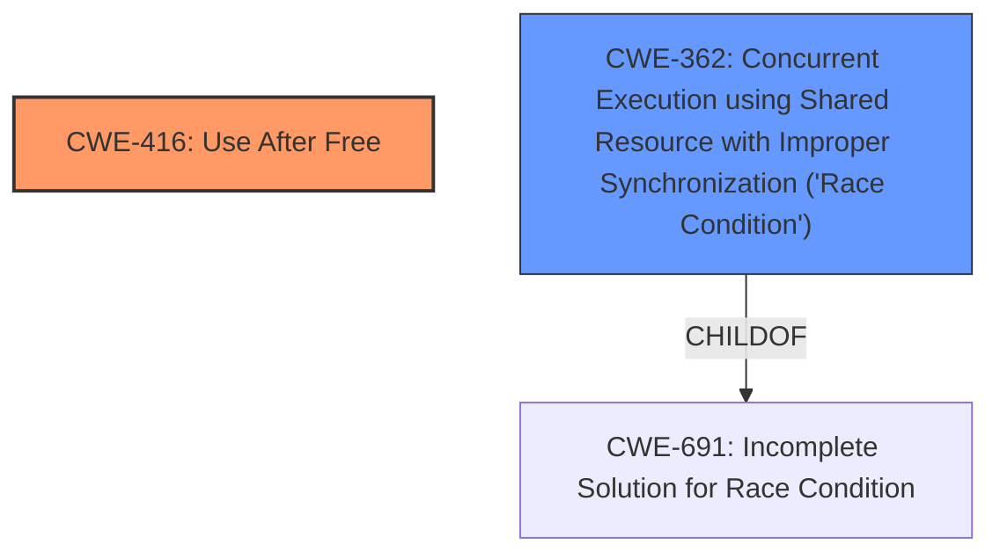

# Final Resolution for CVE-2022-3041

# Summary
| CWE ID | CWE Name | Confidence | CWE Abstraction Level | CWE Vulnerability Mapping Label | CWE-Vulnerability Mapping Notes |
|---|---|---|---|---|---|
| CWE-416 | Use After Free | 1.0 | Variant | Primary | Allowed |
| CWE-362 | Concurrent Execution using Shared Resource with Improper Synchronization ('Race Condition') | 0.4 | Class | Secondary | Allowed-with-Review |

## Evidence and Confidence

*   **Confidence Score:** 0.9
*   **Evidence Strength:** MEDIUM

## Relationship Analysis
The primary relationship considered was the potential for **CWE-362 (Concurrent Execution using Shared Resource with Improper Synchronization ('Race Condition'))** to exacerbate **CWE-416 (Use After Free)**. While the vulnerability description focuses on the UAF, the criticism correctly points out that race conditions are often associated with UAF vulnerabilities. The abstraction level of CWE-416 is Variant, which is specific and suitable. CWE-362 is a Class, suggesting it's a broader category.

## Vulnerability Chain
The vulnerability chain starts with the **ROOTCAUSE** being a memory management error leading to a **CWE-416 (Use After Free)** condition. A potential contributing factor could be **CWE-362 (Concurrent Execution using Shared Resource with Improper Synchronization ('Race Condition'))**, where a race condition leads to premature freeing of memory. The impact is heap corruption, as stated in the vulnerability description.

## Summary of Analysis
The initial analysis correctly identified **CWE-416 (Use After Free)** as the primary **WEAKNESS**. The criticism raised a valid point about the potential involvement of race conditions.

Evidence from the vulnerability description: "Use after free in WebSQL in Google Chrome prior to 105.0.5195.52 allowed a remote attacker to potentially exploit heap corruption via a crafted HTML page."

The graph relationships influenced the decision to include **CWE-362 (Concurrent Execution using Shared Resource with Improper Synchronization ('Race Condition'))** as a secondary CWE. While not explicitly stated in the vulnerability description, the potential for concurrency to trigger or worsen a UAF is a common pattern.

The selected CWEs are at the optimal level of specificity. **CWE-416 (Use After Free)** is a Variant, providing a specific classification for the UAF condition. **CWE-362 (Concurrent Execution using Shared Resource with Improper Synchronization ('Race Condition'))** is included as a secondary CWE due to its potential contribution to the vulnerability, albeit with a lower confidence score.