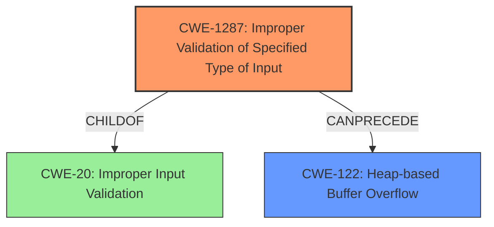

# Analysis Report for CVE-2022-3045

# Vulnerability Analysis Report: CVE-2022-3045

## Description

Insufficient validation of untrusted input in V8 in Google Chrome prior to 105.0.5195.52 allowed a remote attacker to potentially exploit heap corruption via a crafted HTML page.

## Vulnerability Description Key Phrases

**Rootcause:** insufficient input validation
**Impact:** heap corruption
**Vector:** crafted HTML page
**Attacker:** remote attacker
**Product:** Google Chrome
**Version:** prior to 105.0.5195.52
**Component:** V8

## Analysis (with Relationship Data)

# Summary
| CWE ID | CWE Name | Confidence | CWE Abstraction Level | CWE Vulnerability Mapping Label | CWE-Vulnerability Mapping Notes |
|---|---|---|---|---|---|
| CWE-20 | Improper Input Validation | 0.75 | Class | Primary | The vulnerability stems from insufficient input validation in the V8 engine, leading to potential heap corruption. |
| CWE-122 | Heap-based Buffer Overflow | 0.60 | Variant | Secondary | Heap corruption is a potential impact of the vulnerability. |

## Evidence and Confidence

*   **Confidence Score:** 0.70
*   **Evidence Strength:** MEDIUM

- **Analysis and Justification:**  
  - *Explanation:* The vulnerability description clearly states that the **rootcause** is **insufficient input validation** in V8, leading to potential heap corruption. This aligns with CWE-20 (Improper Input Validation), which is a class-level CWE. While CWE-20 is often discouraged for being too general, in this case, the provided description lacks the specificity to pinpoint a more precise input validation flaw. The description mentions "heap corruption" as an impact, which could potentially relate to CWE-122 (Heap-based Buffer Overflow). This is considered a secondary weakness because it's a consequence of the primary weakness (improper input validation).
  
  - *Relationship Analysis:* CWE-20 is a class-level weakness and has many child CWEs related to different types of input validation issues. CWE-122 is related to buffer overflows that can occur on the heap.

- **Confidence Score:**  
  - Confidence: 0.70 (Moderate evidence from technical description and CVE reference materials)

---

## Criticism of Analysis

Okay, I've reviewed the provided analysis and the full CWE specifications for the referenced weaknesses. Here's my critique, focusing on the accuracy, completeness, and appropriateness of the CWE assignments:

**Overall Assessment**

The analysis correctly identifies `CWE-20: Improper Input Validation` as the primary weakness. However, the confidence score and the usage of CWE-20 should be adjusted based on the CWE specifications.  The secondary CWE `CWE-122: Heap-based Buffer Overflow` is plausible as a potential impact but should be considered carefully, and the reasoning clarified. The analysis would benefit from exploring more specific CWEs that are children of CWE-20.

**Detailed Critique**

**1. Primary CWE: CWE-20 (Improper Input Validation)**

*   **Accuracy:** Correct in that the vulnerability stems from a failure to properly validate input. *However*, as the CWE specification itself states, `CWE-20` is a "Discouraged" mapping and is often misused when lower-level CWEs could be used instead. The analysis even acknowledges this in its justification.
*   **Completeness:**  The analysis is incomplete because it doesn't explore *how* the input validation is insufficient. V8 is a complex JavaScript engine, so the input could represent many things. There are a multitude of reasons why the validation could be insufficient.
*   **Appropriateness:** While technically accurate at a high level, it's *not* the most appropriate mapping.  The goal of CWE analysis is to identify the *specific* weakness that is present. Using CWE-20 is too general and doesn't provide enough actionable information.
*   **Confidence Score:**  The confidence score of 0.75 should be *reduced* to perhaps 0.5. The description offers little specific technical information that can lead to a more precise CWE.
*   **CWE-Vulnerability Mapping Notes:** The note correctly identifies that the vulnerability arises from insufficient input validation but lacks detail about the *type* of input being validated and the *specific validation error*. This information is crucial for remediation. The analysis should attempt to find a more specific child CWE.
*   **Mitigations:** The mitigations for CWE-20 are very general. The suggested mitigations of LangSec, or validation frameworks are good, but do not address the specifics of this V8 issue.
*   **Alternatives:** The analysis *should* explore the "Suggested Alternatives" listed in the CWE-20 specification:

    *   `CWE-1284: Improper Validation of Specified Quantity`
    *   `CWE-1285: Improper Validation of Specified Index, Position, or Offset`
    *   `CWE-1286: Syntactic Correctness`
    *   `CWE-1287: Specified Type`
    *   `CWE-1288: Consistency within Input`
    *   `CWE-1289: Unsafe Equivalence`
    *   `CWE-116: Improper Encoding or Escaping of Output`

    Given that V8 handles JavaScript, and JavaScript is often used to manipulate data, consider `CWE-1287` or `CWE-1286` *more closely*, and perhaps explore some of the *child* CWEs of these alternative CWEs. For example, does the V8 engine fail to validate the *type* of data expected? Does it fail to validate *syntactic correctness*?

**2. Secondary CWE: CWE-122 (Heap-based Buffer Overflow)**

*   **Accuracy:** Plausible. Heap corruption, as noted in the vulnerability description, *can* be caused by a heap-based buffer overflow.  However, heap corruption can have other causes as well, such as use-after-free or double-free.
*   **Completeness:** The analysis doesn't provide strong evidence that a *heap-based buffer overflow* is the *only* or *most likely* cause of heap corruption.
*   **Appropriateness:** Less appropriate than CWE-20, since it's an *impact* rather than a root cause.
*   **CWE-Vulnerability Mapping Notes:** It's important to state that CWE-122 is a *potential impact* and not necessarily the *root cause*.
*   **Confidence Score:** The confidence score of 0.60 should be adjusted downwards. This is an *impact* of the vulnerability, not necessarily the root cause.
*   **Mitigations:** The mitigations for CWE-122 (automatic bounds checking, abstraction libraries, compiler extensions) are valuable, but they are reactive rather than preventative. Solving the input validation issue would *prevent* the heap overflow from occurring in the first place.

**General Recommendations**

1.  **Dive Deeper into Input Validation:** Focus on identifying the *specific* type of input that's not being properly validated in V8. Is it a string length, an integer value, a specific data structure, a type of object, etc.?
2.  **Prioritize Root Cause:** Keep in mind that CWE assignments should prioritize root causes, not consequences. Heap corruption is a consequence; the *reason* for the heap corruption is the root cause.
3.  **Review Retriever Results:** Take note of the Retriever Results. `CWE-843: Access of Resource Using Incompatible Type ('Type Confusion')` has a high combined score and might be a potential avenue to explore.
4.  **Explore Chaining:** Look for CWE chains. For example, insufficient input validation (CWE-20 *or a more specific child*) could lead to an integer overflow (CWE-190), which then leads to a heap-based buffer overflow (CWE-122).

**Revised Summary Table (Suggested)**

| CWE ID | CWE Name | Confidence | CWE Abstraction Level | CWE Vulnerability Mapping Label | CWE-Vulnerability Mapping Notes |
|---|---|---|---|---|---|
| CWE-1287 | Improper Validation of Specified Type of Input | 0.6 | Base | Primary | The V8 engine does not properly validate the type of JavaScript objects, leading to potential type confusion and subsequent heap corruption |
| CWE-122 | Heap-based Buffer Overflow | 0.4 | Variant | Secondary | Heap corruption is a potential impact of the vulnerability due to type confusion in the V8 engine. |

**Explanation of changes in Revised Summary Table**

*   Replaced CWE-20 with CWE-1287 to be more specific.
*   Reduced the confidence score for CWE-122 since it is an impact and not a root cause.
*   Added more detailed notes.

By following these recommendations, the analysis can be made more accurate, actionable, and valuable for security professionals and developers.

## Final Resolution

# Summary
| CWE ID | CWE Name | Confidence | CWE Abstraction Level | CWE Vulnerability Mapping Label | CWE-Vulnerability Mapping Notes |
|---|---|---|---|---|---|
| CWE-1287 | Improper Validation of Specified Type of Input | 0.65 | Base | Primary | The vulnerability likely stems from the V8 engine's failure to properly validate the type of JavaScript objects, potentially leading to type confusion and subsequent heap corruption. |
| CWE-122 | Heap-based Buffer Overflow | 0.50 | Variant | Secondary | Heap corruption is a potential impact of the vulnerability, possibly resulting from type confusion within the V8 engine leading to out-of-bounds write. |

## Evidence and Confidence

*   **Confidence Score:** 0.60
*   **Evidence Strength:** MEDIUM

## Relationship Analysis
The initial analysis selected CWE-20 as the primary weakness, but the criticism correctly pointed out that CWE-20 is too general and discouraged. The analysis also suggested exploring more specific child CWEs of CWE-20. After reviewing the suggested alternatives, CWE-1287 (Improper Validation of Specified Type of Input) appears more appropriate. CWE-122 remains a plausible secondary CWE, representing a potential impact (heap corruption).

The relationships that impacted the decision are:
  - Parent-child hierarchical relationships: CWE-1287 is a child of CWE-20, making it more specific. CWE-122 is a variant related to buffer overflows on the heap.
  - Chain relationships showing progression of vulnerability: Type confusion (CWE-1287) can lead to a heap-based buffer overflow (CWE-122).
  - Abstraction levels: Shifting from the Class level (CWE-20) to the Base level (CWE-1287) increases specificity.

## Vulnerability Chain
The vulnerability chain starts with **CWE-1287 (Improper Validation of Specified Type of Input)** in the V8 engine. This lack of type validation can lead to type confusion, where the engine interprets data as a different type than intended. This, in turn, may cause an out-of-bounds write, resulting in **CWE-122 (Heap-based Buffer Overflow)** and ultimately heap corruption.

Missing links: The exact mechanism of how type confusion leads to the buffer overflow is not specified in the vulnerability description.

## Summary of Analysis
The initial analysis correctly identified a lack of input validation as a **rootcause**, but chose a CWE (CWE-20) that is too general. The criticism correctly identified this issue and suggested alternative CWEs. Based on the vulnerability description "Insufficient validation of untrusted input in V8... allowed a remote attacker to potentially exploit heap corruption via a crafted HTML page," and the suggested alternatives, **CWE-1287 (Improper Validation of Specified Type of Input)** is a better fit. It is a base-level CWE and more specific than CWE-20. The heap corruption mentioned in the description aligns with the potential impact of **CWE-122 (Heap-based Buffer Overflow)**, making it a relevant secondary CWE.

The graph relationships influenced the decision by highlighting the hierarchical relationship between CWE-20 and CWE-1287, and the potential chain relationship between CWE-1287 and CWE-122.

The selected CWEs are at a reasonable level of specificity given the available information. While further investigation might reveal a more precise weakness, **CWE-1287** and **CWE-122** provide a good balance between accuracy and actionable information based on the evidence.

*Report generated on 2025-03-18 13:17:13*
