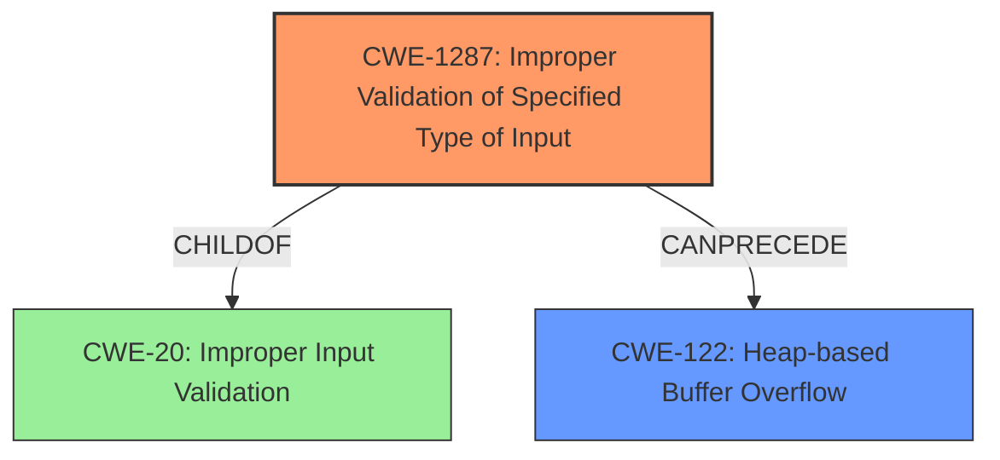

# Final Resolution for CVE-2022-3045

# Summary
| CWE ID | CWE Name | Confidence | CWE Abstraction Level | CWE Vulnerability Mapping Label | CWE-Vulnerability Mapping Notes |
|---|---|---|---|---|---|
| CWE-1287 | Improper Validation of Specified Type of Input | 0.65 | Base | Primary | The vulnerability likely stems from the V8 engine's failure to properly validate the type of JavaScript objects, potentially leading to type confusion and subsequent heap corruption. |
| CWE-122 | Heap-based Buffer Overflow | 0.50 | Variant | Secondary | Heap corruption is a potential impact of the vulnerability, possibly resulting from type confusion within the V8 engine leading to out-of-bounds write. |

## Evidence and Confidence

*   **Confidence Score:** 0.60
*   **Evidence Strength:** MEDIUM

## Relationship Analysis
The initial analysis selected CWE-20 as the primary weakness, but the criticism correctly pointed out that CWE-20 is too general and discouraged. The analysis also suggested exploring more specific child CWEs of CWE-20. After reviewing the suggested alternatives, CWE-1287 (Improper Validation of Specified Type of Input) appears more appropriate. CWE-122 remains a plausible secondary CWE, representing a potential impact (heap corruption).

The relationships that impacted the decision are:
  - Parent-child hierarchical relationships: CWE-1287 is a child of CWE-20, making it more specific. CWE-122 is a variant related to buffer overflows on the heap.
  - Chain relationships showing progression of vulnerability: Type confusion (CWE-1287) can lead to a heap-based buffer overflow (CWE-122).
  - Abstraction levels: Shifting from the Class level (CWE-20) to the Base level (CWE-1287) increases specificity.

## Vulnerability Chain
The vulnerability chain starts with **CWE-1287 (Improper Validation of Specified Type of Input)** in the V8 engine. This lack of type validation can lead to type confusion, where the engine interprets data as a different type than intended. This, in turn, may cause an out-of-bounds write, resulting in **CWE-122 (Heap-based Buffer Overflow)** and ultimately heap corruption.

Missing links: The exact mechanism of how type confusion leads to the buffer overflow is not specified in the vulnerability description.

## Summary of Analysis
The initial analysis correctly identified a lack of input validation as a **rootcause**, but chose a CWE (CWE-20) that is too general. The criticism correctly identified this issue and suggested alternative CWEs. Based on the vulnerability description "Insufficient validation of untrusted input in V8... allowed a remote attacker to potentially exploit heap corruption via a crafted HTML page," and the suggested alternatives, **CWE-1287 (Improper Validation of Specified Type of Input)** is a better fit. It is a base-level CWE and more specific than CWE-20. The heap corruption mentioned in the description aligns with the potential impact of **CWE-122 (Heap-based Buffer Overflow)**, making it a relevant secondary CWE.

The graph relationships influenced the decision by highlighting the hierarchical relationship between CWE-20 and CWE-1287, and the potential chain relationship between CWE-1287 and CWE-122.

The selected CWEs are at a reasonable level of specificity given the available information. While further investigation might reveal a more precise weakness, **CWE-1287** and **CWE-122** provide a good balance between accuracy and actionable information based on the evidence.