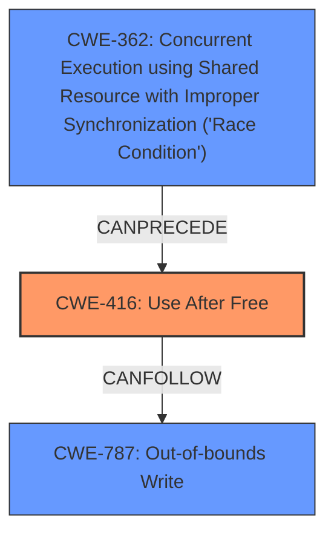

# Final Resolution for CVE-2022-3046

# Summary
| CWE ID | CWE Name | Confidence | CWE Abstraction Level | CWE Vulnerability Mapping Label | CWE-Vulnerability Mapping Notes |
|---|---|---|---|---|---|
| CWE-416 | Use After Free | 1.0 | Variant | Primary | Allowed |
| CWE-787 | Out-of-bounds Write | 0.3 | Base | Consequence | Allowed |
| CWE-362 | Concurrent Execution using Shared Resource with Improper Synchronization ('Race Condition') | 0.2 | Class | Contributing | Allowed-with-Review |

## Evidence and Confidence

*   **Confidence Score:** 0.8
*   **Evidence Strength:** MEDIUM

## Relationship Analysis
The primary weakness is **CWE-416 (Use After Free)**. The criticism suggested considering **CWE-362 (Concurrent Execution using Shared Resource with Improper Synchronization ('Race Condition'))** because the "Browser Tag" component is likely used in a multithreaded environment and a race condition could lead to the use-after-free. The CWE-416 can also lead to **CWE-787 (Out-of-bounds Write)**, as the attacker can overwrite the freed memory, potentially leading to a heap overflow. The abstraction levels influenced the decision to stay at the variant level for **CWE-416** and base level for **CWE-787**, while **CWE-362** remains at the class level due to lack of specific evidence.

## Vulnerability Chain
The vulnerability chain starts with a potential **CWE-362 (Concurrent Execution using Shared Resource with Improper Synchronization ('Race Condition'))**. This race condition *can precede* **CWE-416 (Use After Free)**, where memory is accessed after being freed. Exploitation of **CWE-416** allows an attacker to overwrite the freed memory with malicious data, leading to **CWE-787 (Out-of-bounds Write)**, and ultimately, heap corruption.

## Summary of Analysis
The initial analysis correctly identified **CWE-416 (Use After Free)** as the primary weakness, supported by the vulnerability description explicitly stating "use after free." The criticism suggested considering related CWEs, particularly those concerning concurrency and memory corruption. The analysis considered the possibility of **CWE-362 (Concurrent Execution using Shared Resource with Improper Synchronization ('Race Condition'))**, acknowledging that the "Browser Tag" component is likely used in a multithreaded environment, potentially leading to a race condition that triggers the use-after-free. While there's no explicit evidence of a race condition in the description, the possibility is acknowledged, leading to a lower confidence score for this secondary CWE. The analysis also includes **CWE-787 (Out-of-bounds Write)**, as a potential consequence of the **use-after-free**, where the attacker can overwrite the freed memory and cause heap corruption. The final selection reflects the vulnerability description and addresses the criticism by considering related CWEs, resulting in a more comprehensive analysis. **CWE-416** is at the Variant level of abstraction, which is a preferred level, and **CWE-787** is at the Base level. The evidence supports the classification, and the relationships between the CWEs provide a clearer understanding of the vulnerability chain.