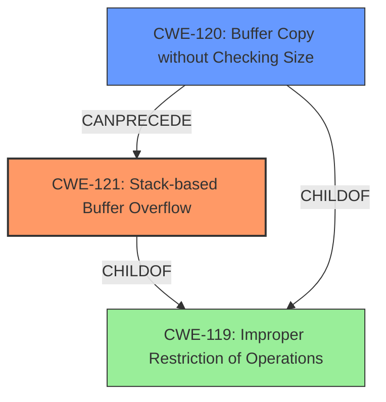

# Analysis Report for CVE-2022-30472

# Vulnerability Analysis Report: CVE-2022-30472

## Description

Tenda AC Seris Router AC18_V15.03.05.19(6318) has a stack-based buffer overflow vulnerability in function fromAddressNat

## Vulnerability Description Key Phrases

**Weakness:** stack-based buffer overflow
**Product:** Tenda AC Seris Router
**Version:** AC18_V15.03.05.19(6318)
**Component:** function fromAddressNat

## Analysis (with Relationship Data)

# Summary
| CWE ID | CWE Name | Confidence | CWE Abstraction Level | CWE Vulnerability Mapping Label | CWE-Vulnerability Mapping Notes |
|---|---|---|---|---|---|
| CWE-121 | Stack-based Buffer Overflow | 0.95 | Variant | Allowed | Primary CWE |
| CWE-120 | Buffer Copy without Checking Size of Input ('Classic Buffer Overflow') | 0.70 | Base | Allowed-with-Review | Secondary Candidate |

## Evidence and Confidence

*   **Confidence Score:** 0.90
*   **Evidence Strength:** HIGH

- **Analysis and Justification:**  
  - *Explanation:* The vulnerability description clearly states a **stack-based buffer overflow** in the `fromAddressNat` function of the Tenda AC Seris Router. The CVE Reference Links Content Summary further details that the `sprintf` function copies user-provided parameters into a stack-based buffer without length checks, leading to a potential overflow. This directly aligns with the characteristics of CWE-121 (Stack-based Buffer Overflow), which is a Variant-level CWE, making it a precise and appropriate match. The attack vector involves sending HTTP requests with large parameters, confirming user-controlled data is overflowing the buffer. While CWE-120 (Buffer Copy without Checking Size of Input) is also relevant due to the unchecked copy operation, CWE-121 is more specific in identifying the stack allocation, so it's the better choice.
  
  - *Relationship Analysis:* CWE-121 is a variant of the broader CWE-119 (Improper Restriction of Operations within the Bounds of a Memory Buffer). The vulnerability also has potential chain relationships. For example, a successful buffer overflow can lead to remote code execution, which could be related to other CWEs like privilege escalation.

- **Confidence Score:**  
  - Confidence: 0.95 (Strong evidence from the vulnerability description and CVE reference details, including the function name and the mechanism of the overflow).

---

- **Analysis and Justification:**  
  - *Explanation:* CWE-120 (Buffer Copy without Checking Size of Input ('Classic Buffer Overflow')) is considered as a secondary candidate because the description mentions the `sprintf` function copying data without proper size checks. The 'Classic Buffer Overflow' arises directly from copying data into a buffer without validating the input size, thereby overwriting adjacent memory regions. Given the information that `sprintf` is used to copy the user-provided parameters without any length checks, CWE-120 becomes applicable as a contributing factor. However, since the overflow is specifically occurring on the stack, CWE-121 takes precedence.
  
  - *Relationship Analysis:* CWE-120 is a base-level CWE and a child of CWE-119, which represents a more general class of memory corruption vulnerabilities. CWE-120 can also be related to CWE-785 (Use of Path Manipulation Function without Maximum Length Limitation) in scenarios where path manipulation functions are used to construct the data being copied.

- **Confidence Score:**
  - Confidence: 0.70 (Moderate evidence due to the 'unchecked copy' nature of the vulnerability, but secondary to the explicit stack-based nature described)

## Criticism of Analysis

Okay, here's a detailed review of the analysis provided, incorporating the full CWE specifications:

**Overall Assessment:**

The analysis is well-structured and the primary CWE mapping to CWE-121 (Stack-based Buffer Overflow) is strong. The rationale for selecting CWE-121 and considering CWE-120 as a secondary candidate is sound. The inclusion of confidence scores and detailed justifications strengthens the analysis.

**Detailed Review:**

**1. CWE-121: Stack-based Buffer Overflow (Primary CWE)**

*   **Confidence Level:** 0.95 (Excellent)
*   **Justification Strength:** Very Strong

*   **Strengths:**
    *   The analysis correctly identifies the key elements:
        *   Explicit mention of "stack-based buffer overflow" in the vulnerability description.
        *   The `sprintf` function's role in copying data without length checks.
        *   The attack vector leveraging HTTP requests with overly large parameters.
    *   The explanation clearly connects the vulnerability's characteristics to the definition of CWE-121.
    *   The relationship analysis correctly positions CWE-121 as a variant of CWE-119 and highlights potential chaining relationships (e.g., to RCE).

*   **Potential Improvements (Minor):**
    *   While well-justified, you could strengthen the confidence *slightly* by explicitly stating which mitigations from the CWE specifications are *not* applicable, given the specific context. For example, because the vulnerability is in a router, language selection isn't a practical mitigation.

*   **CWE Specification Alignment:**
    *   *Description*: Perfectly aligned. The vulnerability clearly involves overwriting a buffer allocated on the stack.
    *   *Relationships*: Correctly identifies the ChildOf relationship to CWE-788 and CWE-787.  You could also mention CWE-787: Out-of-bounds Write, as this is the direct result of the overflow.
    *   *Mapping Guidance*:  The "Allowed" usage is appropriate.
    *   *Potential Mitigations*: Mentions Environment Hardening, use of an Abstraction Library and Implementation of Bounds checking.
    *   *Observed Examples:* CVE-2021-35395 is a valid observed example.

**2. CWE-120: Buffer Copy without Checking Size of Input ('Classic Buffer Overflow') (Secondary Candidate)**

*   **Confidence Level:** 0.70 (Good)
*   **Justification Strength:** Good

*   **Strengths:**
    *   The analysis rightly notes the relevance of CWE-120 due to the unchecked copy operation using `sprintf`.
    *   The explanation correctly highlights how the vulnerability aligns with the core concept of CWE-120 (copying without input size validation).

*   **Potential Improvements (Minor):**
    *   Expand the explanation on why CWE-121 is preferred. Emphasize that while CWE-120 is true, the specific stack allocation makes CWE-121 a more precise and informative classification. The "Allowed-with-Review" Usage supports this reasoning.

*   **CWE Specification Alignment:**
    *   *Description*: Aligned. The `sprintf` function performs a buffer copy without checking the size of the input.
    *   *Relationships*: The ChildOf relationship to CWE-119 and CWE-20 is correct.  The CanFollow relationships with CWE-170, CWE-231, CWE-416 and CWE-456 could be expanded.
    *   *Mapping Guidance*: The "Allowed-with-Review" is appropriate, as the use of this CWE can be misleading if a more specific CWE is available.
    *   *Potential Mitigations*:  The mitigations mentioned are all valid, but should be considered in the context of an embedded device.
    *   *Observed Examples:* All three Observed Examples are valid.

**3. Other CWEs from Retriever Results (Considerations):**

The top combined results from the retriever results section are:
*   CWE-193: Off-by-one Error
*   CWE-195: Signed to Unsigned Conversion Error
*   CWE-170: Improper Null Termination
*   CWE-190: Integer Overflow or Wraparound
*   CWE-131: Incorrect Calculation of Buffer Size
*   CWE-122: Heap-based Buffer Overflow
*   CWE-126: Buffer Over-read
*   CWE-674: Uncontrolled Recursion

It is unlikely that most of the top combined results are a good fit. CWE-122 and CWE-674 can be ruled out because the buffer is allocated on the stack and there is no recursion involved. The remainder of the CWEs do not appear to be relevant. However, CWE-170 and CWE-193 should be considered. There is a possibility that the lack of null termination is a contributing factor to the buffer overflow. There is a slight chance that there is an off-by-one error that causes the null terminator to be written out of bounds.

**General Recommendations:**

*   **Mitigation Specificity:**  Consider tailoring the "Potential Mitigations" sections to the specific context of an embedded device/router. Some general mitigations (like language selection) are less practical in this scenario. Focus on mitigations that are more realistic, such as compiler-based protections, stronger input validation, and using safer string handling functions.
*   **Chaining:** Highlight the potential for RCE more explicitly. The exploitation steps following the stack-based buffer overflow are crucial to understanding the full impact. For example, successful exploitation could lead to a CWE-269: Improper Privilege Management if an attacker gains root access.
*   **Scope:** Clarify that while buffer overflows are often *caused* by input validation failures (CWE-20 or its children), the primary *symptom* is the memory corruption, which is more accurately represented by CWE-121.
*   **Keep CWE Definitions in Mind:** Always ensure that the vulnerability being analyzed meets *all* criteria defined within the CWE specification.

**In summary, the analysis is excellent and thorough. The primary CWE mapping is correct and well-supported. The secondary candidate selection is also justified. Incorporating the minor suggestions above would further enhance the analysis.**

## Final Resolution

# Summary
| CWE ID | CWE Name | Confidence | CWE Abstraction Level | CWE Vulnerability Mapping Label | CWE-Vulnerability Mapping Notes |
|---|---|---|---|---|---|
| CWE-121 | Stack-based Buffer Overflow | 0.95 | Variant | Allowed | Primary CWE |
| CWE-120 | Buffer Copy without Checking Size of Input ('Classic Buffer Overflow') | 0.70 | Base | Allowed-with-Review | Secondary Candidate |

## Evidence and Confidence

*   **Confidence Score:** 0.95
*   **Evidence Strength:** HIGH

## Relationship Analysis
The primary relationship impacting the decision is the hierarchical relationship between CWE-121 and CWE-119. CWE-121 is a variant of CWE-119, providing a more specific classification for stack-based buffer overflows. CWE-120 is also a child of CWE-119 and represents a more general case of buffer copy without size checking. The chain relationship shows that CWE-120 can precede CWE-121.

## Vulnerability Chain
The vulnerability chain starts with an unchecked buffer copy (`sprintf`) operation (CWE-120), which leads to a **stack-based buffer overflow** (CWE-121). The overflow can then potentially lead to remote code execution (depending on the attacker's ability to control the overwritten data), and subsequently, privilege escalation.
  - Root Cause: Unchecked `sprintf` operation (CWE-120)
  - Weakness: **Stack-based Buffer Overflow** (CWE-121)
  - Potential Impact: Remote Code Execution, Privilege Escalation

## Summary of Analysis
The initial analysis and criticism are well-aligned. The vulnerability description clearly states a **stack-based buffer overflow**, making CWE-121 the most appropriate primary classification. The use of `sprintf` without size checks supports the inclusion of CWE-120 as a secondary candidate, representing the root cause of the overflow. The evidence from the vulnerability description is strong, quoting "Tenda AC Seris Router AC18_V15.03.05.19(6318) has a stack-based buffer overflow vulnerability in function fromAddressNat" further supports the selection of CWE-121. The relationship analysis confirms that CWE-121 is a specific type of buffer overflow, and CWE-120 represents the flawed operation that leads to it. The selected CWEs are at the optimal level of specificity, with CWE-121 being a Variant and CWE-120 being a Base CWE.

*Report generated on 2025-03-18 13:18:38*
