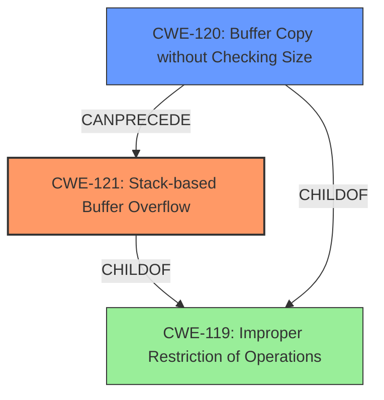

# Final Resolution for CVE-2022-30472

# Summary
| CWE ID | CWE Name | Confidence | CWE Abstraction Level | CWE Vulnerability Mapping Label | CWE-Vulnerability Mapping Notes |
|---|---|---|---|---|---|
| CWE-121 | Stack-based Buffer Overflow | 0.95 | Variant | Allowed | Primary CWE |
| CWE-120 | Buffer Copy without Checking Size of Input ('Classic Buffer Overflow') | 0.70 | Base | Allowed-with-Review | Secondary Candidate |

## Evidence and Confidence

*   **Confidence Score:** 0.95
*   **Evidence Strength:** HIGH

## Relationship Analysis
The primary relationship impacting the decision is the hierarchical relationship between CWE-121 and CWE-119. CWE-121 is a variant of CWE-119, providing a more specific classification for stack-based buffer overflows. CWE-120 is also a child of CWE-119 and represents a more general case of buffer copy without size checking. The chain relationship shows that CWE-120 can precede CWE-121.

## Vulnerability Chain
The vulnerability chain starts with an unchecked buffer copy (`sprintf`) operation (CWE-120), which leads to a **stack-based buffer overflow** (CWE-121). The overflow can then potentially lead to remote code execution (depending on the attacker's ability to control the overwritten data), and subsequently, privilege escalation.
  - Root Cause: Unchecked `sprintf` operation (CWE-120)
  - Weakness: **Stack-based Buffer Overflow** (CWE-121)
  - Potential Impact: Remote Code Execution, Privilege Escalation

## Summary of Analysis
The initial analysis and criticism are well-aligned. The vulnerability description clearly states a **stack-based buffer overflow**, making CWE-121 the most appropriate primary classification. The use of `sprintf` without size checks supports the inclusion of CWE-120 as a secondary candidate, representing the root cause of the overflow. The evidence from the vulnerability description is strong, quoting "Tenda AC Seris Router AC18_V15.03.05.19(6318) has a stack-based buffer overflow vulnerability in function fromAddressNat" further supports the selection of CWE-121. The relationship analysis confirms that CWE-121 is a specific type of buffer overflow, and CWE-120 represents the flawed operation that leads to it. The selected CWEs are at the optimal level of specificity, with CWE-121 being a Variant and CWE-120 being a Base CWE.