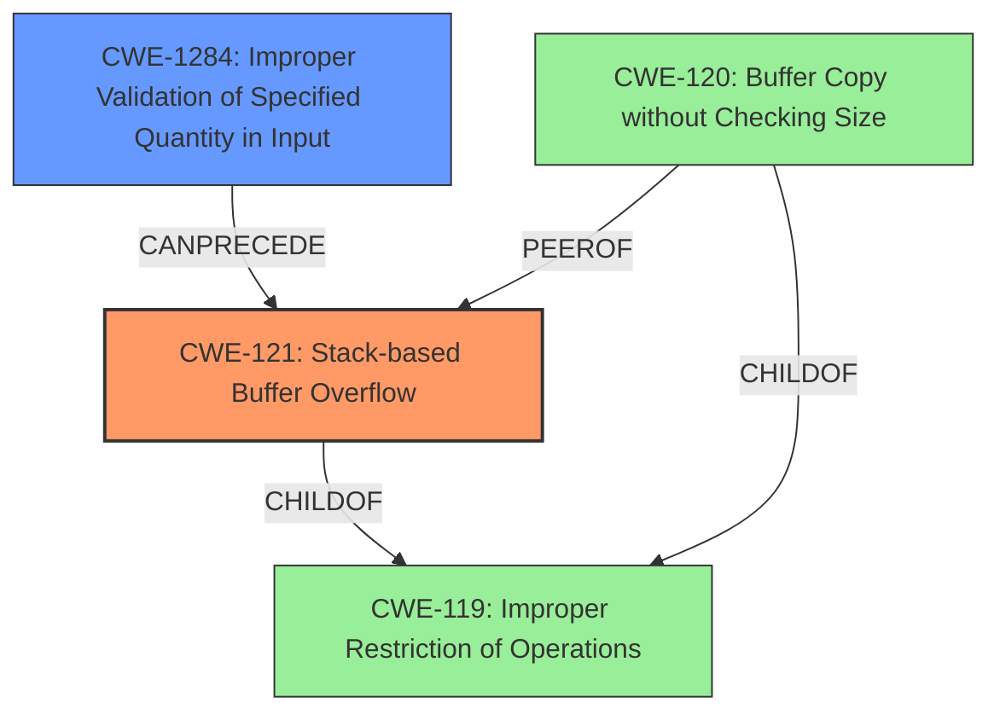

# Final Resolution for CVE-2022-30473

# Summary
| CWE ID | CWE Name | Confidence | CWE Abstraction Level | CWE Vulnerability Mapping Label | CWE-Vulnerability Mapping Notes |
|---|---|---|---|---|---|
| **CWE-121** | **Stack-based Buffer Overflow** | 0.95 | Variant | Allowed | Primary CWE |
| **CWE-1284** | **Improper Validation of Specified Quantity in Input** | 0.80 | Base | Allowed | Secondary Candidate |

## Evidence and Confidence

*   **Confidence Score:** 0.93
*   **Evidence Strength:** HIGH

## Relationship Analysis
The primary weakness is **CWE-121: Stack-based Buffer Overflow**. This is a variant of the broader **CWE-119: Improper Restriction of Operations within the Bounds of a Memory Buffer**, indicating a hierarchical relationship. The secondary weakness, **CWE-1284: Improper Validation of Specified Quantity in Input**, represents the root cause, as the lack of input validation on the `ssid` parameter precedes the buffer overflow. This creates a chain relationship where improper input validation leads to a buffer overflow. **CWE-120: Buffer Copy without Checking Size of Input ('Classic Buffer Overflow')** is a peer of **CWE-121** and also a child of **CWE-119**, representing a potential alternative classification, but **CWE-121** is more specific due to the stack allocation.

## Vulnerability Chain
The vulnerability chain starts with **CWE-1284: Improper Validation of Specified Quantity in Input**. The `ssid` parameter's length is not validated before being used in the `strcpy` function. This leads to **CWE-121: Stack-based Buffer Overflow**, where the overly long input is copied to a smaller stack-based buffer, overwriting adjacent memory. The consequence is potential code execution and system compromise.

## Summary of Analysis
The initial analysis correctly identified **CWE-121: Stack-based Buffer Overflow** as the primary weakness based on the vulnerability description, which explicitly states "stack-based buffer overflow". The provided evidence also mentions that the code copies user-provided input for the `ssid` parameter into a smaller stack-based buffer using `strcpy` without a length check, which supports this conclusion. The criticism suggested adding **CWE-1284** as a secondary CWE, focusing on the lack of input validation for the length of the `ssid` parameter. This aligns well with the CWE-1284 description: "The product receives input that is expected to specify a quantity (such as size or length), but it does not validate or incorrectly validates that the quantity has the required properties." I agree with the criticism.

The relationships influenced my decision to include **CWE-1284** as a secondary CWE because it clarifies the root cause of the vulnerability. The vulnerability chain shows how the lack of input validation leads directly to the buffer overflow.

The selected CWEs are at the optimal level of specificity. **CWE-121** is a Variant, making it more specific than the Base **CWE-120**. **CWE-1284** is a Base CWE that describes the specific type of missing input validation. These choices provide a clear and accurate picture of the vulnerability.