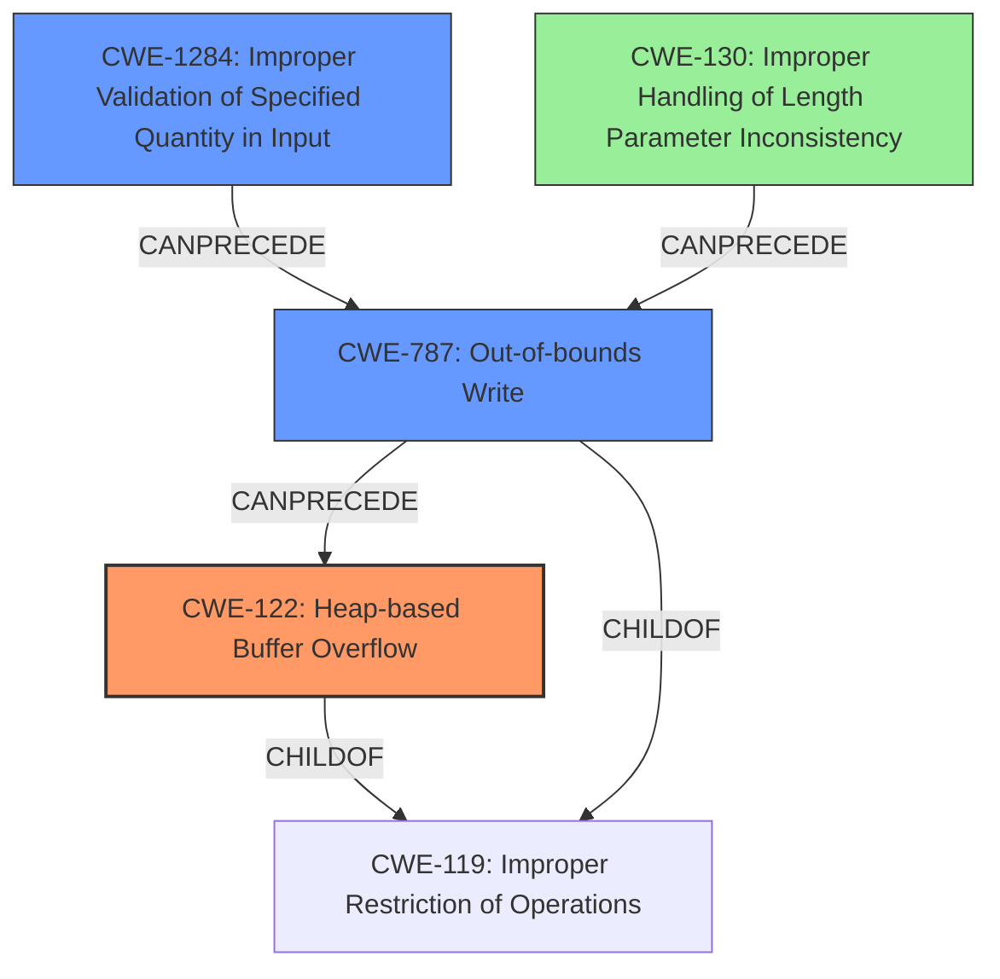

# Final Resolution for CVE-2022-30474

# Summary
| CWE ID | CWE Name | Confidence | CWE Abstraction Level | CWE Vulnerability Mapping Label | CWE-Vulnerability Mapping Notes |
|---|---|---|---|---|---|
| CWE-122 | Heap-based Buffer Overflow | 0.95 | Variant | Primary | Allowed |
| CWE-787 | Out-of-bounds Write | 0.7 | Base | Secondary | Allowed |
| CWE-1284 | Improper Validation of Specified Quantity in Input | 0.6 | Base | Secondary | Allowed |
| CWE-130 | Improper Handling of Length Parameter Inconsistency | 0.4 | Base | Tertiary | Allowed |

## Evidence and Confidence

*   **Confidence Score:** 0.95
*   **Evidence Strength:** HIGH

## Relationship Analysis
The primary CWE is CWE-122, a variant of buffer overflows. The vulnerability chain starts with CWE-1284 (Improper Validation of Specified Quantity in Input), where the length of the deviceId is not validated. This leads to CWE-787 (Out-of-bounds Write) because `strcpy` is used without a length check, causing data to be written beyond the allocated buffer. This out-of-bounds write manifests as CWE-122 (Heap-based Buffer Overflow) because the buffer is allocated on the heap. CWE-130 is a tertiary CWE because the size of the deviceId is inconsistent with the expected size, also contributing to the overflow. The abstraction levels (Variant for CWE-122, Base for CWE-787, CWE-1284, and CWE-130) provide a good balance between specificity and general understanding.

## Vulnerability Chain
The vulnerability chain begins with the **ROOTCAUSE**: the lack of input validation (CWE-1284 and CWE-130). The product does not properly validate the length of the `deviceId` parameter. This leads to **WEAKNESS**: an out-of-bounds write (CWE-787) when `strcpy` copies the oversized input into a heap-allocated buffer. The **IMPACT** is a heap-based buffer overflow (CWE-122), potentially leading to arbitrary code execution or denial of service.

## Summary of Analysis
The initial analysis and criticism both correctly identify CWE-122 as the primary **WEAKNESS**. The addition of CWE-787 and CWE-1284 as secondary CWEs provides additional context. The suggestion to add CWE-130 as a tertiary CWE is also valid, as the size of the `deviceId` is inconsistent with the expected size.

The evidence from the vulnerability description states "**heap overflow**" in the httpd module. The CVE reference confirms that the root cause is a heap overflow in the `saveParentControlInfo` function due to the use of `strcpy` without a length check when copying the user-provided `deviceId` parameter. This directly aligns with CWE-122.

The graph relationships helped clarify the vulnerability chain, showing how the lack of input validation (CWE-1284 and CWE-130) leads to an out-of-bounds write (CWE-787), resulting in a heap-based buffer overflow (CWE-122).

The selected CWEs are at the optimal level of specificity. CWE-122 is a Variant that directly describes the type of buffer overflow. CWE-787, CWE-1284, and CWE-130 are Base CWEs that provide a broader understanding of the issue and its root cause.