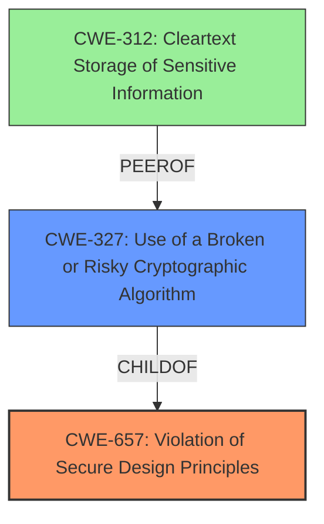

# Final Resolution for CVE-2022-30683

# Summary
| CWE ID | CWE Name | Confidence | CWE Abstraction Level | CWE Vulnerability Mapping Label | CWE-Vulnerability Mapping Notes |
|---|---|---|---|---|---|
| CWE-657 | Violation of Secure Design Principles | 0.7 | Class | Primary | Allowed |
| CWE-327 | Use of a Broken or Risky Cryptographic Algorithm | 0.7 | Class | Secondary | Allowed-with-Review |

## Evidence and Confidence

*   **Confidence Score:** 0.7
*   **Evidence Strength:** MEDIUM

## Relationship Analysis
The primary relationship considered was the parent-child relationship. CWE-657 is a class-level weakness, and the criticism suggested more specific CWEs. The analysis considered CWE-327 as an alternative to CWE-312, which is a more specific type of design flaw related to cryptography.

## Vulnerability Chain
The vulnerability chain starts with a **violation of secure design principles** (**CWE-657**), leading to a flawed encryption mechanism. This mechanism uses a **broken or risky cryptographic algorithm** (**CWE-327**), enabling an attacker who already possesses secrets to decrypt them, ultimately bypassing the intended security feature.

## Summary of Analysis
The initial analysis correctly identified **CWE-657 (Violation of Secure Design Principles)** as the primary **weakness**. The criticism suggested a more granular approach, especially in the cryptographic context.

The vulnerability description states that the **weakness** "could lead to bypass the security feature of the encryption mechanism." This strongly suggests a flaw in the encryption implementation itself, not just storage of secrets in cleartext. Thus, **CWE-327 (Use of a Broken or Risky Cryptographic Algorithm)** is more fitting than **CWE-312 (Cleartext Storage of Sensitive Information)** as a secondary **weakness**, because the description explicitly mentions a flawed encryption mechanism.

The final decision is based on the evidence in the vulnerability description and the relationships between CWEs, particularly the parent-child relationship between **CWE-657** and more specific cryptographic weaknesses like **CWE-327**. The selected CWEs are at an appropriate level of specificity given the available information.