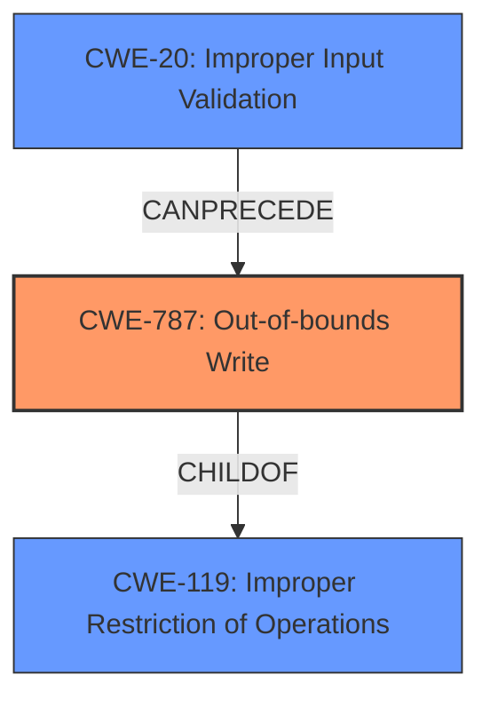

# Final Resolution for CVE-2022-30937

# Summary
| CWE ID | CWE Name | Confidence | CWE Abstraction Level | CWE Vulnerability Mapping Label | CWE-Vulnerability Mapping Notes |
|---|---|---|---|---|---|
| CWE-787 | Out-of-bounds Write | 0.9 | Base | Allowed | Primary CWE |
| CWE-20 | Improper Input Validation | 0.7 | Base | Allowed | Secondary CWE - Input Validation |
| CWE-119 | Improper Restriction of Operations within the Bounds of a Memory Buffer | 0.6 | Class | Discouraged | Secondary Candidate |

## Evidence and Confidence

*   **Confidence Score:** 0.8
*   **Evidence Strength:** HIGH

## Relationship Analysis
The primary relationship influencing the decision is the hierarchical relationship between CWE-119 and CWE-787, where CWE-787 is a child of CWE-119, allowing for a more specific classification. The chain relationship is that CWE-20 can precede CWE-787, as improper input validation can lead to an out-of-bounds write. The abstraction levels played a crucial role, favoring the Base level CWEs (CWE-787 and CWE-20) over the Class level CWE (CWE-119).

## Vulnerability Chain
The vulnerability chain starts with **CWE-20 (Improper Input Validation)**, where the application fails to properly validate specially crafted HTTP packets. This leads to **CWE-787 (Out-of-bounds Write)**, where the application writes data outside the intended buffer boundaries due to the unvalidated input. The consequence is a denial of service (DoS) condition because of **memory corruption**, as the vulnerability description says: "This could allow an attacker to crash the affected application leading to a denial of service condition."

## Summary of Analysis
The initial analysis correctly identified **CWE-787 (Out-of-bounds Write)** as the primary weakness due to the "**memory corruption**" vulnerability when parsing HTTP packets. The criticism suggested adding **CWE-20 (Improper Input Validation)** as a chained weakness, which is now accepted because the vulnerability stems from "specially crafted HTTP packets," indicating a failure in input validation.

*   **CWE-787 (Out-of-bounds Write)** is selected as the primary CWE because the vulnerability description explicitly states a "**memory corruption**" issue when parsing HTTP packets. The CVE Reference Links Content Summary further confirms the "**Root cause of vulnerability**" as a **memory corruption** vulnerability when parsing specially crafted HTTP packets. This aligns well with **CWE-787 (Out-of-bounds Write)**, a Base level CWE that describes writing data outside the intended buffer boundaries, leading to **memory corruption**.

*   **CWE-20 (Improper Input Validation)** is selected as a secondary CWE because the vulnerability description mentions "specially crafted HTTP packets," indicating a failure to properly validate the input. The crafted packets are not validated, allowing them to trigger the out-of-bounds write.

*   **CWE-119 (Improper Restriction of Operations within the Bounds of a Memory Buffer)** is retained as a secondary candidate but with a lower confidence score. While it accurately captures the general class of **memory corruption**, it lacks the specificity of **CWE-787 (Out-of-bounds Write)**.

The selected CWEs are at the optimal level of specificity. **CWE-787 (Out-of-bounds Write)** is a Base level CWE that provides a precise description of the **memory corruption** issue. **CWE-20 (Improper Input Validation)** is also a Base level CWE and explains how the attacker can trigger the vulnerability. **CWE-119 (Improper Restriction of Operations within the Bounds of a Memory Buffer)** is a Class level CWE and is too general for this vulnerability.