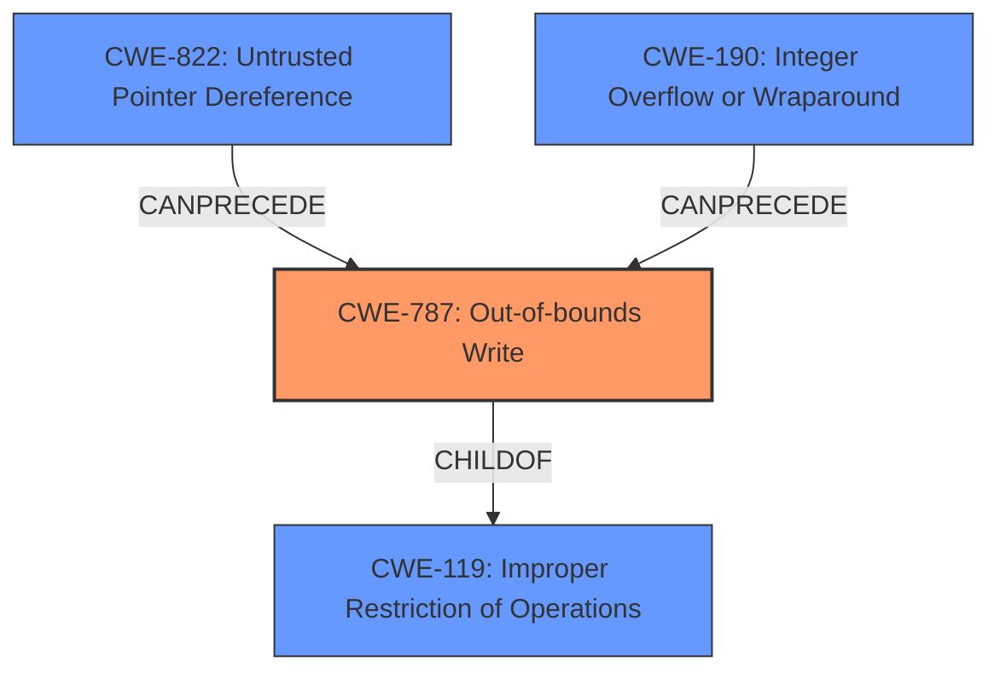

# Analysis Report for CVE-2022-30938

# Vulnerability Analysis Report: CVE-2022-30938

## Description

A vulnerability has been identified in EN100 Ethernet module DNP3 IP variant (All versions), EN100 Ethernet module IEC 104 variant (All versions), EN100 Ethernet module IEC 61850 variant (All versions < V4.40), EN100 Ethernet module Modbus TCP variant (All versions), EN100 Ethernet module PROFINET IO variant (All versions). Affected applications contains a memory corruption vulnerability while parsing specially crafted HTTP packets to /txtrace endpoint manupulating a specific argument. This could allow an attacker to crash the affected application leading to a denial of service condition

## Vulnerability Description Key Phrases

**Weakness:** memory corruption
**Impact:** denial of service
**Vector:** specially crafted HTTP packets to /txtrace endpoint
**Attacker:** attacker
**Product:** EN100 Ethernet module
**Version:** ['IEC 61850 variant (All versions < V4.40)', 'All versions']

## Analysis (with Relationship Data)

# Summary
| CWE ID  | CWE Name  | Confidence | CWE Abstraction Level | CWE Vulnerability Mapping Label | CWE-Vulnerability Mapping Notes |
|---|---|---|---|---|---|
| CWE-787 | Out-of-bounds Write | 0.95 | Base | Allowed | The vulnerability involves **memory corruption** due to parsing specially crafted HTTP packets, leading to an out-of-bounds write. |
| CWE-119 | Improper Restriction of Operations within the Bounds of a Memory Buffer | 0.75 | Class | Discouraged | The CVE reference summary indicates the vulnerability is classified as CWE-119. While it is related, CWE-787 provides a more specific description of the **memory corruption**. |

## Evidence and Confidence

*   **Confidence Score:** 0.90
*   **Evidence Strength:** HIGH

- **Analysis and Justification:**
  - *Explanation:* The primary weakness is **memory corruption** caused by parsing specially crafted HTTP packets. The description mentions manipulating a specific argument, leading to a crash. The CVE Reference Links Content Summary also highlights that this vulnerability is classified as CWE-119. However, based on the description of memory being corrupted, CWE-787 (Out-of-bounds Write) is more specific and accurately describes the vulnerability because it directly involves writing outside the intended buffer. CWE-787 is also listed as the Primary CWE Match for similar CVE descriptions. MITRE mapping guidance states that CWE-787 is ALLOWED and a Base level of abstraction, which is a preferred level.

  - *Relationship Analysis:* CWE-787 is a base level CWE that is a child of CWE-119. While CWE-119 is mentioned in the CVE reference summary, CWE-787 gives a more specific root cause. CWE-787 can follow CWE-825, CWE-824, CWE-823, and CWE-822, and can precede CWE-787 due to exploitation.

- **Confidence Score:**
  - Confidence: 0.95 (High evidence from the vulnerability description, CVE reference materials, and the primary CWE match.)

## Criticism of Analysis

Okay, here's a review of the provided analysis, considering the full CWE specifications and mapping guidance:

**Overall Assessment:**

The analysis correctly identifies `CWE-787: Out-of-bounds Write` as the primary weakness with high confidence. The justification is well-reasoned and uses the CWE definitions appropriately. The decision to select `CWE-787` over its parent, `CWE-119`, is sound and aligned with CWE's recommendation to use the most specific CWE available. The analysis demonstrates a good understanding of the CWE hierarchy and mapping guidance.

**Detailed Review:**

*   **CWE-787: Out-of-bounds Write**

    *   **Confidence:** 0.95 - Justified and appropriate.
    *   **Abstraction Level:** Base - Correct.
    *   **Mapping Label:** Allowed - Correct.
    *   **Justification:**
        *   The explanation clearly connects the vulnerability description (memory corruption due to parsing crafted HTTP packets) to the definition of `CWE-787`. The manipulation of arguments leading to a crash implies that the crafted HTTP packets are causing a write beyond the intended buffer.
        *   The analysis correctly points out that the CVE reference summary mentions `CWE-119`, but `CWE-787` provides a more specific root cause description.
        *   The reference to MITRE mapping guidance is accurate. `CWE-787` is a Base level CWE and is ALLOWED.
    *   **Relationship Analysis:**
        *   The relationships with other CWEs are accurately described. `CWE-787` is a child of `CWE-119`. The relationships to predecessor and successor CWEs provide helpful context.
    *   **CWE Examples from Database** are not present in the report

*   **CWE-119: Improper Restriction of Operations within the Bounds of a Memory Buffer**

    *   **Confidence:** 0.75 - Reasonable as a secondary consideration given it's mentioned in the CVE summary, however, it could be removed as it doesn't provide additional value to the analysis.
    *   **Abstraction Level:** Class - Correct.
    *   **Mapping Label:** Discouraged - Correct.
    *   **Justification:**
        *   The analysis correctly states that the CVE reference *mentions* `CWE-119`, but highlights that `CWE-787` offers a more precise characterization of the memory corruption. This aligns with CWE's discouraged usage for `CWE-119` and the recommendation to use more specific children when available.

*   **General Comments & Potential Improvements:**

    *   **Clarity:** The analysis is generally clear and well-organized.
    *   **Evidence Strength:**  The evidence is strong, but adding details of the /txtrace endpoint argument name that is being manipulated would improve the confidence further.
    *   **Negative Constraints:** The analysis could be strengthened by discussing *why* other potentially relevant CWEs are *not* applicable. For example, briefly mentioning why `CWE-125: Out-of-bounds Read` is not the primary cause could add more weight to the `CWE-787` selection.
    *   **Retriever Results:**  The retriever results show that `CWE-770: Allocation of Resources Without Limits or Throttling` was the highest scoring CWE. This could be discussed as a potential CWE for a chain if the specific argument being manipulated is a buffer size or memory allocation.
    *   **CWE Examples:** The report contains examples for CWE-823, while that CWE isn't mapped to this CVE directly, it shows the examples section is being populated with potential findings. I would recommend to fill out the CWE Examples section for CWE-787 as that is the primary CWE mapping.

**Addressing the Retriever Results:**

The retriever results offer some interesting alternative CWEs, but in this case, they are less accurate than CWE-787. It's useful to consider why they were suggested:

*   **CWE-770 (Allocation of Resources Without Limits or Throttling):** This might be suggested if the manipulated argument controls the *size* of an allocated buffer. If an attacker can cause the application to allocate an extremely large buffer without limits, this could lead to resource exhaustion and DoS. *However*, the primary issue is not the *allocation* itself, but the *out-of-bounds write* during the parsing process. If the vulnerability were to allocate a huge buffer, and then copy data within bounds into the huge buffer then CWE-770 would be more applicable, but here it's about writing *beyond* the allocated buffer.
*   **CWE-121 (Stack-based Buffer Overflow):** This is a possible *variant* of `CWE-787` if the buffer is allocated on the stack. Without further information about the implementation, it's difficult to determine if this is accurate.
*    **CWE-401 (Missing Release of Memory after Effective Lifetime):** Allocation of memory is not the main weakness identified in the vulnerability description.
*    **CWE-130 (Improper Handling of Length Parameter Inconsistency):** This would need to be involved for this to be the correct mapping.
*    **CWE-824 (Access of Uninitialized Pointer):** Not a pointer problem

**Revised Summary Table**

| CWE ID  | CWE Name  | Confidence | CWE Abstraction Level | CWE Vulnerability Mapping Label | CWE-Vulnerability Mapping Notes |
|---|---|---|---|---|---|
| CWE-787 | Out-of-bounds Write | 0.95 | Base | Allowed | The vulnerability involves **memory corruption** due to parsing specially crafted HTTP packets, leading to an out-of-bounds write. |
| CWE-119 | Improper Restriction of Operations within the Bounds of a Memory Buffer | 0.75 | Class | Discouraged | The CVE reference summary indicates the vulnerability is classified as CWE-119. While it is related, CWE-787 provides a more specific description of the **memory corruption**. |

**In conclusion,** the analysis is strong and well-justified. The choice of CWE-787 is appropriate. Addressing the minor points above would improve the analysis.

## Final Resolution

# Summary
| CWE ID  | CWE Name  | Confidence | CWE Abstraction Level | CWE Vulnerability Mapping Label | CWE-Vulnerability Mapping Notes |
|---|---|---|---|---|---|
| CWE-787 | Out-of-bounds Write | 0.95 | Base | Allowed | The vulnerability involves **memory corruption** due to parsing specially crafted HTTP packets, leading to an out-of-bounds write. |

## Evidence and Confidence

*   **Confidence Score:** 0.95
*   **Evidence Strength:** HIGH

## Relationship Analysis
The primary relationship that influenced the decision was the parent-child relationship between CWE-119 and CWE-787. While the CVE summary mentions CWE-119, CWE-787 provides a more specific description of the **memory corruption**. The analysis also considered the chain relationships of CWE-787, such as potentially following CWE-822 (Untrusted Pointer Dereference) or CWE-190 (Integer Overflow or Wraparound) if the crafted HTTP packets cause an integer overflow to occur which is then used in a write operation. The abstraction level of CWE-787 as a Base CWE further solidified its selection.

## Vulnerability Chain
The vulnerability chain starts with the receipt of specially crafted HTTP packets to the /txtrace endpoint. These packets manipulate a specific argument, leading to **memory corruption** (CWE-787). This out-of-bounds write can then lead to a crash of the affected application, resulting in a denial of service condition.

## Summary of Analysis
The initial analysis and criticism both converge on CWE-787 as the most appropriate classification. The decision is based on the vulnerability description, which highlights **memory corruption** caused by crafted HTTP packets. This aligns perfectly with the description of CWE-787 (Out-of-bounds Write).

The evidence from the vulnerability description: "Affected applications contains a memory corruption vulnerability while parsing specially crafted HTTP packets to /txtrace endpoint manupulating a specific argument. This could allow an attacker to crash the affected application leading to a denial of service condition" is directly related to CWE-787.

The graph relationships support this decision, as CWE-787 is a more specific child of the more general CWE-119, which is mentioned in the CVE summary.

The selection of CWE-787 is at the optimal level of specificity because it accurately describes the **root cause** of the vulnerability (the out-of-bounds write) without being overly broad (like CWE-119) or requiring more specific implementation details (like stack vs. heap).

*Report generated on 2025-03-18 13:25:45*
