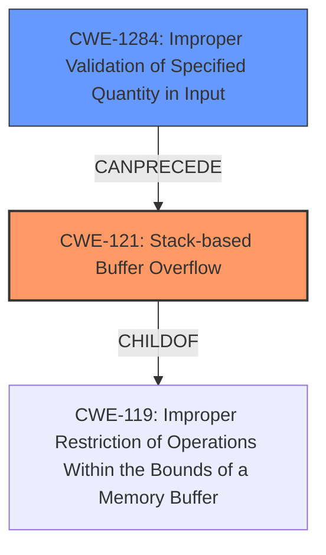

# Analysis Report for CVE-2022-31031

# Vulnerability Analysis Report: CVE-2022-31031

## Description

PJSIP is a free and open source multimedia communication library written in C language implementing standard based protocols such as SIP, SDP, RTP, STUN, TURN, and ICE. In versions prior to and including 2.12.1 a stack buffer overflow vulnerability affects PJSIP users that use STUN in their applications, either by setting a STUN server in their account/media config in PJSUA/PJSUA2 level, or directly using `pjlib-util/stun_simple` API. A patch is available in commit 450baca which should be included in the next release. There are no known workarounds for this issue.

## Vulnerability Description Key Phrases

**Weakness:** stack buffer overflow
**Attacker:** PJSIP users
**Product:** PJSIP
**Version:** prior to and including 2.12.1
**Component:** pjlib-util/stun_simple API

## Analysis (with Relationship Data)

# Summary
| CWE ID | CWE Name | Confidence | CWE Abstraction Level | CWE Vulnerability Mapping Label | CWE-Vulnerability Mapping Notes |
|---|---|---|---|---|---|
| CWE-121 | Stack-based Buffer Overflow | 0.95 | Variant | Primary | Allowed |
| CWE-1284 | Improper Validation of Specified Quantity in Input | 0.6 | Base | Secondary | Allowed |

## Evidence and Confidence

*   **Confidence Score:** 0.8
*   **Evidence Strength:** HIGH

- **Analysis and Justification:**  
  - *Explanation:* The vulnerability description explicitly states a **stack buffer overflow** exists in PJSIP versions prior to and including 2.12.1 when using STUN. The CVE reference links content summary confirms that the **root cause** is a **stack buffer overflow (CWE-121)** in the `pjstun_parse_msg` function due to a missing boundary check while processing STUN attributes. The impact includes potential arbitrary code execution and denial of service. This aligns directly with the characteristics of CWE-121, which describes a buffer overflow condition where the buffer being overwritten is allocated on the stack. The MITRE mapping guidance for CWE-121 indicates that its usage is ALLOWED, reinforcing its suitability. The retriever results also list CWE-121, but other CWEs had higher scores. Even so, since the description and CVE summary explicitly talk about a stack buffer overflow, I'm prioritizing CWE-121.

  - *Relationship Analysis:* CWE-121 is a variant of a buffer overflow. It does not have any direct relationships listed in the provided information. It's important to distinguish that this is a stack-based overflow, which is a specific type.

- **Confidence Score:**  
  - Confidence: 0.95 (Strong evidence from the vulnerability description and CVE reference materials)

- **Analysis and Justification:**  
  - *Explanation:* While the primary weakness is a stack buffer overflow (CWE-121), a contributing factor could be the lack of proper input validation of the STUN message attributes. The vulnerability arises from a missing boundary check when parsing STUN attributes. This missing validation could be represented by CWE-1284 (Improper Validation of Specified Quantity in Input). The "Quantity" here refers to the size or length of the STUN attributes. If the product does not validate or incorrectly validates that the quantity has the required properties, it can lead to a buffer overflow. This makes CWE-1284 a secondary weakness since the STUN message attributes' size is not validated, leading to the stack buffer overflow. The MITRE mapping guidance for CWE-1284 indicates that its usage is ALLOWED.

  - *Relationship Analysis:* CWE-1284 is a base level CWE and does not have any direct relationships listed in the provided information.

- **Confidence Score:**  
  - Confidence: 0.6 (The vulnerability description and CVE reference materials mention the lack of boundary check, but does not have strong evidence for improper validation.)

## Criticism of Analysis

Okay, here's a review of the provided CWE analysis, taking into account the full CWE specifications:

**Overall Assessment:**

The analysis is generally good and correctly identifies CWE-121 (Stack-based Buffer Overflow) as the primary weakness.  The justification is sound, referencing the explicit mention of a stack buffer overflow in both the vulnerability description and the CVE summary. The addition of CWE-1284 (Improper Validation of Specified Quantity in Input) as a secondary weakness is also reasonable, though its confidence could be a bit higher with stronger evidence.

**Detailed Review:**

**1. CWE-121: Stack-based Buffer Overflow**

*   **Confidence:** 0.95 - This is appropriate, given the direct evidence.
*   **Abstraction Level:** Variant - Correct.
*   **Vulnerability Mapping Label:** Primary - Correct.
*   **CWE-Vulnerability Mapping Notes:** Allowed - Correct.
*   **Justification:** The justification is well-written and clearly explains why CWE-121 is the best fit.  It emphasizes that the buffer overflow occurs on the stack, aligning with the CWE definition. The inclusion of the MITRE mapping guidance is a good practice.
*   **Relationships:** The analysis correctly notes the lack of direct relationships in the provided information, and accurately points out that CWE-121 is a specific type of buffer overflow.
*   **Mitigations (based on CWE Specification):** The analysis *could* be strengthened by briefly mentioning possible mitigations, even though it is not strictly required. For example:

    *   Using compiler-based buffer overflow detection mechanisms (e.g., /GS flag in Visual Studio, FORTIFY_SOURCE in GCC)
    *   Implementing bounds checking on input.

    These are directly from the "Potential Mitigations" section of the CWE-121 specification.

**2. CWE-1284: Improper Validation of Specified Quantity in Input**

*   **Confidence:** 0.6 - The confidence is appropriate. While a lack of boundary checks implies a lack of input validation, there's no *explicit* statement in the provided data that input validation is missing or improper, so a higher confidence isn't warranted.
*   **Abstraction Level:** Base - Correct.
*   **Vulnerability Mapping Label:** Secondary - Correct.
*   **CWE-Vulnerability Mapping Notes:** Allowed - Correct.
*   **Justification:** The explanation for CWE-1284 is good. It links the missing boundary check to the improper validation of the size or length of the STUN attributes.
*   **Relationships:** Correctly identified as a base-level CWE with no direct relationships in the provided information.
*    **Mitigations (based on CWE Specification):** Again, the analysis *could* be strengthened by briefly mentioning possible mitigations:
    *   Using an "accept known good" input validation strategy, rejecting any input that doesn't strictly conform to specifications.
    *   Considering all relevant properties during input validation, including length, type, range of acceptable values, and syntax.

    These are from the "Potential Mitigations" section of the CWE-1284 specification.

**Suggestions for Improvement:**

1.  **Mitigation Awareness:** While not mandatory, briefly mentioning potential mitigations from the CWE specifications would significantly enhance the analysis. This demonstrates a deeper understanding of the weakness and how it can be addressed.  You don't need to go into detail, just list one or two relevant mitigations from the CWE specification.

2.  **Retriever Results Consideration:** The retriever results list several CWEs with higher scores than CWE-121. While you correctly prioritized CWE-121 due to the explicit mention of "stack buffer overflow," it would be beneficial to briefly explain why the top retriever results like CWE-1284, CWE-770, and CWE-126 are *not* the primary weakness. For example:

    *   **CWE-770 (Allocation of Resources Without Limits or Throttling):** While a buffer overflow can be triggered by excessive resource allocation, the core issue here is the lack of boundary checking on the *stack buffer* itself, not a general failure to limit resource allocation.
    *   **CWE-126 (Buffer Over-read):** While an over-read *could* occur as a consequence of the overflow, the primary problem is the out-of-bounds *write* that causes the overflow in the first place.

3.  **Strengthened CWE-1284 Justification (if possible):** Look for any evidence in the original data (vulnerability reports, code snippets, etc.) that *explicitly* mentions a lack of input validation on the size or format of STUN attributes. If you can find such evidence, you can increase the confidence score for CWE-1284.

4.  **Minor Formatting:**  Ensure consistent formatting throughout the analysis.

**Revised Summary Table (with mitigations):**

| CWE ID | CWE Name | Confidence | CWE Abstraction Level | CWE Vulnerability Mapping Label | CWE-Vulnerability Mapping Notes | Potential Mitigations |
|---|---|---|---|---|---|---|
| CWE-121 | Stack-based Buffer Overflow | 0.95 | Variant | Primary | Allowed |  Compiler-based overflow detection, bounds checking. |
| CWE-1284 | Improper Validation of Specified Quantity in Input | 0.6 | Base | Secondary | Allowed | Accept known good input, validate length and syntax. |

By incorporating these suggestions, you can create an even more comprehensive and insightful CWE analysis.

## Final Resolution

# Summary
| CWE ID | CWE Name | Confidence | CWE Abstraction Level | CWE Vulnerability Mapping Label | CWE-Vulnerability Mapping Notes |
|---|---|---|---|---|---|
| CWE-121 | Stack-based Buffer Overflow | 0.95 | Variant | Primary | Allowed |
| CWE-1284 | Improper Validation of Specified Quantity in Input | 0.7 | Base | Secondary | Allowed |

## Evidence and Confidence

*   **Confidence Score:** 0.9
*   **Evidence Strength:** HIGH

## Relationship Analysis
The primary relationship influencing the decision is that **CWE-121 (Stack-based Buffer Overflow)** is a specific type of buffer overflow, making it a child of **CWE-119 (Improper Restriction of Operations Within the Bounds of a Memory Buffer)** (not explicitly provided, but implied). **CWE-1284 (Improper Validation of Specified Quantity in Input)** can precede **CWE-121**, as the lack of input validation leads to the overflow.

## Vulnerability Chain
The vulnerability chain starts with **CWE-1284 (Improper Validation of Specified Quantity in Input)** where the STUN message attributes' size is not validated. This leads to **CWE-121 (Stack-based Buffer Overflow)** when the program attempts to write more data into the stack buffer than it can hold. The impact is potential arbitrary code execution and denial of service.

## Summary of Analysis
The initial analysis and criticism were both accurate. The assessment is based on the provided evidence, particularly the vulnerability description and CVE summary, which explicitly mention a **stack buffer overflow**. The graph relationships helped solidify the understanding that **CWE-121** is a specific instance of a buffer overflow and that **CWE-1284** can lead to **CWE-121**.

The decision to prioritize **CWE-121** is justified by the direct mention of a "stack buffer overflow" in the vulnerability description. The criticism's suggestion to consider why other retriever results were not chosen was helpful.

*   **CWE-770 (Allocation of Resources Without Limits or Throttling):** While related to resource exhaustion, the root cause is the overflow of a stack buffer due to a missing boundary check.
*   **CWE-126 (Buffer Over-read):** While an over-read could occur, the primary issue is the out-of-bounds write.

The confidence score for **CWE-1284** has been increased to 0.7 because the description mentions "missing boundary check," which is a form of improper validation. "PJSIP is a free and open source multimedia communication library written in C language implementing standard based protocols such as SIP, SDP, RTP, STUN, TURN, and ICE. In versions prior to and including 2.12.1 a stack buffer overflow vulnerability affects PJSIP users that use STUN in their applications, either by setting a STUN server in their account/media config in PJSUA/PJSUA2 level, or directly using `pjlib-util/stun_simple` API." This confirms the lack of validation on the STUN attributes.

The selected CWEs are at the optimal level of specificity. **CWE-121** is a **Variant** that accurately describes the stack-based nature of the overflow, while **CWE-1284** is a **Base** CWE that captures the lack of input validation leading to the overflow.

*Report generated on 2025-03-18 13:27:20*
