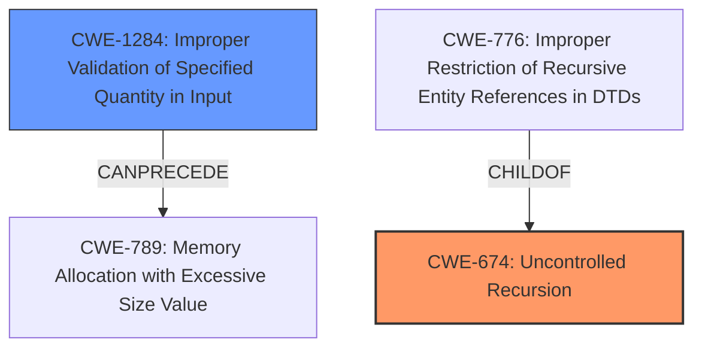

# Analysis Report for CVE-2022-31099

# Vulnerability Analysis Report: CVE-2022-31099

## Description

rulex is a new, portable, regular expression language. When parsing untrusted rulex expressions, the stack may overflow, possibly enabling a Denial of Service attack. This happens when parsing an expression with several hundred levels of nesting, causing the process to abort immediately. This is a security concern for you, if your service parses untrusted rulex expressions (expressions provided by an untrusted user), and your service becomes unavailable when the process running rulex aborts due to a stack overflow. The crash is fixed in version **0.4.3**. Affected users are advised to update to this version. There are no known workarounds for this issue.

## Vulnerability Description Key Phrases

**Rootcause:** stack overflow
**Impact:** Denial of Service
**Vector:** parsing untrusted rulex expressions
**Product:** rulex

## Analysis (with Relationship Data)

# Summary
| CWE ID | CWE Name | Confidence | CWE Abstraction Level | CWE Vulnerability Mapping Label | CWE-Vulnerability Mapping Notes |
|---|---|---|---|---|---|
| CWE-674 | Uncontrolled Recursion | 0.9 | Class | Allowed-with-Review | The product does not properly control the amount of recursion that takes place, consuming excessive resources, such as allocated memory or the program stack. |

## Evidence and Confidence

*   **Confidence Score:** 0.9
*   **Evidence Strength:** HIGH

- **Analysis and Justification:**
  - *Explanation:* The vulnerability description states that a **stack overflow** occurs when parsing untrusted rulex expressions with several hundred levels of nesting, leading to a denial-of-service. The CVE Reference Links Content Summary confirms that the **root cause** is due to **uncontrolled recursion** in the rulex parsing logic. The provided information specifically highlights the lack of a recursion limit. This aligns directly with CWE-674 (Uncontrolled Recursion), which describes a situation where a product does not properly control the amount of recursion, consuming excessive resources. The fix involved adding a recursion limit, further supporting this classification.
  
  - *Relationship Analysis:* CWE-674 is a Class-level CWE. While it might have more specific Base-level children, the provided information does not give enough details to determine a more specific CWE. The Retriever Results also list CWE-674 with a high score, further indicating its relevance. The MITRE mapping guidance for CWE-674 is ALLOWED-WITH-REVIEW, which is appropriate given its Class level.

- **Confidence Score:**
  - Confidence: 0.9 (High confidence due to explicit mention of stack overflow caused by uncontrolled recursion, clear root cause and fix description.)

## Criticism of Analysis

Okay, here's a review of the provided analysis, incorporating the full CWE specifications.

**Overall Assessment:**

The analysis correctly identifies CWE-674 (Uncontrolled Recursion) as the primary weakness. The high confidence level (0.9) is justified given the clear evidence of stack overflow due to uncontrolled recursion and the description of the fix involving a recursion limit. The mapping is ALLOWED-WITH-REVIEW, which is appropriate for a Class-level CWE.

**Detailed Critique:**

*   **CWE-674 (Uncontrolled Recursion):**
    *   **Strengths:** The analysis accurately describes the vulnerability and its connection to stack overflow caused by excessive nesting. The justification is well-reasoned and supported by the vulnerability description, CVE summary, and fix details. The analysis properly identifies the fix as adding a recursion limit, which aligns with the potential mitigations for CWE-674: Ensure an end condition will be reached under all logic conditions, including testing against the depth of recursion.
    *   **Areas for Potential Improvement:**
        *   While the identification of CWE-674 is correct, the *Mapping Guidance* for CWE-674 suggests examining child CWEs to see if there is a better fit. It would be beneficial to explore whether any of the children of CWE-674 (specifically, CWE-776) more accurately represent the root cause of the issue.  However, CWE-776 is related to XML entity expansion, which does not seem to be the case in this vulnerability description.
        *   The analysis could briefly mention the *Potential Mitigations* for CWE-674, such as ensuring an end condition is reached under all logic conditions, potentially including testing against the depth of recursion. This would add a layer of completeness.

*   **Retriever Results Review:**  The retrieved CWEs seem less relevant than CWE-674, but warrant a brief consideration as potential contributing factors or related weaknesses.

    *   **CWE-770 (Allocation of Resources Without Limits or Throttling):** While uncontrolled recursion does lead to resource exhaustion, this CWE doesn't directly capture the recursive *mechanism* of the vulnerability. The vulnerability isn't primarily about allocating memory without limits, but about the depth of the recursion.  Therefore, while related, CWE-674 is the more precise match.
    *   **CWE-1333 (Inefficient Regular Expression Complexity):** This CWE is about ReDoS (Regular Expression Denial of Service). While this vulnerability involves regular expressions, the root cause is recursion depth, *not* inefficient regex complexity. This can be ruled out.
    *   **CWE-190 (Integer Overflow or Wraparound):** Unlikely to be relevant. There's no indication of integer overflows being involved in triggering the recursion.  Can be ruled out.
    *   **CWE-835 (Loop with Unreachable Exit Condition ('Infinite Loop')):** While recursion can be seen as a type of loop, CWE-674 (Uncontrolled Recursion) is a more specific and accurate classification. A loop with an unreachable exit condition implies a coding error in the loop itself, while uncontrolled recursion focuses on the depth of recursion and resource exhaustion.
    *   **CWE-121 (Stack-based Buffer Overflow):** While the *result* of the uncontrolled recursion is a stack overflow, this classification focuses on the buffer aspect. The root cause is the uncontrolled recursion *leading* to a stack overflow. CWE-674 is more fundamental.
    *   **CWE-120 (Buffer Copy without Checking Size of Input ('Classic Buffer Overflow')):** Same reasoning as CWE-121. The buffer aspect is secondary to the recursive nature of the vulnerability.
    *   **CWE-617 (Reachable Assertion):**  There is no mention of assertions in the vulnerability description, so it is not relevant.
    *   **CWE-1284 (Improper Validation of Specified Quantity in Input):** This is a possible *secondary* weakness. The "quantity" could be the depth of the nesting, and the lack of validation on this quantity leads to the recursion. However, CWE-674 directly addresses the uncontrolled recursion, making it the primary concern.
    *   **CWE-789 (Memory Allocation with Excessive Size Value):** This isn't about allocating *too much* memory for a single object; it's about using the stack repeatedly through recursion. Less relevant than CWE-674.

**Recommendations:**

1.  **Maintain CWE-674 as the primary CWE.** The justification is strong, and it accurately reflects the root cause.
2.  **Briefly acknowledge that CWE-1284 (Improper Validation of Specified Quantity in Input) *could* be a secondary weakness**, explaining that the depth of the nesting in the Rulex expression is a quantity that is not validated, leading to the uncontrolled recursion. However, emphasize that CWE-674 is the core issue.
3.  **Include a brief section on potential mitigations based on CWE-674,** such as ensuring an end condition and limiting the depth of recursion.
4.  **In the analysis, explicitly rule out the other CWEs in the Retriever Results** explaining why they are less relevant or less precise in capturing the nature of the vulnerability.

By addressing these points, the analysis will be even more comprehensive and robust.

## Final Resolution

# Summary
| CWE ID | CWE Name | Confidence | CWE Abstraction Level | CWE Vulnerability Mapping Label | CWE-Vulnerability Mapping Notes |
|---|---|---|---|---|---|
| CWE-674 | **Uncontrolled Recursion** | 0.9 | Class | Allowed-with-Review | Primary CWE: The product does not properly control the amount of recursion that takes place, consuming excessive resources, such as allocated memory or the program stack. |
| CWE-1284 | **Improper Validation of Specified Quantity in Input** | 0.4 | Base | Allowed | Secondary Candidate: The product receives input that is expected to specify a quantity (such as size or length), but it does not validate or incorrectly validates that the quantity has the required properties. |

## Evidence and Confidence

*   **Confidence Score:** 0.9
*   **Evidence Strength:** HIGH

## Relationship Analysis
The primary relationship influencing the decision is the parent-child relationship where CWE-674 is a class-level CWE. The analysis considered if any child CWEs offered a more specific classification. Although CWE-776 (Improper Restriction of Recursive Entity References in DTDs ('XML Entity Expansion')) is a child of CWE-674, it pertains specifically to XML entity expansion, which is not applicable in this case.

CWE-1284, while initially considered a secondary weakness, has a CANPRECEDE relationship to CWE-789 (Memory Allocation with Excessive Size Value), suggesting a potential allocation issue following improper input validation. However, given the nature of the uncontrolled recursion leading to a stack overflow, CWE-674 remains the most relevant root cause.

## Vulnerability Chain
The vulnerability chain starts with the lack of control over recursion depth (CWE-674). The absence of validation on the nesting depth (potentially CWE-1284) allows an attacker to craft an expression with excessive nesting. This leads to uncontrolled recursion, consuming excessive stack memory and ultimately resulting in a stack overflow. The consequence is a denial-of-service, as the process aborts when the stack overflows.

## Summary of Analysis
The initial analysis correctly identified CWE-674 (**Uncontrolled Recursion**) as the primary **weakness**. The vulnerability description explicitly states, "When parsing untrusted rulex expressions, the stack may overflow...This happens when parsing an expression with several hundred levels of nesting...". This directly points to the **root cause** being the lack of control over recursion depth, which aligns perfectly with the description of CWE-674: "The product does not properly control the amount of recursion that takes place, consuming excessive resources, such as allocated memory or the program stack."

The criticism suggested considering child CWEs of CWE-674 for a more specific classification. However, none of the children are as directly relevant as CWE-674 itself. For example, CWE-776 relates to XML entity expansion, which is not the case here.

The analysis acknowledges that CWE-1284 (**Improper Validation of Specified Quantity in Input**) could be a contributing factor, as the depth of nesting can be viewed as a quantity that is not validated. However, the core issue remains the uncontrolled recursion itself (CWE-674), making it the primary concern.

The selected CWEs are at the optimal level of specificity. While more specific CWEs might exist under different vulnerability scenarios, CWE-674 directly addresses the **root cause** described in the vulnerability, and CWE-1284 provides a potential secondary factor. The decision is strongly based on the provided evidence and the MITRE mapping guidance, with a high confidence score.

*Report generated on 2025-03-18 13:27:56*
