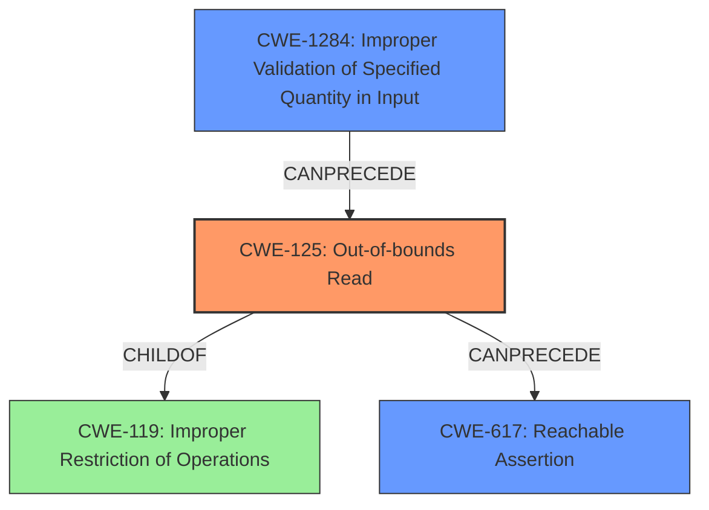

# Analysis Report for CVE-2022-31620

# Vulnerability Analysis Report: CVE-2022-31620

## Description

In libjpeg before 1.64, BitStreamGet in bitstream.hpp has an assertion failure that may cause denial of service. This is related to out-of-bounds array access during arithmetically coded lossless scan or arithmetically coded sequential scan.

## Vulnerability Description Key Phrases

**Rootcause:** out-of-bounds array access
**Impact:** denial of service
**Vector:** ['arithmetically coded lossless scan', 'arithmetically coded sequential scan']
**Product:** libjpeg
**Version:** before 1.64
**Component:** BitStreamGet in bitstream.hpp

## Analysis (with Relationship Data)

# Summary
| CWE ID | CWE Name | Confidence | CWE Abstraction Level | CWE Vulnerability Mapping Label | CWE-Vulnerability Mapping Notes |
|---|---|---|---|---|---|
| CWE-125 | Out-of-bounds Read | 0.95 | Base | Allowed | Primary CWE |
| CWE-617 | Reachable Assertion | 0.75 | Base | Allowed | Secondary Candidate |

## Evidence and Confidence

*   **Confidence Score:** 0.90
*   **Evidence Strength:** HIGH

- **Analysis and Justification:**  
  - *Explanation:* The vulnerability is described as an **out-of-bounds array access** in `BitStreamGet` within libjpeg. The CVE Reference Links Content Summary confirms this, stating "The vulnerability stems from a lack of proper bounds checking during the decoding of lossless JPEG images" and "decoder could read beyond the allocated memory." This aligns directly with the description of CWE-125 (Out-of-bounds Read), which states: "The product reads data past the end, or before the beginning, of the intended buffer." The impact is a denial of service, which is a common consequence of out-of-bounds reads. The Retriever Results also identify CWE-125 as a highly relevant candidate with a good score. MITRE mapping guidance for CWE-125 indicates that it is ALLOWED.
  
  - *Relationship Analysis:* CWE-125 is a child of CWE-119 (Improper Restriction of Operations within the Bounds of a Memory Buffer), but CWE-125 is more specific and accurately describes the **out-of-bounds read**. CWE-125 can precede CWE-824 (Access of a Resource Using a Pointer that Has Been Dereferenced).

- **Confidence Score:**  
  - Confidence: 0.95 (High confidence due to clear evidence of out-of-bounds read and supporting CVE details.)

---

- **Analysis and Justification:**  
  - *Explanation:* The vulnerability description mentions an "assertion failure that may cause denial of service." The CVE Reference Links Content Summary elaborates, stating "An assertion in `BitStream<false>::Get` could be triggered by providing a crafted input that results in `bits > 0 && bits <= 24` condition failure." This aligns with CWE-617 (Reachable Assertion), which states: "The product contains an assert() or similar statement that can be triggered by an attacker, which leads to an application exit or other behavior that is more severe than necessary." While the primary weakness is the out-of-bounds read (CWE-125), the assertion failure is a direct consequence and contributes to the denial of service impact. The Retriever Results identify CWE-617 as a relevant candidate. MITRE mapping guidance for CWE-617 indicates that it is ALLOWED.
  
  - *Relationship Analysis:* CWE-617 is a child of CWE-670 (Always-Incorrect Control Flow Implementation). CWE-617 itself doesn't directly relate to CWE-125 in a 'CanPrecede' or 'CanFollow' relationship, but it's a secondary issue directly triggered by the crafted input and leading to denial of service.

- **Confidence Score:**  
  - Confidence: 0.75 (The assertion failure is a secondary effect of the out-of-bounds read.)

## Criticism of Analysis

Okay, here's a review of the provided CWE analysis, incorporating the full CWE specifications:

**Overall Assessment**

The analysis is generally well-reasoned and arrives at a solid conclusion. The primary CWE mapping to CWE-125 (Out-of-bounds Read) is accurate and well-supported by the provided evidence. The secondary mapping to CWE-617 (Reachable Assertion) is also reasonable, providing further context to the vulnerability. The confidence scores are appropriately assigned, reflecting the strength of the evidence for each CWE.

**Detailed Critique**

**1. CWE-125: Out-of-bounds Read (Primary)**

*   **Accuracy:** The mapping to CWE-125 is highly accurate. The description of the vulnerability as "out-of-bounds array access" and the summary stating "decoder could read beyond the allocated memory" directly align with the definition of CWE-125: "The product reads data past the end, or before the beginning, of the intended buffer."
*   **Abstraction Level:** CWE-125 is a Base-level CWE, which is the preferred level for mapping.
*   **Mapping Guidance:** The analysis correctly notes that CWE-125 is *Allowed* for mapping. The mapping guidance for CWE-119 (Improper Restriction of Operations within the Bounds of a Memory Buffer) explicitly discourages direct mapping to CWE-119 and encourages mapping to its children, like CWE-125.  The analysis correctly explains this relationship.
*   **Potential Mitigations:** The analysis doesn't explicitly mention the mitigations from the CWE specification, but they are relevant.
    *   **Input Validation:** The analysis implicitly points to the importance of input validation, and the specification of CWE-125 makes this explicit. Specifically, that the application should, "Assume all input is malicious. Use an "accept known good" input validation strategy."
    *   **Language Selection:** Use a language that provides appropriate memory abstractions.
*   **Relationships:** The analysis correctly identifies that CWE-125 is a child of CWE-119. The mention of a 'CanPrecede' relationship to CWE-824 is not as applicable in this case.

**2. CWE-617: Reachable Assertion (Secondary)**

*   **Accuracy:** The mapping to CWE-617 is appropriate as a *secondary* concern. While the primary cause is the out-of-bounds read, the assertion failure is a direct consequence of specific crafted inputs that trigger the underlying vulnerability.  The description "assertion failure that may cause denial of service" aligns with CWE-617: "The product contains an assert() or similar statement that can be triggered by an attacker, which leads to an application exit or other behavior that is more severe than necessary."
*   **Abstraction Level:** CWE-617 is a Base-level CWE, which is the preferred level for mapping.
*   **Mapping Guidance:** The analysis correctly notes that CWE-617 is *Allowed* for mapping.
*   **Potential Mitigations:**
    *   The analysis does not explicitly mention the potential mitigations. They include making "sensitive open/close operation non reachable by directly user-controlled data" or "Perform input validation on user data." These are relevant to this CVE as input validation could avoid the situation where the assertion is reached.
*   **Relationships:** The analysis notes that CWE-617 is a child of CWE-670. The analysis states that CWE-617 doesn't directly relate to CWE-125 in a 'CanPrecede' or 'CanFollow' relationship, but that "it's a secondary issue directly triggered by the crafted input and leading to denial of service." This is accurate.

**Recommendations for Improvement**

1.  **Explicitly Mention Mitigations:** When discussing each CWE, briefly list the most relevant potential mitigations from the CWE specification. This reinforces the importance of addressing the root cause.  For example, adding a sentence such as, "Mitigations for CWE-125 include strict input validation to ensure that length arguments, buffer size calculations, and offsets are correct, and use of languages that provide appropriate memory abstractions."
2.  **Consider Input Validation (CWE-20 and Children):** Although the primary issue is an out-of-bounds read and a reachable assertion, the root cause often involves *improper input validation*. The analysis could benefit from briefly discussing input validation and the relevant CWEs. Because the input of the JPEG leads to the OOB read, the root cause could be argued to be an improper validation of the input. Consider adding a sentence such as, "Contributing to this vulnerability is the lack of proper input validation, which allows specially crafted JPEG files to trigger the out-of-bounds read. This can be classified as CWE-20, and more specifically, either CWE-1284, Improper Validation of Specified Quantity in Input, or CWE-1285, Improper Validation of Specified Index, Position, or Offset in Input, depending on the exact nature of the missing validation."
3.  **Avoid Ambiguous Terminology:** While "buffer overflow" is used in the `Alternative Terms` part of CWE-119, try to be precise in your descriptions and explanations by using terms such as "out-of-bounds read" rather than "buffer overflow". The CWE documentation itself encourages this precision.
4.  **Chaining Analysis (Optional):** While not strictly necessary, a more detailed analysis could explore potential CWE chains. For example: `Improper Input Validation (CWE-20) -> Out-of-bounds Read (CWE-125) -> Denial of Service (CWE-400)` or `CWE-125 -> CWE-617`.

**Revised Summary Table**

Here's the summary table with the recommended addition of relevant Mitigations and input validation:

| CWE ID | CWE Name | Confidence | CWE Abstraction Level | CWE Vulnerability Mapping Label | CWE-Vulnerability Mapping Notes | Relevant Mitigations |
|---|---|---|---|---|---|---|
| CWE-125 | Out-of-bounds Read | 0.95 | Base | Allowed | Primary CWE | Input validation, Language Selection with memory abstractions |
| CWE-617 | Reachable Assertion | 0.75 | Base | Allowed | Secondary Candidate | Make sensitive operations unreachable by user input, Input Validation |
| CWE-20 | Improper Input Validation | 0.40 | Class | Supporting | Contributes to root cause |  Use validated libraries/frameworks, reduce attack surface |

**Conclusion**

The analysis provides a solid foundation for understanding the vulnerability. The suggestions above enhance the analysis by incorporating the full CWE specifications, explicitly addressing potential mitigations and considering potential chains of CWEs.

## Final Resolution

# Summary
| CWE ID | CWE Name | Confidence | CWE Abstraction Level | CWE Vulnerability Mapping Label | CWE-Vulnerability Mapping Notes |
|---|---|---|---|---|---|
| CWE-125 (**Out-of-bounds Read**) | The product reads data past the end, or before the beginning, of the intended buffer. | 0.95 | Base | Allowed | Primary CWE |
| CWE-617 (**Reachable Assertion**) | The product contains an assert() or similar statement that can be triggered by an attacker, which leads to an application exit or other behavior that is more severe than necessary. | 0.75 | Base | Allowed | Secondary Candidate |
| CWE-1284 (**Improper Validation of Specified Quantity in Input**) | The product receives input that is expected to specify a quantity (such as size or length), but it does not validate or incorrectly validates that the quantity has the required properties. | 0.50 | Base | Allowed | Supporting |

## Evidence and Confidence

*   **Confidence Score:** 0.90
*   **Evidence Strength:** HIGH

## Relationship Analysis
The primary weakness is **CWE-125 (Out-of-bounds Read)**, which is a child of **CWE-119 (Improper Restriction of Operations within the Bounds of a Memory Buffer)**. While **CWE-119** is a more general category, **CWE-125** provides the necessary specificity for this vulnerability. **CWE-617 (Reachable Assertion)** is a consequence of the **out-of-bounds read** and contributes to the denial-of-service impact. I'm also adding **CWE-1284 (Improper Validation of Specified Quantity in Input)** to reflect the root cause of the vulnerability. The crafted input that leads to the **out-of-bounds read** suggests a failure to properly validate the input.

## Vulnerability Chain
The vulnerability chain starts with **CWE-1284 (Improper Validation of Specified Quantity in Input)**, where the application fails to properly validate the size or length of the input data. This leads to **CWE-125 (Out-of-bounds Read)**, where the application reads data beyond the allocated buffer. This **out-of-bounds read** then triggers **CWE-617 (Reachable Assertion)**, causing the application to terminate and resulting in a denial of service.

## Summary of Analysis
The initial analysis correctly identified **CWE-125 (Out-of-bounds Read)** and **CWE-617 (Reachable Assertion)** as the primary and secondary weaknesses, respectively. The criticism provided valuable suggestions, including explicitly mentioning mitigations and considering input validation.

The decision to include **CWE-1284 (Improper Validation of Specified Quantity in Input)** as a contributing factor is based on the understanding that the vulnerability stems from the application's failure to validate the input data, allowing a crafted input to trigger the **out-of-bounds read**. This is further supported by the CVE Reference Links Content Summary, which states that "The vulnerability stems from a lack of proper bounds checking during the decoding of lossless JPEG images." While the direct consequence is the **out-of-bounds read**, the root cause lies in the improper input validation.

The selected CWEs are at the optimal level of specificity. **CWE-125** accurately describes the **out-of-bounds read**, **CWE-617** captures the assertion failure, and **CWE-1284** addresses the root cause of improper input validation.

*Report generated on 2025-03-18 13:28:47*
