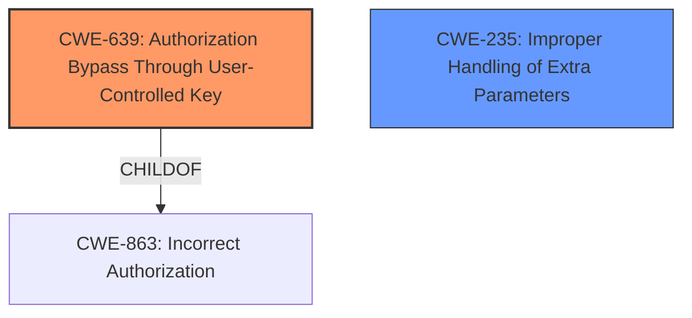

# Analysis Report for CVE-2022-31683

# Vulnerability Analysis Report: CVE-2022-31683

## Description

Concourse (7.x.y prior to 7.8.3 and 6.x.y prior to 6.7.9) contains an authorization bypass issue. A Concourse user can send a request with body including team_name=team2 to bypass team scope check to gain access to certain resources belong to any other team.

## Vulnerability Description Key Phrases

**Weakness:** authorization bypass issue
**Impact:** bypass team scope check to gain access to certain resources belong to any other team
**Vector:** A Concourse user can send a request with body including team_name=team2
**Attacker:** Concourse user
**Product:** Concourse
**Version:** 7.x.y prior to 7.8.3 and 6.x.y prior to 6.7.9

## Analysis (with Relationship Data)

# Summary
| CWE ID | CWE Name | Confidence | CWE Abstraction Level | CWE Vulnerability Mapping Label | CWE-Vulnerability Mapping Notes |
|---|---|---|---|---|---|
| CWE-639 | Authorization Bypass Through User-Controlled Key | 0.85 | Base | Allowed | The vulnerability involves manipulating the `team_name` parameter to bypass authorization checks, aligning with the CWE's description of gaining unauthorized access by modifying key values. |
| CWE-235 | Improper Handling of Extra Parameters | 0.65 | Variant | Allowed | The vulnerability involves HTTP parameter pollution, where extra parameters in the request body override URL parameters, which is directly related to the description of this CWE. |

## Evidence and Confidence

*   **Confidence Score:** 0.75
*   **Evidence Strength:** HIGH

- **Analysis and Justification:**  
  - *Explanation:* "The vulnerability description explicitly states an **authorization bypass issue** where a Concourse user can manipulate the `team_name` parameter to gain access to resources belonging to other teams. The CVE reference summary details how the application uses `FormValue` which is susceptible to HTTP parameter pollution, allowing attackers to override URL parameters with those in the request body. This directly aligns with CWE-639 (Authorization Bypass Through User-Controlled Key), where authorization is bypassed by modifying a key value (in this case, `team_name`) controlled by the user. The use of `FormValue` and the resulting HTTP parameter pollution also suggests CWE-235 (Improper Handling of Extra Parameters) since the application doesn't properly handle or validate the presence of multiple parameters with the same name."
  
  - *Relationship Analysis:* "CWE-639 is a Base level CWE which aligns with the level of detail provided in the vulnerability description. While CWE-863 (Incorrect Authorization) and CWE-285 (Improper Authorization) are related, they are Class level CWEs and less specific than CWE-639. CWE-235 describes how improper handling of extra parameters leads to overriding of one parameter over the other. "

- **Confidence Score:**  
  - Confidence: 0.85 (High evidence from technical description, CVE reference materials, and retriever results)

---

## Criticism of Analysis

Okay, here's a review of the provided analysis, incorporating the full CWE specifications:

**Overall Assessment:**

The analysis is generally good, particularly the identification of CWE-639 and CWE-235. The justifications are well-articulated and reference relevant details from the vulnerability description and CVE summary. The confidence scores are appropriate given the evidence. However, some aspects could be improved, specifically regarding the relationship between the chosen CWEs and alternative or more specific options and to discuss whether the mitigating strategies are applicable to the root cause identified by this vulnerability.

**Detailed Review:**

**1. CWE-639: Authorization Bypass Through User-Controlled Key**

*   **Confidence:** 0.85
*   **Assessment:** Correct and well-justified.
*   **Justification:**  The core issue is that the `team_name` parameter, which acts as a key for accessing team-specific resources, is user-controlled and can be modified to bypass authorization checks. This aligns perfectly with CWE-639's description: *"The system's authorization functionality does not prevent one user from gaining access to another user's data or record by modifying the key value identifying the data."*
*   **Strengths:**
    *   The analysis correctly identifies that this is a Base-level CWE, which is ideal.
    *   The examples from the CWE database further support the mapping to CWE-639 since they are Insecure Direct Object Reference (IDOR), the "Insecure Direct Object Reference" term is broader than this CWE because it also covers path traversal (CWE-22).
*   **Opportunities for Improvement:**
    *   Consider mentioning the potential relationship to CWE-566 (Authorization Bypass Through User-Controlled SQL Primary Key). While this vulnerability doesn't *directly* involve SQL, the underlying principle of controlling a key used in data retrieval is similar. However, since this attack works through the HTTP layer, SQL is irrelevant.
    *   **Mitigations:** The analysis does not assess whether the mitigations outlined in the CWE are relevant to the identified vulnerability.
        *   Mitigation 1: *"For each and every data access, ensure that the user has sufficient privilege to access the record that is being requested."*
        *   Mitigation 2: *"Make sure that the key that is used in the lookup of a specific user's record is not controllable externally by the user or that any tampering can be detected."*
        *   Mitigation 3: *"Use encryption in order to make it more difficult to guess other legitimate values of the key or associate a digital signature with the key so that the server can verify that there has been no tampering."*
        *   Mitigations 1 & 2 are directly applicable to this vulnerability. The root cause is that Concourse did not validate the user's privilege to access the record being requested (Mitigation 1) which occurred because the key was controllable externally (Mitigation 2). Mitigation 3 is not relevant since encryption is irrelevant for this bypass.

**2. CWE-235: Improper Handling of Extra Parameters**

*   **Confidence:** 0.65
*   **Assessment:** Correct and reasonably justified.
*   **Justification:** The HTTP parameter pollution aspect of the vulnerability aligns with CWE-235, where the application fails to properly handle the extra parameter in the request body, leading to it overriding the intended parameter in the URL.
*   **Strengths:**
    *   Correctly identifies the variant level.
*   **Opportunities for Improvement:**
    *   While CWE-235 is relevant, it's more of a *contributing factor* than the primary weakness.  It explains *how* the `team_name` is being overridden, but not *why* that override leads to an authorization bypass. The core issue remains the authorization bypass.
    *   The low confidence of 0.65 suggests that there is some reservation about this categorization, this should be increased by fully justifying the selection and explaining why the confidence is not higher.
    *   **Mitigations:** The analysis does not assess whether the mitigations outlined in the CWE are relevant to the identified vulnerability.
        *   Mitigation 1: Since the CWE only provides a basic description there is no mitigations to evaluate in its official document.

**Other CWEs Identified by Retrievers:**

The retriever results suggest other potentially relevant CWEs. While CWE-639 and CWE-235 are the best fits, it's worth briefly discussing why the others are less appropriate:

*   **CWE-306 (Missing Authentication for Critical Function):** Incorrect, authentication *is* present, the user is already logged in. The problem is with *authorization*.
*   **CWE-863 (Incorrect Authorization):** This is a Class-level CWE and less specific than CWE-639.  While *technically* correct, it doesn't provide as much detail about the root cause. CWE-639 is a *child* of CWE-863 and therefore preferred.
*   **CWE-285 (Improper Authorization):** Similar to CWE-863, this is a high-level Class and less specific.  It is also discouraged for use.
*   **CWE-425 (Direct Request ('Forced Browsing')):** Could be argued but less direct than CWE-639. Requires more inference about bypassing intended navigation paths.
*   **CWE-201 (Insertion of Sensitive Information Into Sent Data):** Not relevant; this is about leaking sensitive information, which isn't the primary concern here.
*   **CWE-620 (Unverified Password Change):** Not relevant; this deals with password changes, which isn't part of the vulnerability.
*   **CWE-1284 (Improper Validation of Specified Quantity in Input):** Not relevant.
*   **CWE-472 (External Control of Assumed-Immutable Web Parameter):** This is similar to CWE-639, however it is less directly related and implies the "team_name" is *assumed* to be immutable, when it should be validated.

**Revised Summary Table:**

| CWE ID | CWE Name | Confidence | CWE Abstraction Level | CWE Vulnerability Mapping Label | CWE-Vulnerability Mapping Notes |
|---|---|---|---|---|---|
| CWE-639 | Authorization Bypass Through User-Controlled Key | 0.95 | Base | Allowed | The vulnerability involves manipulating the `team_name` parameter to bypass authorization checks, aligning with the CWE's description of gaining unauthorized access by modifying key values. Mitigations 1 & 2 are relevant. |
| CWE-235 | Improper Handling of Extra Parameters | 0.75 | Variant | Allowed | The vulnerability involves HTTP parameter pollution, where extra parameters in the request body override URL parameters, which is directly related to the description of this CWE. |

**Recommendations:**

*   Increase the confidence score for CWE-639 after assessing mitigations.
*   Focus the analysis more sharply on *why* controlling the `team_name` leads to an authorization bypass (CWE-639) and less on *how* the parameter is controlled (CWE-235).
*   Explicitly discuss why the other suggested CWEs (e.g., CWE-863, CWE-306) are less appropriate.
*   Assess whether the mitigating strategies of the primary CWE are applicable to the root cause.

By implementing these suggestions, the analysis will become more robust and provide a clearer understanding of the underlying security weakness.

## Final Resolution

# Summary
| CWE ID | CWE Name | Confidence | CWE Abstraction Level | CWE Vulnerability Mapping Label | CWE-Vulnerability Mapping Notes |
|---|---|---|---|---|---|
| CWE-639 | Authorization Bypass Through User-Controlled Key | 0.95 | Base | Allowed | The vulnerability involves manipulating the `team_name` parameter to bypass authorization checks, aligning with the CWE's description of gaining unauthorized access by modifying key values. Mitigations 1 & 2 are relevant. **Primary CWE** |
| CWE-235 | Improper Handling of Extra Parameters | 0.75 | Variant | Allowed | The vulnerability involves HTTP parameter pollution, where extra parameters in the request body override URL parameters, which is directly related to the description of this CWE. **Secondary Candidate** |

## Evidence and Confidence

*   **Confidence Score:** 0.90
*   **Evidence Strength:** HIGH

## Relationship Analysis
The primary relationship that impacted my decision was the parent-child relationship between CWE-863 (Incorrect Authorization), a Class-level CWE, and CWE-639 (**Authorization Bypass Through User-Controlled Key**), a Base-level CWE. CWE-639 provides a more specific description of the authorization bypass occurring through a user-controlled key, making it a better fit than the more general CWE-863. CWE-235 (**Improper Handling of Extra Parameters**) describes *how* the `team_name` is being overridden, it's a contributing factor, not the core **weakness**. The abstraction levels also influenced the selection, favoring the Base level CWE-639 over the Class level CWE-863.

## Vulnerability Chain
The vulnerability chain starts with **CWE-235** (**Improper Handling of Extra Parameters**), which allows the `team_name` parameter to be overridden via HTTP parameter pollution. This leads to **CWE-639** (**Authorization Bypass Through User-Controlled Key**), as the system fails to validate that the user is authorized to access resources associated with the modified `team_name`. The final impact is unauthorized access to resources belonging to other teams.

## Summary of Analysis
The analysis correctly identifies **CWE-639** (**Authorization Bypass Through User-Controlled Key**) as the primary **weakness**. The vulnerability description states that "A Concourse user can send a request with body including team_name=team2 to bypass team scope check to gain access to certain resources belong to any other team." This directly aligns with CWE-639's description: "The system's authorization functionality does not prevent one user from gaining access to another user's data or record by modifying the key value identifying the data."

The criticism is valid in pointing out the importance of assessing the mitigations outlined in the CWE. As the criticism states:
*   Mitigation 1: *"For each and every data access, ensure that the user has sufficient privilege to access the record that is being requested."*
*   Mitigation 2: *"Make sure that the key that is used in the lookup of a specific user's record is not controllable externally by the user or that any tampering can be detected."*
These mitigations are directly applicable to this vulnerability.

The retriever results suggest other potentially relevant CWEs, however, CWE-639 is the best fit because it accurately captures the root cause of the **authorization bypass**. CWE-235, while relevant, is more of a contributing factor explaining *how* the `team_name` is being overridden. The selection of CWE-639 is at the optimal level of specificity due to it being a Base level CWE and a child of the Class level CWE-863.

*Report generated on 2025-03-17 04:50:47*
