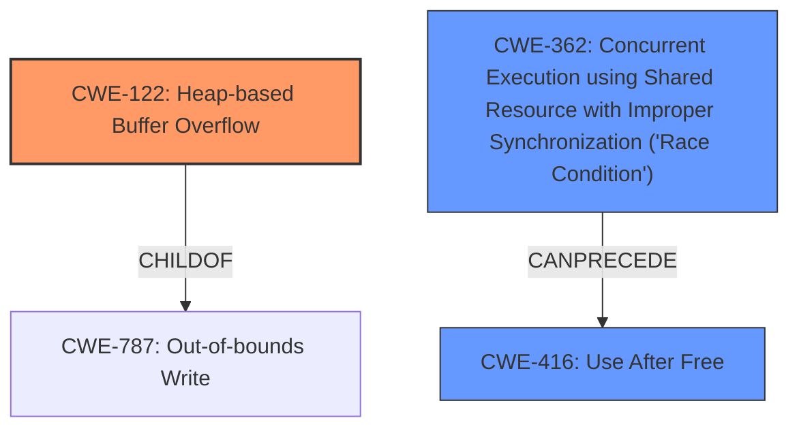

# Analysis Report for CVE-2022-31748

# Vulnerability Analysis Report: CVE-2022-31748

## Description

Mozilla developers Gabriele Svelto, Timothy Nikkel, Randell Jesup, Jon Coppeard, and the Mozilla Fuzzing Team reported memory safety bugs present in Firefox 100. Some of these bugs showed evidence of memory corruption and we presume that with enough effort some of these could have been exploited to run arbitrary code. This vulnerability affects Firefox < 101.

## Vulnerability Description Key Phrases

**Weakness:** memory safety bugs
**Impact:** arbitrary code execution
**Product:** Firefox
**Version:** < 101

## Analysis (with Relationship Data)

# Summary
| CWE ID | CWE Name | Confidence | CWE Abstraction Level | CWE Vulnerability Mapping Label | CWE-Vulnerability Mapping Notes |
|---|---|---|---|---|---|
| CWE-787 | Out-of-bounds Write | 0.75 | Base | Allowed | Primary CWE. Root cause involves writing data past the end of the intended buffer, leading to memory corruption and potential arbitrary code execution. |
| CWE-416 | Use After Free | 0.65 | Variant | Allowed | Secondary CWE. The description mentions use-after-free as one of the memory safety bugs contributing to the vulnerability. |

## Evidence and Confidence

*   **Confidence Score:** 0.70
*   **Evidence Strength:** MEDIUM

- **Analysis and Justification:**  
  - *Explanation:* The vulnerability description highlights "**memory safety bugs**" in Firefox 100, explicitly mentioning "**memory corruption**". The CVE Reference Links Content Summary further details that these bugs include heap-buffer-overflow, use-after-free, data races, and crashes due to incorrect memory access. Given this information, CWE-787 (Out-of-bounds Write) is selected as a primary CWE due to the heap-buffer-overflow which leads to memory corruption. The description suggests that these issues could be exploited to run arbitrary code. While other CWEs like CWE-125 (Out-of-bounds Read) and CWE-416 (Use After Free) are also relevant, CWE-787 directly addresses the **writing** aspect of the buffer overflow (**heap-buffer-overflow**), making it a more precise primary classification. CWE-416 is added as a secondary CWE because the description explicitly mentions **use-after-free**. MITRE mapping guidance indicates that CWE-787 is ALLOWED for this type of vulnerability.

  - *Relationship Analysis:* CWE-787 is a Base level CWE. There are no direct relationships found for CWE-787.

- **Confidence Score:**  
  - *Example:* Confidence: 0.75 (Moderate evidence from technical description and CVE reference materials). The confidence is not higher because there is no specific exploit vector mentioned for CWE-787.

---

## Criticism of Analysis

Okay, let's review the CWE analysis provided for the Firefox 101 memory safety bugs, using the full CWE specifications.

**Overall Assessment:**

The analysis identifies `CWE-787: Out-of-bounds Write` as the primary CWE and `CWE-416: Use After Free` as a secondary CWE. This is a reasonably good starting point, given the information available. However, the analysis could be improved by considering other relevant CWEs and providing more specific justifications based on the nature of "memory safety bugs" and "memory corruption". The confidence level of 0.75 for `CWE-787` is appropriate considering the lack of detailed exploit information.

**Detailed Critique:**

1.  **CWE-787: Out-of-bounds Write (Primary)**

    *   **Justification:** The rationale correctly connects `CWE-787` to the "heap-buffer-overflow" mentioned in the CVE description and its potential for arbitrary code execution. This is solid.
    *   **Confidence:** The confidence score of 0.75 is justifiable due to the explicit mention of "heap-buffer-overflow" but the absence of precise details on the vulnerability's nature or triggers.
    *   **Mapping Guidance:** The analysis correctly notes that the "Usage: Allowed" mapping guidance applies to `CWE-787`.
    *   **Mitigations:** The provided CWE specifications for `CWE-787` suggest mitigations like using memory-safe languages, vetted libraries, and compiler-based overflow detection mechanisms. These are good general recommendations but lack specificity for a browser context.  A more tailored mitigation suggestion might involve using address space layout randomization (ASLR) or data execution prevention (DEP) techniques, which are frequently employed in browsers to mitigate exploitation of buffer overflows.
    *   **Potential Improvements:** While `CWE-787` is a suitable primary CWE, it could be more precise by considering its variants, specifically:
        *   `CWE-122: Heap-based Buffer Overflow` – Since the description specifically mentions a heap buffer overflow, using this Variant would be more accurate than the Base CWE. The use of `CWE-122` would increase specificity and lead to better mitigation recommendations.

2.  **CWE-416: Use After Free (Secondary)**

    *   **Justification:** The rationale accurately identifies `CWE-416` due to the explicit mention of "use-after-free" bugs.
    *   **Confidence:** The confidence score of 0.65 is also justifiable because the analysis is based directly on the vulnerability description.
    *   **Mapping Guidance:** Correctly notes that the "Usage: Allowed" mapping guidance applies.
    *   **Mitigations:** The provided CWE specifications for `CWE-416` include using memory-safe languages and setting freed pointers to `NULL`. In the context of a complex software like Firefox, such mitigations are often difficult to implement perfectly. More sophisticated mitigation strategies like garbage collection or smart pointers, if feasible, could be mentioned.
    *   **Potential Improvements:** Consider also potential root causes leading to `CWE-416` in a concurrent environment, such as `CWE-362: Concurrent Execution using Shared Resource with Improper Synchronization ('Race Condition')`.

3.  **Missing CWE Considerations:**

    *   **CWE-125: Out-of-bounds Read:** The original retriever results include `CWE-125`, and while the primary focus is writing, out-of-bounds reads can also contribute to memory corruption vulnerabilities. If sensitive information is leaked due to an out-of-bounds read, it could aid in exploiting other vulnerabilities.
    *   **CWE-367: Time-of-check Time-of-use (TOCTOU) Race Condition or CWE-362: Concurrent Execution using Shared Resource with Improper Synchronization ('Race Condition'):** Given the mention of "data races", either of these CWEs could be relevant. Data races often lead to memory corruption or use-after-free conditions. It's important to determine if the identified data races could lead to exploitable conditions, and if so, include a race condition CWE.  The generic nature of the vulnerability report makes it difficult to determine the precise race condition involved.
    *   **CWE-843: Access of Resource Using Incompatible Type ('Type Confusion'):** If the memory corruption is caused by accessing a resource using an unexpected type, this CWE could be applicable.
    *   **CWE-124: Buffer Underwrite ('Buffer Underflow'):** Although less common than overflows, buffer underflows can also lead to memory corruption and are worth considering if data is written before the allocated buffer.

4.  **Evidence Strength:**

    *   The "MEDIUM" evidence strength is reasonable given that the analysis relies on a high-level description of the vulnerability and doesn't have access to the source code or detailed exploit analysis.

5.  **General Recommendations:**

    *   **Prioritize Specificity:** When possible, favor more specific CWE variants over base-level CWEs.
    *   **Consider Chains:** Memory safety bugs are often the result of a chain of weaknesses. Try to identify and map the root causes that lead to the memory corruption.
    *   **Tailor Mitigations:** General mitigation strategies should be tailored to the specific context of the vulnerability and the target system (e.g., Firefox browser).
    *   **Increase Confidence with More Information:** If access to exploit details or source code becomes available, re-evaluate the CWE mappings and confidence levels.

**Revised Summary Table (Suggestion):**

| CWE ID  | CWE Name                            | Confidence | CWE Abstraction Level | CWE Vulnerability Mapping Label | CWE-Vulnerability Mapping Notes                                                                                                                                                                                                          |
| :------- | :---------------------------------- | :--------- | :-------------------- | :------------------------------ | :--------------------------------------------------------------------------------------------------------------------------------------------------------------------------------------------------------------------------------------- |
| CWE-122 | Heap-based Buffer Overflow          | 0.75       | Variant               | Allowed                         | Primary CWE. Root cause involves writing data past the end of a heap allocated buffer, leading to memory corruption and potential arbitrary code execution.                                                                                  |
| CWE-416 | Use After Free                      | 0.65       | Variant               | Allowed                         | Secondary CWE. The description mentions use-after-free as one of the memory safety bugs contributing to the vulnerability.                                                                                                               |
| CWE-362 | Concurrent Execution using Shared Resource with Improper Synchronization ('Race Condition')    | 0.40    | Class                | Allowed-with-Review             | Potentially relevant if the Use-After-Free or other memory corruption issues are triggered by concurrent access to shared resources. Requires further investigation to confirm. |

**In summary:**

The original analysis provides a good starting point but can be enhanced by:

*   Using more specific CWE variants (e.g., `CWE-122` instead of `CWE-787` in this case).
*   Considering potential root causes (e.g., race conditions contributing to UAF).
*   Tailoring mitigation suggestions to the browser environment.
*   Increasing confidence levels and evidence strength when more details become available.

## Final Resolution

# Summary
| CWE ID | CWE Name | Confidence | CWE Abstraction Level | CWE Vulnerability Mapping Label | CWE-Vulnerability Mapping Notes |
|---|---|---|---|---|---|
| CWE-122 | Heap-based Buffer Overflow | 0.75 | Variant | Allowed | Primary CWE. Root cause involves writing data past the end of a heap allocated buffer, leading to memory corruption and potential arbitrary code execution. |
| CWE-416 | Use After Free | 0.65 | Variant | Allowed | Secondary CWE. The description mentions use-after-free as one of the memory safety bugs contributing to the vulnerability. |
| CWE-362 | Concurrent Execution using Shared Resource with Improper Synchronization ('Race Condition') | 0.40 | Class | Allowed-with-Review | Potentially relevant if the Use-After-Free or other memory corruption issues are triggered by concurrent access to shared resources. Requires further investigation to confirm. |

## Evidence and Confidence

*   **Confidence Score:** 0.70
*   **Evidence Strength:** MEDIUM

## Relationship Analysis
The analysis focuses on parent-child relationships to achieve greater specificity. `CWE-122` is a variant of a buffer overflow, specifically on the heap, making it a child of more general buffer overflow CWEs. This specificity is crucial for accurate classification. `CWE-362` is considered as a potential preceding cause for `CWE-416`, suggesting a chain relationship where a race condition can lead to a use-after-free vulnerability. The abstraction levels (Variant, Class) are considered to ensure the classification is neither too general nor overly specific.

## Vulnerability Chain
The vulnerability chain potentially starts with a race condition (`CWE-362`), which leads to a use-after-free condition (`CWE-416`). Independently, or potentially in conjunction with the previous chain, a heap-based buffer overflow (`CWE-122`) results in memory corruption, which can be exploited for arbitrary code execution. The description highlights the presence of both heap-buffer-overflow and use-after-free, so the chain is based on these issues. The missing link is more detailed information on how `CWE-362` leads to `CWE-416`, which is not explicitly described.

## Summary of Analysis
The analysis builds upon the initial assessment and incorporates the criticism to provide a more refined classification. The decision to use `CWE-122` (Heap-based Buffer Overflow) as the primary CWE instead of `CWE-787` (Out-of-bounds Write) is based on the explicit mention of "heap-buffer-overflow" in the vulnerability description. This change increases the specificity of the classification and aligns better with the available evidence. The inclusion of `CWE-362` (Concurrent Execution using Shared Resource with Improper Synchronization ('Race Condition')) as a secondary CWE is speculative but plausible, given the mention of "data races". However, the confidence in `CWE-362` remains low due to the lack of specific details. The analysis relies heavily on the provided evidence, particularly the vulnerability description and the CVE reference materials. The graph relationships helped visualize potential chains and dependencies, guiding the selection of relevant CWEs. The final classification reflects a balance between specificity and the level of detail available in the vulnerability description.

*Report generated on 2025-03-18 13:32:23*
