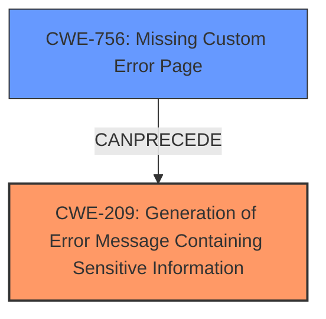

# Final Resolution for CVE-2022-3175

# Summary
| CWE ID | CWE Name | Confidence | CWE Abstraction Level | CWE Vulnerability Mapping Label | CWE-Vulnerability Mapping Notes |
|---|---|---|---|---|---|
| CWE-209 | Generation of Error Message Containing Sensitive Information | 0.95 | Base | Primary | The application's default error page leaks stack trace information, revealing sensitive details. |
| CWE-756 | Missing Custom Error Page | 0.85 | Base | Secondary | The absence of a custom error page causes the default error page to be displayed, which exposes the stack trace. |

## Evidence and Confidence

*   **Confidence Score:** 0.95
*   **Evidence Strength:** HIGH

## Relationship Analysis
The primary relationship impacting the decision is the CANPRECEDE relationship from CWE-756 (Missing Custom Error Page) to CWE-209 (Generation of Error Message Containing Sensitive Information). The absence of a custom error page directly leads to the exposure of sensitive information through the default error page. Both CWEs are at the Base level, providing an appropriate level of specificity.

## Vulnerability Chain
The vulnerability chain starts with the **ROOTCAUSE** being the lack of a custom error page (**CWE-756**). This leads to the application displaying the default error page, which contains sensitive information such as stack traces. The exposure of this information constitutes **CWE-209**, and the ultimate impact is information disclosure, which can be used by attackers to gain further insights into the system and potentially launch more targeted attacks.

## Summary of Analysis
The initial analysis and criticism both correctly identified the primary and secondary CWEs. The vulnerability description states: "Missing Custom Error Page in GitHub repository ikus060/rdiffweb prior to 2.4.2." This directly supports the involvement of **CWE-756** (Missing Custom Error Page) and the resulting display of a default error page containing sensitive information, aligning with **CWE-209** (Generation of Error Message Containing Sensitive Information). The graph relationships confirm that the missing error page can precede the generation of sensitive error messages. The selected CWEs are at the optimal level of specificity because they are both at the Base level and accurately represent the **weakness** and contributing factor. The retriever results provided further support for the selection of CWE-756.