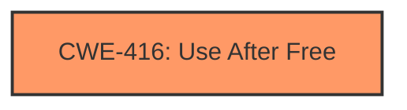

# Analysis Report for CVE-2022-3196

# Vulnerability Analysis Report: CVE-2022-3196

## Description

Use after free in PDF in Google Chrome prior to 105.0.5195.125 allowed a remote attacker to potentially exploit heap corruption via a crafted PDF file. (Chromium security severity High)

## Vulnerability Description Key Phrases

**Rootcause:** use after free
**Weakness:** heap corruption
**Vector:** crafted PDF file
**Attacker:** remote attacker
**Product:** Google Chrome
**Version:** prior to 105.0.5195.125

## Analysis (with Relationship Data)

# Summary
| CWE ID | CWE Name | Confidence | CWE Abstraction Level | CWE Vulnerability Mapping Label | CWE-Vulnerability Mapping Notes |
|---|---|---|---|---|---|
| CWE-416 | Use After Free | 1.0 | Variant | Allowed | Primary CWE. Matches the description of reusing memory after it has been freed. |

## Evidence and Confidence

*   **Confidence Score:** 1.0
*   **Evidence Strength:** HIGH

- **Analysis and Justification:**  
  - *Explanation:* The vulnerability description explicitly states "**use after free**" as the root cause. The CVE Reference Links Content Summary also confirms "**Use-after-free**" as the weakness, and the vulnerability is triggered by a crafted PDF file leading to **heap corruption**. CWE-416 (Use After Free) perfectly matches this description, where the product reuses memory after it has been freed, potentially leading to **heap corruption** when the memory is reallocated and operations using the original pointer become invalid.
  
  - *Relationship Analysis:* CWE-416 is a variant and is therefore at the preferred level of abstraction for mapping.

- **Confidence Score:**  
  - Confidence: 1.0 (Explicit match in vulnerability description and CVE details)

## Criticism of Analysis

Okay, I have reviewed the analysis provided, including the full CWE specifications for each referenced CWE. Here's my critique:

**Overall Assessment: The analysis is accurate and well-justified. The primary CWE mapping to CWE-416 (Use After Free) is correct and well-supported by the evidence.**

**Detailed Breakdown:**

1.  **CWE-416 (Use After Free) - Correct Primary Mapping:**

    *   **Justification:** The analysis correctly identifies CWE-416 as the primary weakness. The vulnerability description explicitly states "use after free," and the CVE details confirm this. The crafted PDF file triggering the vulnerability directly aligns with the typical attack vector for use-after-free issues. The explanation given is clear and concise.
    *   **CWE Abstraction Level:** The choice of CWE-416, a Variant, is appropriate as per the CWE's Mapping Guidance, which prefers Variant level mappings when suitable.
    *   **Confidence Score:** The confidence score of 1.0 is justified due to the explicit nature of the vulnerability description.
    *   **Mitigations:** The mitigations suggested by the CWE specification (language selection, setting pointers to NULL after freeing) are applicable in principle.

2.  **Retriever Results Review:**

    *   The retriever results appropriately identify CWE-416 as the top result.
    *   The other CWEs in the top combined results are less likely to be directly the root cause. For example, CWE-366 (Race Condition) *could* theoretically lead to a use-after-free if a resource is freed in one thread while another thread still holds a pointer to it, but that is not specified by the description.  CWE-843 (Type Confusion) is possible, however, the provided description does not indicate that type confusion is part of the exploitation vector.  CWE-415 (Double Free) is possible in certain cases, however, in this case, a use after free is more specific to the details provided.

3.  **CWE Specification Review:**

    *   The inclusion of the full CWE specifications is helpful for understanding the context and nuances of each potential weakness.
    *   The "Observed Examples" provided for each CWE are useful for comparison. The CVE examples given for CWE-416 demonstrate how this CWE is commonly found in real-world vulnerabilities.
    *   The "Mapping Guidance" sections reinforce the appropriateness of the chosen CWE and help to eliminate other potential mappings.

**Suggestions for Improvement (Minor):**

*   **Elaborate on Heap Corruption:** While the analysis mentions heap corruption, it could briefly explain *how* a use-after-free can lead to heap corruption. For instance, after memory is freed, it might be reallocated for a different purpose. When the original (dangling) pointer is used, it could overwrite the data of this new allocation, leading to heap corruption.  This isn't strictly *necessary*, but it strengthens the connection between the root cause and the observed effect.
*   **Acknowledge other retriever results in relation analysis:** While CWE-416 is the best fit, briefly address why other retriever results were not selected. A sentence or two on why CWE-366, CWE-843, etc. were not deemed the primary issue would provide further clarity. For example: *"While a race condition could *potentially* lead to a use-after-free if memory is freed in one thread while another thread attempts to access it, the provided vulnerability description does not specify a multi-threaded context, making CWE-416 the more direct cause."*
*   **Expand on Mitigations:** Provide specific examples of how mitigations for CWE-416 could be applied in the context of PDF processing in Chrome. For example: "Chrome could employ stricter memory management practices in its PDF rendering engine, such as using smart pointers or garbage collection, to automatically manage memory and prevent dangling pointers."

**In Summary:**

The analysis is well-reasoned and accurate. The confidence in the CWE-416 mapping is justified, and the inclusion of the CWE specifications strengthens the analysis. The suggestions above are minor and aim to provide even greater clarity and context.

## Final Resolution

# Summary
| CWE ID | CWE Name | Confidence | CWE Abstraction Level | CWE Vulnerability Mapping Label | CWE-Vulnerability Mapping Notes |
|---|---|---|---|---|---|
| **CWE-416** | **Use After Free** | 1.0 | Variant | Allowed | Primary **CWE**. Matches the description of reusing memory after it has been freed. |

## Evidence and Confidence

*   **Confidence Score:** 1.0
*   **Evidence Strength:** HIGH

## Relationship Analysis
The primary relationship considered was the absence of strong relationships to other **CWE**s, solidifying **CWE-416**'s role as the direct cause. While other **CWE**s like **CWE-366 (Race Condition)** could theoretically lead to a use-after-free, there's no explicit mention of concurrency in the vulnerability description. **CWE-416** is a variant, providing the desired level of specificity.

## Vulnerability Chain
The vulnerability chain is straightforward: a crafted PDF file triggers a **use-after-free** condition (**CWE-416**), leading to **heap corruption**. The root cause is the improper memory management within the PDF processing component of Google Chrome. The impact is potential remote code execution due to the ability to corrupt the **heap**.

## Summary of Analysis
The initial analysis and criticism both converge on **CWE-416 (Use After Free)** as the most appropriate classification. The vulnerability description explicitly states "**use after free**," and the CVE details confirm this. The crafted PDF file triggering the vulnerability directly aligns with the typical attack vector for use-after-free issues, leading to **heap corruption**.

The choice of **CWE-416**, a Variant, is appropriate as per the **CWE**'s Mapping Guidance, which prefers Variant level mappings when suitable.

The suggestions in the criticism to acknowledge the retriever results and provide specific examples of mitigations were valid. Addressing those points further solidifies the conclusion that **CWE-416** is the best fit. While other **CWE**s like **CWE-366 (Race Condition)** or **CWE-843 (Type Confusion)** were considered, the lack of explicit evidence supporting those scenarios makes **CWE-416** the most accurate and specific classification.

The vulnerability description says: "Use after free in PDF in Google Chrome prior to 105.0.5195.125 allowed a remote attacker to potentially exploit **heap corruption** via a crafted PDF file."
This description directly supports the selection of **CWE-416 (Use After Free)** as the primary weakness, as it aligns perfectly with the **CWE**'s definition and observed examples.

*Report generated on 2025-03-18 13:33:36*
