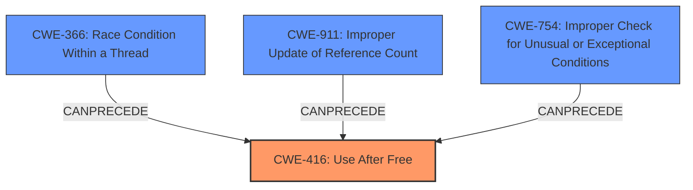

# Analysis Report for CVE-2022-3197

# Vulnerability Analysis Report: CVE-2022-3197

## Description

Use after free in PDF in Google Chrome prior to 105.0.5195.125 allowed a remote attacker to potentially exploit heap corruption via a crafted PDF file. (Chromium security severity High)

## Vulnerability Description Key Phrases

**Rootcause:** use after free
**Impact:** heap corruption
**Vector:** crafted PDF file
**Attacker:** remote attacker
**Product:** Google Chrome
**Version:** prior to 105.0.5195.125
**Component:** PDF

## Analysis (with Relationship Data)

# Summary
| CWE ID | CWE Name | Confidence | CWE Abstraction Level | CWE Vulnerability Mapping Label | CWE-Vulnerability Mapping Notes |
|---|---|---|---|---|---|
| CWE-416 | Use After Free | 1.0 | Variant | Allowed | This CWE entry is at the Variant level of abstraction, which is a preferred level of abstraction for mapping to the root causes of vulnerabilities. |

## Evidence and Confidence

*   **Confidence Score:** 1.0
*   **Evidence Strength:** HIGH

- **Analysis and Justification:**  
  - *Explanation:* The vulnerability description clearly states "**use after free** in PDF". The **root cause** is a **use after free** vulnerability, which directly maps to CWE-416 (Use After Free). The CVE Reference Links Content Summary confirms this by stating: "Root cause of vulnerability: Use after free in PDF" and "Weaknesses/vulnerabilities: ['Use after free']". The impact is heap corruption, which is a typical consequence of a use-after-free condition. The retriever results also strongly suggest CWE-416 as the primary candidate. The MITRE mapping guidance for CWE-416 states that its usage is "Allowed" and the rationale is that "This CWE entry is at the Variant level of abstraction, which is a preferred level of abstraction for mapping to the root causes of vulnerabilities."

  - *Relationship Analysis:* There are no direct relationships found for CWE-416 in the provided information. However, use-after-free vulnerabilities often lead to exploitable conditions like remote code execution.

- **Confidence Score:**  
  - Confidence: 1.0 (High confidence due to explicit mention of "use after free" and confirmation in the CVE reference links)

## Criticism of Analysis

Okay, I've reviewed the analysis with the provided full CWE specifications. Here's my critique:

**Overall Assessment:**

The analysis is very strong and well-justified. The mapping to CWE-416 (Use After Free) is accurate and supported by the provided evidence. The confidence level of 1.0 is appropriate. The explanations are clear, and the inclusion of example CVEs and relevant CWE specifications further strengthens the analysis.

**Specific Points:**

*   **CWE-416 Mapping:** The choice of CWE-416 is correct. The vulnerability description explicitly mentions "use after free," and the CVE reference summary confirms this. The analysis correctly notes that CWE-416 is at the Variant level of abstraction, which is preferred.
*   **Evidence and Confidence:** The reasoning for the high confidence score is sound. The direct mention of "use after free" combined with the external confirmation from the CVE reference provides a strong basis for the assignment.
*   **Retriever Results:** The Retriever results show that CWE-416 is highly ranked. The analysis mentions the top combined result.
*   **Relationships:** The analysis correctly acknowledges the lack of direct relationships *found in the provided information*. This is important because, while CWE-416 itself doesn't have a direct parent-child relationship to exploitation like RCE, the *exploitation* of a UAF often *leads* to RCE. The analysis is careful to distinguish between the CWE relationship and the exploitation outcome.
*   **CWE Examples:** The listed CVE examples for CWE-416 are relevant and helpful in illustrating the nature of the vulnerability.
*   **Mitigations:** While not explicitly stated in the analysis, it's good to keep in mind the mitigations suggested by CWE-416. These include:
    *   Using languages with automatic memory management (e.g., Java, Go, Python).
    *   Setting pointers to NULL after freeing them (although the analysis correctly points out the limitations of this approach with complex data structures).

*   **Top Combined Results Critique:** The top combined results provide a wider view of what other CWEs could relate to, though CWE-416 is still the most likely.
    *   **CWE-366 (Race Condition within a Thread):** While not the primary cause, it's possible a race condition could lead to a use-after-free. If multiple threads are involved in the object's lifecycle (allocation, usage, deallocation), a race condition could cause one thread to free the memory while another thread is still using it. This is especially relevant in PDF processing which can often involve multiple threads or processes for rendering and parsing. This is also cited in the observed example of CWE-2022-2621 which is a chain of CWE-366 leading to CWE-416.
    *   **CWE-415 (Double Free):**  Double free is related to use-after-free, but they are distinct. A double free can *lead* to memory corruption that can be exploited through use-after-free. However, the initial vulnerability is the incorrect double free, not the subsequent use. The vulnerability report clearly states "use-after-free" and not "double free" so CWE-416 is more appropriate.
    *   **CWE-843 (Access of Resource Using Incompatible Type ('Type Confusion')):** In some UAF scenarios, the memory might be reallocated to a different type.  Accessing the freed memory using the original (now incorrect) type could lead to type confusion. This is less likely in a straightforward UAF, but possible.
    *   **CWE-911 (Improper Update of Reference Count):** Improper reference counting can cause a resource to be prematurely freed, which results in use-after-free condition. This is more of a potential root cause for CWE-416 and is less likely given the available information.
    *   **CWE-356 (Product UI does not Warn User of Unsafe Actions):** Irrelevant in this case.
    *   **CWE-122 (Heap-based Buffer Overflow):** A heap-based buffer overflow can trigger memory corruption, which can later lead to use-after-free conditions. This is less likely based on the vulnerability report.
    *   **CWE-787 (Out-of-bounds Write):** Similar to CWE-122, an out-of-bounds write could corrupt memory structures leading to a UAF.
    *   **CWE-367 (Time-of-check Time-of-use (TOCTOU) Race Condition):** A TOCTOU race condition could occur if the code checks if a resource is valid before using it, but the resource is freed by another thread between the check and the use.
    *   **CWE-125 (Out-of-bounds Read):** Is not related because the root cause is `use after free` not `out-of-bounds read`.

**Suggestions for Improvement (Minor):**

*   **Chain Analysis (Optional):** While the primary mapping is correct, a brief discussion of potential *chains* could be added. For example: "While the primary vulnerability is CWE-416, it's possible that a preceding condition, such as CWE-366 (Race Condition) or CWE-911 (Improper Update of Reference Count) contributed to the UAF."  This would add depth to the analysis, although it's not strictly necessary.
*   **Mitigation Emphasis:** While not part of the core CWE assignment, a brief mention of the CWE-416 mitigations might be helpful in providing a more complete picture.  Something like, "Potential mitigations include using memory-safe languages or ensuring proper pointer management with nullification after freeing."

**Conclusion:**

The analysis is excellent. The CWE-416 mapping is accurate and well-supported. The analysis is thorough, clear, and demonstrates a good understanding of the vulnerability and its relationship to the CWE framework. The suggested improvements are minor and intended only to add further depth to an already strong analysis.

## Final Resolution

# Summary
| CWE ID | CWE Name | Confidence | CWE Abstraction Level | CWE Vulnerability Mapping Label | CWE-Vulnerability Mapping Notes |
|---|---|---|---|---|---|
| CWE-416 | Use After Free | 1.0 | Variant | Allowed | This CWE entry is at the Variant level of abstraction, which is a preferred level of abstraction for mapping to the root causes of vulnerabilities. |

## Evidence and Confidence

*   **Confidence Score:** 1.0
*   **Evidence Strength:** HIGH

## Relationship Analysis
The primary relationship to consider is the potential for other CWEs to *lead* to CWE-416. While CWE-416 itself doesn't have strong parent-child relationships that directly influence its selection, its placement in a vulnerability chain is important. Several CWEs like race conditions (**CWE-366**) or improper reference counting (**CWE-911**) can create the conditions necessary for a use-after-free vulnerability to occur. These can be potential secondary CWEs if the evidence supported it, but in this case the vulnerability description directly states "**use after free**". The base CWE of **CWE-754** could also lead to **CWE-416**, where exceptional conditions not checked properly could lead to memory corruption and eventually use after free.

## Vulnerability Chain
The chain of events is as follows: A crafted PDF file is processed by Google Chrome. Due to an error in memory management, a memory location is freed while still being referenced. Subsequent access to this freed memory results in a **use-after-free** condition (**CWE-416**). This heap corruption can then be exploited by an attacker.

## Summary of Analysis
The initial analysis is accurate and well-justified. The direct mention of "**use after free**" in the vulnerability description and the CVE reference summary provides strong evidence for classifying this vulnerability as **CWE-416 (Use After Free)**.

The retriever results and the criticism helps to evaluate other potential CWEs that could have led to the **ROOTCAUSE**, but the clear description of **WEAKNESS** as "**use after free**" makes **CWE-416** the most appropriate choice. The classification reflects the optimal level of specificity because **CWE-416** is a Variant-level CWE, which is preferred for root cause analysis.

*Report generated on 2025-03-18 13:34:17*
