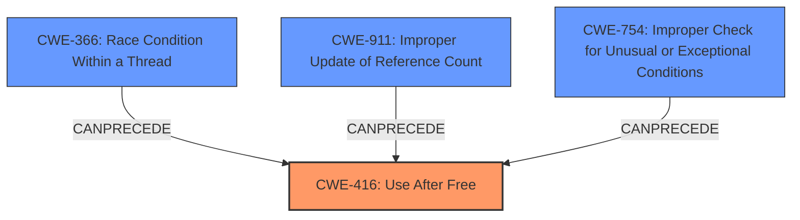

# Final Resolution for CVE-2022-3197

# Summary
| CWE ID | CWE Name | Confidence | CWE Abstraction Level | CWE Vulnerability Mapping Label | CWE-Vulnerability Mapping Notes |
|---|---|---|---|---|---|
| CWE-416 | Use After Free | 1.0 | Variant | Allowed | This CWE entry is at the Variant level of abstraction, which is a preferred level of abstraction for mapping to the root causes of vulnerabilities. |

## Evidence and Confidence

*   **Confidence Score:** 1.0
*   **Evidence Strength:** HIGH

## Relationship Analysis
The primary relationship to consider is the potential for other CWEs to *lead* to CWE-416. While CWE-416 itself doesn't have strong parent-child relationships that directly influence its selection, its placement in a vulnerability chain is important. Several CWEs like race conditions (**CWE-366**) or improper reference counting (**CWE-911**) can create the conditions necessary for a use-after-free vulnerability to occur. These can be potential secondary CWEs if the evidence supported it, but in this case the vulnerability description directly states "**use after free**". The base CWE of **CWE-754** could also lead to **CWE-416**, where exceptional conditions not checked properly could lead to memory corruption and eventually use after free.

## Vulnerability Chain
The chain of events is as follows: A crafted PDF file is processed by Google Chrome. Due to an error in memory management, a memory location is freed while still being referenced. Subsequent access to this freed memory results in a **use-after-free** condition (**CWE-416**). This heap corruption can then be exploited by an attacker.

## Summary of Analysis
The initial analysis is accurate and well-justified. The direct mention of "**use after free**" in the vulnerability description and the CVE reference summary provides strong evidence for classifying this vulnerability as **CWE-416 (Use After Free)**.

The retriever results and the criticism helps to evaluate other potential CWEs that could have led to the **ROOTCAUSE**, but the clear description of **WEAKNESS** as "**use after free**" makes **CWE-416** the most appropriate choice. The classification reflects the optimal level of specificity because **CWE-416** is a Variant-level CWE, which is preferred for root cause analysis.