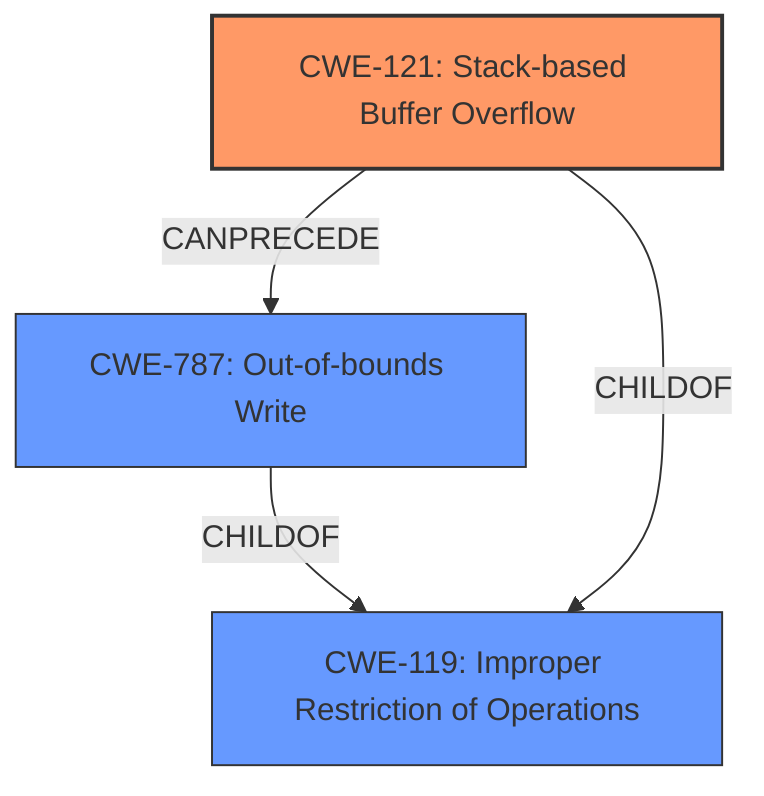

# Analysis Report for CVE-2022-32030

# Vulnerability Analysis Report: CVE-2022-32030

## Description

Tenda AX1806 v1.0.0.1 was discovered to contain a stack overflow via the list parameter in the function formSetQosBand.

## Vulnerability Description Key Phrases

**Weakness:** stack overflow
**Product:** Tenda AX1806
**Version:** v1.0.0.1
**Component:** formSetQosBand function

## Analysis (with Relationship Data)

# Summary
| CWE ID | CWE Name | Confidence | CWE Abstraction Level | CWE Vulnerability Mapping Label | CWE-Vulnerability Mapping Notes |
|---|---|---|---|---|---|
| CWE-121 | Stack-based Buffer Overflow | 0.95 | Variant | Allowed | Root cause of the vulnerability is a stack buffer overflow due to uncontrolled input size. |
| CWE-787 | Out-of-bounds Write | 0.75 | Base | Allowed | The overflow leads to writing beyond the allocated buffer on the stack. |

## Evidence and Confidence

*   **Confidence Score:** 0.90
*   **Evidence Strength:** HIGH

- **Analysis and Justification:**  
  - *Explanation:* "The vulnerability description clearly states a **stack overflow** via the list parameter in the `formSetQosBand` function. The CVE Reference Links Content Summary confirms that the `formSetQosBand` function in `tdhttpd` is vulnerable to a **stack buffer overflow** when processing the `list` parameter from user-supplied input. Sending a large string causes a crash, indicating a buffer overflow on the stack. CWE-121 (Stack-based Buffer Overflow) directly matches this scenario. The MITRE mapping guidance allows CWE-121 for this case."
  
  - *Relationship Analysis:* "CWE-121 is a variant of CWE-119 (Improper Restriction of Operations within the Bounds of a Memory Buffer), focusing specifically on stack-based overflows. The description doesn't provide enough information to pinpoint other contributing factors, but the primary issue is clearly a buffer overflow on the stack due to uncontrolled input. CWE-787 (Out-of-bounds Write) is a related weakness, as the stack overflow leads to writing beyond the allocated buffer."

- **Confidence Score:**  
  - Confidence: 0.95 (Strong evidence from the vulnerability description and CVE details)

---
- **Analysis and Justification:**  
  - *Explanation:* "CWE-787 (Out-of-bounds Write) is a secondary candidate. While the primary weakness is the stack overflow itself (CWE-121), the consequence of the overflow is that data is written beyond the boundaries of the allocated buffer. CWE-787 accurately describes this out-of-bounds write condition. The description states that sending a large string of 'A' characters causes a crash, which implies an attempt to write beyond the allocated buffer on the stack."
  
  - *Relationship Analysis:* "CWE-787 is a child of CWE-119, similar to CWE-121. It represents the actual action of writing beyond the intended buffer. While CWE-121 describes the specific type of buffer overflow (stack-based), CWE-787 focuses on the writing aspect of the vulnerability. Given that CWE-121 is a more specific root cause, it is preferred as the primary CWE."

- **Confidence Score:**  
  - Confidence: 0.75 (Supporting evidence from the vulnerability description)
---

## Criticism of Analysis

Okay, I've reviewed your analysis against the provided full CWE specifications. Here's a critique focusing on the accuracy, completeness, and justification of your CWE mappings, as well as suggestions for improvement:

**Overall Assessment:**

Your analysis is generally good, and your primary mapping to CWE-121 (Stack-based Buffer Overflow) is correct and well-justified. The inclusion of CWE-787 (Out-of-bounds Write) as a secondary CWE is also reasonable, although its confidence score could be adjusted. Here's a breakdown of each CWE mapping:

**1. CWE-121: Stack-based Buffer Overflow**

*   **Confidence:** 0.95 - Correct.
*   **Justification Strength:** Excellent. You correctly identify that the vulnerability description explicitly mentions a "stack overflow" in the `formSetQosBand` function and that a large input string causes a crash. The PoC confirms this.
*   **Abstraction Level:** Correct (Variant).
*   **CWE-Vulnerability Mapping Label:** Correct (Allowed).
*   **CWE-Vulnerability Mapping Notes:** Appropriate. The explanation is clear and accurately reflects the root cause.
*   **Critique and Suggestions:** None. This is a strong mapping.
*   **Mitigations:** The mitigations provided in the CWE specification are relevant. Using compiler-based overflow detection mechanisms (e.g., /GS flag in Visual Studio) and performing bounds checking on input would be effective in preventing this vulnerability.

**2. CWE-787: Out-of-bounds Write**

*   **Confidence:** 0.75 - Appropriate, but consider lowering slightly.
*   **Justification Strength:** Good. You correctly point out that a consequence of the stack overflow (CWE-121) is that data is written beyond the allocated buffer, which is described by CWE-787.
*   **Abstraction Level:** Correct (Base).
*   **CWE-Vulnerability Mapping Label:** Correct (Allowed).
*   **CWE-Vulnerability Mapping Notes:** The notes are generally good, but it is worth considering that CWE-787 is a *consequence* of the primary root cause (CWE-121).
*   **Critique and Suggestions:** Consider lowering the confidence slightly, maybe to 0.70, because CWE-787 is more descriptive of the *effect* of the overflow rather than the *root cause*. Since CWE-121 describes the specific buffer overflow on the stack, it takes precedence.  The relationship is well explained by saying CWE-121 is the preferred *primary* CWE.
*   **Mitigations:** The listed mitigations are applicable, but the focus should be on preventing the *overflow* in the first place (CWE-121 mitigations).

**Additional Considerations and Potential Improvements:**

*   **CWE-119 (Improper Restriction of Operations within the Bounds of a Memory Buffer):** The provided CWE specifications rightly say to avoid this CWE. The specifications state, "Look at CWE-119's children and consider mapping to CWEs such as CWE-787: Out-of-bounds Write, CWE-125: Out-of-bounds Read, or others. "
*   **Input Validation (Potential but Unlikely):** While a buffer overflow is the core issue, there might be a *lack of input validation* that allows the overly-long string to be passed to the vulnerable function in the first place. If there is *no* input validation whatsoever, then CWE-20 (Improper Input Validation) or a more specific child of CWE-20 (as suggested by the specifications, like CWE-1284: Specified Quantity) *could* be considered as a *contributing factor* in a chain. However, *only* include CWE-20 (or its children) if there is absolutely *no* input validation; it is likely that some level of input validation might be in place, but it isn't sufficient. Because this is related to the router's Web interface, a better CWE may be CWE-116: Improper Encoding or Escaping of Output because proper encoding could allow the input to be safely recorded in a database or similar.

**Revised Analysis Table (with Suggested Changes):**

| CWE ID | CWE Name | Confidence | CWE Abstraction Level | CWE Vulnerability Mapping Label | CWE-Vulnerability Mapping Notes |
|---|---|---|---|---|---|
| CWE-121 | Stack-based Buffer Overflow | 0.95 | Variant | Allowed | Root cause of the vulnerability is a stack buffer overflow due to uncontrolled input size. |
| CWE-787 | Out-of-bounds Write | 0.70 | Base | Allowed | The overflow leads to writing beyond the allocated buffer on the stack. This is a consequence of the stack overflow (CWE-121). |

**Summary of Recommendations:**

*   Your primary mapping to CWE-121 is excellent. No changes needed.
*   Lower the confidence score for CWE-787 slightly to reflect its role as a consequence rather than the primary root cause.
*   *Avoid* using CWE-119 as it is discouraged when more specific mappings are possible.
*   Consider adding CWE-20 (or a more specific child like CWE-1284 or CWE-116) *only* if there is evidence that absolutely *no* input validation is performed *at all* on the `list` parameter before it reaches the vulnerable function.
*   When describing potential mitigations, emphasize the importance of preventing the *overflow* (CWE-121) as the primary goal.

By incorporating these suggestions, your analysis will be even more precise and better aligned with the CWE specifications and mapping guidance.

## Final Resolution

# Summary

| CWE ID | CWE Name | Confidence | CWE Abstraction Level | CWE Vulnerability Mapping Label | CWE-Vulnerability Mapping Notes |
|---|---|---|---|---|---|
| CWE-121 | Stack-based Buffer Overflow | 0.95 | Variant | Allowed | Primary CWE. Root cause of the vulnerability is a stack buffer overflow due to uncontrolled input size. |
| CWE-787 | Out-of-bounds Write | 0.70 | Base | Allowed | Secondary CWE. The overflow leads to writing beyond the allocated buffer on the stack. This is a consequence of the stack overflow (CWE-121). |

## Evidence and Confidence

*   **Confidence Score:** 0.92
*   **Evidence Strength:** HIGH

## Relationship Analysis
The primary relationship that impacted the decision was the parent-child relationship between CWE-119 (Improper Restriction of Operations within the Bounds of a Memory Buffer) and its variants, CWE-121 (Stack-based Buffer Overflow) and CWE-787 (Out-of-bounds Write). CWE-121 is a variant that specifically describes a stack-based buffer overflow, making it a more precise classification than the more general CWE-119. CWE-787, also a child of CWE-119, describes the out-of-bounds write that results from the overflow. The decision was made to classify CWE-121 as primary because it more accurately captures the root cause, while CWE-787 is a secondary effect. The abstraction levels (Variant for CWE-121 and Base for CWE-787) further support this decision, as Variant is generally preferred when it accurately describes the vulnerability.

## Vulnerability Chain
The vulnerability chain starts with the lack of proper input size control, leading to a **stack overflow** (**CWE-121**). The consequence of this overflow is an **out-of-bounds write** (**CWE-787**), where data is written beyond the allocated buffer on the stack, potentially overwriting adjacent data or code and leading to a crash or other exploitable behavior.

## Summary of Analysis
The initial analysis and criticism both correctly identified CWE-121 (Stack-based Buffer Overflow) as the primary **weakness**. The vulnerability description explicitly states a **stack overflow** via the `list` parameter in the `formSetQosBand` function, and the CVE details confirm a **stack buffer overflow** when processing the `list` parameter. This direct evidence supports the selection of CWE-121.

The criticism suggested lowering the confidence score for CWE-787, which I have done (from 0.75 to 0.70), as it is more descriptive of the *effect* of the overflow rather than the *root cause**.
The graph relationships influenced the final selection by highlighting the specificity of CWE-121 as a Variant of CWE-119, making it a more appropriate choice than the broader Class. The chain relationship, where CWE-121 CanPrecede CWE-787, further solidified this decision. The selected CWEs are at the optimal level of specificity because CWE-121 accurately describes the type of buffer overflow (stack-based), and CWE-787 describes the consequence (out-of-bounds write).

*Report generated on 2025-03-18 13:36:35*
