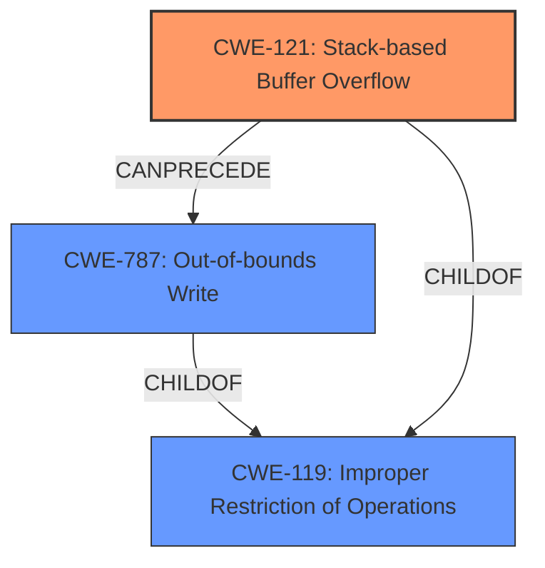

# Final Resolution for CVE-2022-32030

# Summary

| CWE ID | CWE Name | Confidence | CWE Abstraction Level | CWE Vulnerability Mapping Label | CWE-Vulnerability Mapping Notes |
|---|---|---|---|---|---|
| CWE-121 | Stack-based Buffer Overflow | 0.95 | Variant | Allowed | Primary CWE. Root cause of the vulnerability is a stack buffer overflow due to uncontrolled input size. |
| CWE-787 | Out-of-bounds Write | 0.70 | Base | Allowed | Secondary CWE. The overflow leads to writing beyond the allocated buffer on the stack. This is a consequence of the stack overflow (CWE-121). |

## Evidence and Confidence

*   **Confidence Score:** 0.92
*   **Evidence Strength:** HIGH

## Relationship Analysis
The primary relationship that impacted the decision was the parent-child relationship between CWE-119 (Improper Restriction of Operations within the Bounds of a Memory Buffer) and its variants, CWE-121 (Stack-based Buffer Overflow) and CWE-787 (Out-of-bounds Write). CWE-121 is a variant that specifically describes a stack-based buffer overflow, making it a more precise classification than the more general CWE-119. CWE-787, also a child of CWE-119, describes the out-of-bounds write that results from the overflow. The decision was made to classify CWE-121 as primary because it more accurately captures the root cause, while CWE-787 is a secondary effect. The abstraction levels (Variant for CWE-121 and Base for CWE-787) further support this decision, as Variant is generally preferred when it accurately describes the vulnerability.

## Vulnerability Chain
The vulnerability chain starts with the lack of proper input size control, leading to a **stack overflow** (**CWE-121**). The consequence of this overflow is an **out-of-bounds write** (**CWE-787**), where data is written beyond the allocated buffer on the stack, potentially overwriting adjacent data or code and leading to a crash or other exploitable behavior.

## Summary of Analysis
The initial analysis and criticism both correctly identified CWE-121 (Stack-based Buffer Overflow) as the primary **weakness**. The vulnerability description explicitly states a **stack overflow** via the `list` parameter in the `formSetQosBand` function, and the CVE details confirm a **stack buffer overflow** when processing the `list` parameter. This direct evidence supports the selection of CWE-121.

The criticism suggested lowering the confidence score for CWE-787, which I have done (from 0.75 to 0.70), as it is more descriptive of the *effect* of the overflow rather than the *root cause**.
The graph relationships influenced the final selection by highlighting the specificity of CWE-121 as a Variant of CWE-119, making it a more appropriate choice than the broader Class. The chain relationship, where CWE-121 CanPrecede CWE-787, further solidified this decision. The selected CWEs are at the optimal level of specificity because CWE-121 accurately describes the type of buffer overflow (stack-based), and CWE-787 describes the consequence (out-of-bounds write).