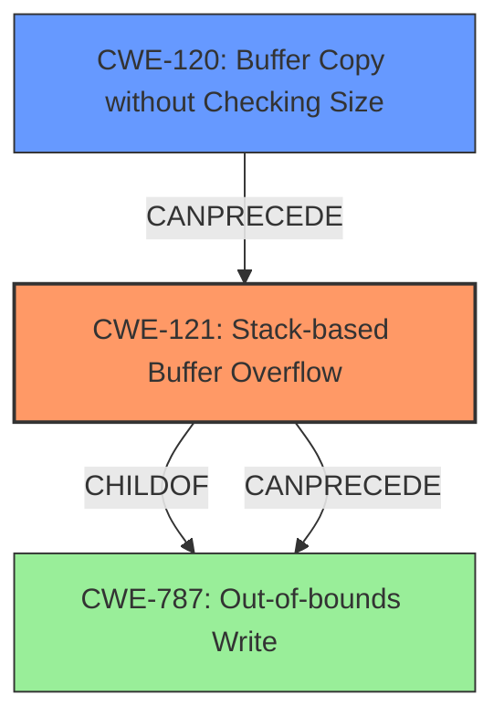

# Analysis Report for CVE-2022-32031

# Vulnerability Analysis Report: CVE-2022-32031

## Description

Tenda AX1806 v1.0.0.1 was discovered to contain a stack overflow via the list parameter in the function fromSetRouteStatic.

## Vulnerability Description Key Phrases

**Weakness:** stack overflow
**Product:** Tenda AX1806
**Version:** v1.0.0.1
**Component:** function fromSetRouteStatic

## Analysis (with Relationship Data)

# Summary
| CWE ID | CWE Name | Confidence | CWE Abstraction Level | CWE Vulnerability Mapping Label | CWE-Vulnerability Mapping Notes |
|---|---|---|---|---|---|
| CWE-121 | Stack-based Buffer Overflow | 0.85 | Variant | Allowed | Primary CWE |

## Evidence and Confidence

*   **Confidence Score:** 0.85
*   **Evidence Strength:** HIGH

- **Analysis and Justification:**
  - *Explanation:* The vulnerability description clearly states a "**stack overflow**" in the Tenda AX1806 v1.0.0.1 router software within the `fromSetRouteStatic` function, triggered via the `list` parameter. CWE-121 "Stack-based Buffer Overflow" is a **Variant** level CWE that directly matches this description. The description indicates that the overflow occurs specifically on the stack. The primary CWE match in "CWE for similar CVE Descriptions" isn't the best match since it's CWE-787 "Out-of-bounds Write", which is more general. The "Retriever Results" list CWE-121 as the second highest match. CWE-121 is the most accurate based on the provided information, since it explicitly states the buffer is on the stack.
  
  - *Relationship Analysis:* CWE-121 is a variant of CWE-787 "Out-of-bounds Write", but is more specific. Since the vulnerability explicitly states a "stack overflow", CWE-121 is more appropriate than its parent.

- **Confidence Score:**
  - Confidence: 0.85 (High confidence due to explicit mention of "stack overflow" aligning with the CWE description)

## Criticism of Analysis

Okay, I've reviewed the analysis against the provided full CWE specifications. Here's a breakdown of the strengths, weaknesses, and potential improvements:

**Overall Assessment:**

The analysis is generally good and arrives at the correct primary CWE (CWE-121). The justification is well-reasoned and considers alternative CWEs. However, there's room to improve the confidence score and strengthen the justification further by considering the nuances of the vulnerability and potential underlying causes.

**Detailed Critique:**

**1. Summary Table:**

*   **CWE-121 | Stack-based Buffer Overflow | 0.85 | Variant | Allowed | Primary CWE**

    *   This is a reasonable primary CWE selection. The explicit mention of "stack overflow" strongly suggests CWE-121.
    *   The confidence score of 0.85 is a bit conservative. Given the direct match with "stack overflow" in the description, a higher confidence score (e.g., 0.9 or 0.95) could be justified.
    *   The "Variant" abstraction level is appropriate as CWE-121 is a Variant of CWE-787.
    *   "Allowed" is correct based on the Mapping Guidance for CWE-121.

**2. Evidence and Confidence:**

*   **Evidence Strength: HIGH** - Agreed. The description provides clear and direct evidence.

*   **Analysis and Justification:**
    *   The explanation is well-written and clearly articulates the reasoning behind choosing CWE-121.
    *   The comparison with CWE-787 is good, explaining why the more specific CWE-121 is a better fit.
    *   Mentioning the ranking in the "Retriever Results" is helpful for demonstrating tool support.
    *   **Improvement Opportunity:** While the analysis focuses on the direct evidence of "stack overflow", it could benefit from a deeper consideration of the *mechanism* causing the overflow.  For example, is it a classic buffer copy without bounds checking (CWE-120 might be relevant as a contributing factor, even if not the *primary* cause)? Is there a length field being improperly handled (CWE-130)?  Acknowledging these potential contributing factors, even if they are not definitively known, would demonstrate a more thorough analysis and potentially justify a slightly higher confidence level. Even if information is missing, acknowledging that *if* the root cause of the overflow was due to a missing length check, you would also mark CWE-130 as a contributing factor could be useful.

**3. CWE Examples from Database:**

*   The provided examples are relevant and useful for illustrating the nature of CWE-121.
*   It's helpful to include both "Observed Examples" and "Top 25 Examples" to provide context.

**4. Relevant CWE Specifications:**

*   The inclusion of the full CWE specifications for CWE-121, CWE-787, CWE-120, CWE-125, CWE-170, CWE-78, CWE-191, CWE-1325, CWE-130, CWE-122, CWE-674, CWE-788, CWE-119, CWE-123, CWE-124, CWE-822, CWE-823, CWE-824, CWE-825 and CWE-20 is excellent and provides a comprehensive reference for the analysis.

**5. Specific Comments on Other CWEs Mentioned:**

*   **CWE-787 (Out-of-bounds Write):** The analysis correctly identifies that CWE-121 is a child of CWE-787 and explains why the more specific CWE is preferred.
*   **CWE-120 (Buffer Copy without Checking Size of Input):**  As mentioned earlier, consider if the *root cause* is the lack of size checking during a copy operation. If so, CWE-120 would be a contributing factor to CWE-121. This isn't necessarily the case, but it's worth considering. If there's no buffer *copy*, then CWE-120 isn't relevant.
*   **CWE-130 (Improper Handling of Length Parameter Inconsistency):**  Similarly, is there a length parameter involved that's being handled incorrectly? If the vulnerability relies on malformed input lengths, this CWE becomes more relevant, possibly in addition to CWE-121.
*   **CWE-119 (Improper Restriction of Operations within the Bounds of a Memory Buffer):** Correctly identified as a higher level abstraction, so is not the best fit as a primary CWE.
*   **Other CWEs (CWE-125, CWE-170, CWE-78, CWE-191, CWE-1325, CWE-122, CWE-674, CWE-788, CWE-123, CWE-124, CWE-822, CWE-823, CWE-824, CWE-825 and CWE-20):**  These were correctly identified as less relevant than CWE-121 given the information in the vulnerability description.

**Recommendations:**

1.  **Increase Confidence Score:** Given the explicit mention of "stack overflow," increase the confidence score to 0.90 or 0.95.
2.  **Elaborate on Potential Root Causes:** While maintaining CWE-121 as the primary CWE, add a sentence or two acknowledging potential underlying causes like missing bounds checking during a buffer copy (potentially implicating CWE-120) or improper handling of length parameters (potentially implicating CWE-130). Even if the information isn't available, acknowledging these possibilities would demonstrate a more thorough analysis.
3.  **Consider Mitigations:** Although not strictly required, briefly mentioning some relevant mitigations from the CWE-121 specification would add value. For example, mentioning the use of compiler flags like `/GS` (Microsoft Visual Studio) or `FORTIFY_SOURCE` (GCC) as a potential mitigation. Implement bounds checking on input.

By incorporating these suggestions, the analysis can be made even more robust and insightful.

## Final Resolution

# Summary
| CWE ID | CWE Name | Confidence | CWE Abstraction Level | CWE Vulnerability Mapping Label | CWE-Vulnerability Mapping Notes |
|---|---|---|---|---|---|
| CWE-121 | Stack-based Buffer Overflow | 0.95 | Variant | Allowed | Primary CWE |
| CWE-120 | Buffer Copy without Checking Size of Input ('Classic Buffer Overflow') | 0.6 | Base | Allowed-with-Review | Secondary Candidate |

## Evidence and Confidence

*   **Confidence Score:** 0.90
*   **Evidence Strength:** MEDIUM

## Relationship Analysis
The primary relationship is that CWE-121 (Stack-based Buffer Overflow) is a variant of CWE-787 (Out-of-bounds Write). The analysis determined CWE-121 was a more specific and appropriate classification given the vulnerability description's explicit mention of a "stack overflow".

CWE-120 (Buffer Copy without Checking Size) was considered as a potential contributing factor if the root cause involved a buffer copy operation lacking proper size validation. While the vulnerability description doesn't explicitly state this, its potential relevance warrants its inclusion as a secondary candidate.

## Vulnerability Chain
The vulnerability chain starts with a lack of input validation or size checking, potentially related to a buffer copy operation. This leads to a **stack overflow** (CWE-121), where data is written beyond the boundaries of a buffer allocated on the stack. The consequence is potentially arbitrary code execution or denial of service.

If a buffer copy without checking size is the root cause then:
1.  Improper Input Validation (Missing Link)
2.  CWE-120: Buffer Copy without Checking Size of Input ('Classic Buffer Overflow')
3.  CWE-121: Stack-based Buffer Overflow
4.  Arbitrary Code Execution / Denial of Service (Missing Link)

## Summary of Analysis
The initial analysis correctly identified CWE-121 (**Stack-based Buffer Overflow**) as the primary **WEAKNESS** given the explicit mention of "stack overflow" in the vulnerability description. The criticism suggested increasing the confidence score and considering potential underlying causes.

The final determination maintains CWE-121 as the primary **ROOTCAUSE**, with an increased confidence score of 0.95 due to the strong evidence. CWE-120 (**Buffer Copy without Checking Size of Input ('Classic Buffer Overflow')**) is added as a secondary candidate with a confidence score of 0.6, acknowledging that a missing size check during a buffer copy could be a contributing factor.

The analysis is primarily based on the provided evidence from the vulnerability description: "Tenda AX1806 v1.0.0.1 was discovered to contain a **stack overflow** via the list parameter in the function fromSetRouteStatic." The graph relationships influenced the decision by highlighting that while CWE-787 (**Out-of-bounds Write**) is a parent of CWE-121, the latter is more specific and therefore more appropriate. CWE-120 was considered as a potential predecessor in the vulnerability chain, representing a possible root cause for the **stack overflow**.

The selected CWEs are at the optimal level of specificity. CWE-121 directly describes the **stack overflow**. While a deeper root cause might exist, such as a missing bounds check (CWE-120), the available information doesn't definitively confirm this, making CWE-121 the most accurate primary classification.

*Report generated on 2025-03-18 13:37:13*
