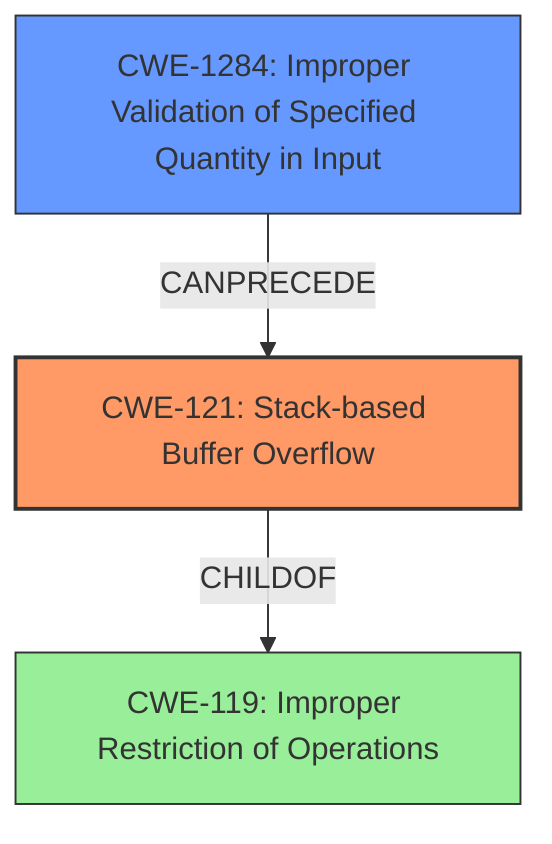

# Final Resolution for CVE-2022-32037

# Summary
| CWE ID | CWE Name | Confidence | CWE Abstraction Level | CWE Vulnerability Mapping Label | CWE-Vulnerability Mapping Notes |
|---|---|---|---|---|---|
| CWE-121 | Stack-based Buffer Overflow | 0.95 | Variant | Allowed | Primary CWE; Consequence |
| CWE-1284 | Improper Validation of Specified Quantity in Input | 0.7 | Base | Allowed | Contributing Factor; Root Cause |

## Evidence and Confidence

*   **Confidence Score:** 0.9
*   **Evidence Strength:** MEDIUM

## Relationship Analysis
The primary relationship influencing the decision is the chain relationship. CWE-1284 **Improper Validation of Specified Quantity in Input** can precede CWE-121 **Stack-based Buffer Overflow**. The vulnerability description clearly states a **stack overflow**, which makes CWE-121 a direct match. However, the overflow likely stems from a failure to validate input size, making CWE-1284 a contributing factor. CWE-121 is a variant of CWE-119 **Improper Restriction of Operations within the Bounds of a Memory Buffer**, providing a hierarchical context.

## Vulnerability Chain
The vulnerability chain starts with CWE-1284 **Improper Validation of Specified Quantity in Input**. The product receives input intended to specify a quantity but fails to validate it properly. This leads to CWE-121 **Stack-based Buffer Overflow** because the improperly validated quantity is used to allocate or copy data into a stack-based buffer, exceeding its boundaries. The final impact is a **stack overflow**, potentially leading to arbitrary code execution or denial of service.

## Summary of Analysis
The initial analysis correctly identified CWE-121 **Stack-based Buffer Overflow** as the primary weakness, which is supported by the vulnerability description: "Tenda M3 V1.0.0.12 was discovered to contain a stack overflow via the function formSetAPCfg." The criticism suggested considering CWE-1284 **Improper Validation of Specified Quantity in Input** as a contributing factor, which is a valid point. While the initial analysis focused on the direct consequence (the **stack overflow**), the root cause likely involves a failure to validate the size of the input. The graph relationships, particularly the CANPRECEDE relationship between CWE-1284 and CWE-121, supports this chained approach. The final decision is to classify the vulnerability as CWE-121, with CWE-1284 as a secondary contributing factor, providing a more complete picture of the vulnerability. This is at the optimal level of specificity, as it identifies both the immediate cause (**stack overflow**) and a likely root cause (improper input validation). The evidence for CWE-1284 is indirect, inferred from the nature of buffer overflows, lowering the overall confidence score.