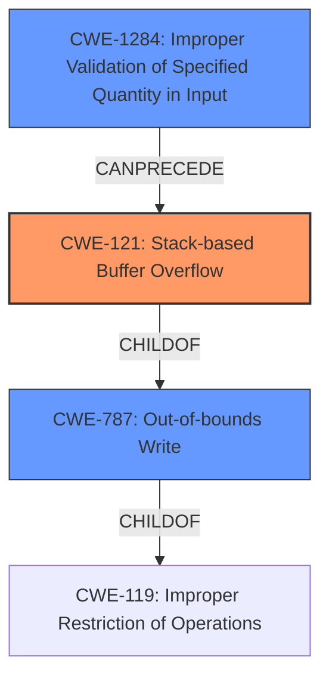

# Final Resolution for CVE-2022-32039

# Summary
| CWE ID | CWE Name | Confidence | CWE Abstraction Level | CWE Vulnerability Mapping Label | CWE-Vulnerability Mapping Notes |
|---|---|---|---|---|---|
| CWE-121 | Stack-based Buffer Overflow | 0.95 | Variant | Allowed | Primary CWE: Directly addresses the stack overflow described in the vulnerability. |
| CWE-1284 | Improper Validation of Specified Quantity in Input | 0.85 | Base | Allowed | Secondary CWE: The root cause is the lack of input validation on the size of the `listN` parameter. |
| CWE-787 | Out-of-bounds Write | 0.60 | Base | Allowed | Secondary CWE: Occurs due to writing data beyond the intended buffer boundary. |

## Evidence and Confidence

*   **Confidence Score:** 0.90
*   **Evidence Strength:** HIGH

## Relationship Analysis
The primary relationship impacting the decision is the parent-child relationship. CWE-121 (Stack-based Buffer Overflow) is a specific type of **CWE-787** (Out-of-bounds Write), which in turn is a type of **CWE-119** (Improper Restriction of Operations within the Bounds of a Memory Buffer). Choosing CWE-121 provides the most specific classification. The addition of CWE-1284 highlights the lack of input validation that leads to the overflow.

## Vulnerability Chain
The vulnerability chain starts with **CWE-1284** (Improper Validation of Specified Quantity in Input), which leads to **CWE-121** (Stack-based Buffer Overflow), a specific instance of **CWE-787** (Out-of-bounds Write). The lack of input validation allows an attacker to send an overly long `listN` parameter. This parameter is then concatenated without bounds checking, resulting in a write beyond the allocated buffer on the stack. The consequence is a denial of service due to the `httpd` process crashing.

## Summary of Analysis
The initial analysis correctly identified **CWE-121** (Stack-based Buffer Overflow) as the primary weakness. The vulnerability description explicitly states a stack overflow, and the CVE reference confirms the root cause in the `fromDhcpListClient` function due to the improper handling of the `listN` POST parameter. The code concatenates the `listN` POST parameter without checking the length of the input leading to a buffer overflow on the stack.

The criticism suggested strengthening the input validation argument and considering additional CWEs. Based on the MITRE mapping guidance and the vulnerability details, **CWE-1284** (Improper Validation of Specified Quantity in Input) has been added to represent the root cause: the absence of input validation on the size of the `listN` parameter. Without input validation, **CWE-121** (Stack-based Buffer Overflow) is possible. **CWE-787** (Out-of-bounds Write) is added to represent the consequence of writing beyond the allocated buffer.

The selected CWEs are at the optimal level of specificity. **CWE-121** is chosen because the description specifically states a stack overflow.
**CWE-1284** is included because a specified quantity in the input is not validated.
These choices are based on direct evidence from the vulnerability description and the CWE specifications.