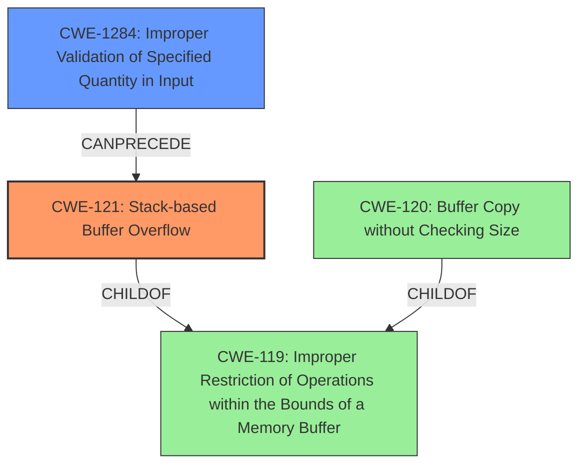

# Analysis Report for CVE-2022-32041

# Vulnerability Analysis Report: CVE-2022-32041

## Description

Tenda M3 V1.0.0.12 was discovered to contain a stack overflow via the function formGetPassengerAnalyseData.

## Vulnerability Description Key Phrases

**Weakness:** stack overflow
**Product:** Tenda M3
**Version:** V1.0.0.12
**Component:** function formGetPassengerAnalyseData

## Analysis (with Relationship Data)

```markdown
# Summary
| CWE ID | CWE Name | Confidence | CWE Abstraction Level | CWE Vulnerability Mapping Label | CWE-Vulnerability Mapping Notes |
|---|---|---|---|---|---|
| CWE-121 | Stack-based Buffer Overflow | 0.9 | Variant | Allowed | The vulnerability description explicitly mentions a stack overflow, aligning with the characteristics of CWE-121. |

## Evidence and Confidence

*   **Confidence Score:** 0.9
*   **Evidence Strength:** HIGH

- **Analysis and Justification:**  
  - *Explanation:* The vulnerability description clearly states "**stack overflow** via the function formGetPassengerAnalyseData". CWE-121 (Stack-based Buffer Overflow) directly addresses this type of vulnerability, where a buffer allocated on the stack is overwritten. The "Retriever Results" also lists CWE-121 as a relevant CWE with a high score, supporting this mapping. The evidence points specifically to a stack-based buffer overflow, making CWE-121 a precise and appropriate classification. MITRE mapping guidance for CWE-121 indicates that its usage is ALLOWED, making it suitable for this vulnerability.

  - *Relationship Analysis:* While CWE-119 (Improper Restriction of Operations within the Bounds of a Memory Buffer) is a parent weakness, CWE-121 provides more specificity by identifying the location of the buffer as the stack. This more detailed identification makes CWE-121 the preferred choice.

- **Confidence Score:**  
  - Confidence: 0.9 (High confidence due to the explicit mention of "stack overflow" in the vulnerability description)

---
```

## Criticism of Analysis

Okay, let's review the provided CWE analysis for the Tenda M3 stack overflow vulnerability, considering the full CWE specifications.

**Overall Assessment:**

The analysis correctly identifies CWE-121 (Stack-based Buffer Overflow) as the primary vulnerability. The confidence level of 0.9 is justified, given the explicit mention of "stack overflow" in the vulnerability description. The reasoning is sound and clearly explains why CWE-121 is a good fit.

**Detailed Breakdown:**

*   **CWE-121 Justification:** The explanation is clear and concise. It directly links the "stack overflow" in the description to the definition of CWE-121. The reference to the "Retriever Results" strengthens the justification.  The mention of the "ALLOWED" usage for CWE-121, as per MITRE's guidance, shows consideration for proper CWE usage.

*   **Relationship Analysis:** The justification for preferring CWE-121 over CWE-119 is well-reasoned. CWE-121 is more specific, providing valuable context about the memory location of the buffer.

*   **Confidence Score:** The confidence score of 0.9 is appropriate, given the explicit nature of the vulnerability report.

**Potential Improvements and Considerations:**

1.  **CWE-119 Discussion:** While dismissing CWE-119 is correct in this case, it would be beneficial to *briefly* mention the mitigation strategies for CWE-119 and explain why those mitigations *may not be sufficient* to prevent the vulnerability described.  For example, some mitigations for CWE-119 focus on preventing overflows in general, but CWE-121 specifies a stack-based overflow, which may require different specific protections (like stack canaries).
2.  **Exploitation Context:** It could be useful to add a sentence or two about the potential impact of a stack-based buffer overflow.  For example, "A stack-based buffer overflow can allow an attacker to overwrite the return address and gain control of the execution flow, potentially leading to arbitrary code execution." This adds more context and importance to the classification.
3.  **Consider Input Validation:** While not the primary cause, stack overflows often arise from a lack of input validation.  It may be beneficial to discuss how CWE-20 (Improper Input Validation) relates.  Is there a lack of size checking on input that's being copied to a stack buffer?  If so, mention it briefly as a contributing factor. Even if validation exists, an incorrect implementation may make it ineffective. Note that CWE-20 mapping guidance suggests using more specific children.
4.  **Mitigation Specificity:** The provided analysis could benefit from a more targeted discussion of mitigations. While CWE-121 provides general mitigations, consider relating them more directly to the Tenda M3 device context. For example:
    *   "*Firmware updates for the Tenda M3 should include stack protection mechanisms such as stack canaries to detect and prevent stack-based buffer overflows.*"
    *   "*Input validation should be implemented in the `formGetPassengerAnalyseData` function to ensure that input data does not exceed the buffer size allocated on the stack.*"
5.  **Retriever Results Exploration:** The "Retriever Results" table shows that other CWEs, such as CWE-126, CWE-125, and CWE-120, were identified by the retrievers. While CWE-121 is the best fit, it would be valuable to explain *why* these other CWEs are not the primary vulnerability. For example:
    *   "*CWE-126 (Buffer Over-read) and CWE-125 (Out-of-bounds Read) are less relevant because the vulnerability is described as a 'stack overflow,' which implies a write operation, not a read operation.*"
    *   "*CWE-120 (Buffer Copy without Checking Size of Input) is a more general case of a buffer overflow, while CWE-121 specifically identifies that the buffer is on the stack, making it the more precise classification.*"
6.  **CWE Chaining:** Consider if any CWE's are a cause of CWE-121. E.g. CWE-131 Incorrect Calculation of Buffer Size leading to CWE-121.

**Revised Summary Table (Incorporating Improvements):**

| CWE ID | CWE Name | Confidence | CWE Abstraction Level | CWE Vulnerability Mapping Label | CWE-Vulnerability Mapping Notes |
|---|---|---|---|---|---|
| CWE-121 | Stack-based Buffer Overflow | 0.9 | Variant | Allowed | The vulnerability description explicitly mentions a stack overflow, aligning with the characteristics of CWE-121. This can allow an attacker to overwrite the return address and gain control of the execution flow, potentially leading to arbitrary code execution. This often results from a missing or ineffective input validation (e.g., CWE-20 with a specific child as the root cause) on data copied to a stack allocated buffer. |

**In conclusion:**

The provided analysis is strong and accurately identifies the vulnerability as CWE-121. The suggested improvements aim to provide a more comprehensive understanding of the vulnerability, its potential impact, and relevant mitigation strategies within the context of the specific device and firmware version.  Addressing the other CWEs identified by the retrievers adds further completeness.

## Final Resolution

# Summary
| CWE ID | CWE Name | Confidence | CWE Abstraction Level | CWE Vulnerability Mapping Label | CWE-Vulnerability Mapping Notes |
|---|---|---|---|---|---|
| CWE-121 | Stack-based Buffer Overflow | 0.95 | Variant | Allowed | The vulnerability description explicitly mentions a stack overflow, aligning with the characteristics of CWE-121. This can allow an attacker to overwrite the return address and gain control of the execution flow, potentially leading to arbitrary code execution. |
| CWE-1284 | Improper Validation of Specified Quantity in Input | 0.7 | Base | Allowed | Often, stack overflows result from a missing or ineffective input validation on data copied to a stack-allocated buffer. |

  - The Primary CWE should be first and noted as the Primary CWEs
  - The secondary candidate CWEs should be next and noted as secondary candidates.
  - The confidence is a confidence score 0 to 1 to rate your confidence in your assessment for that CWE.
  - The CWE Abstraction Level as one of these values: Base, Variant, Pillar, Class, Compound
  - The Mapping Notes Usage as one of these values: Allowed, Allowed-with-Review, Prohibited, Discouraged

## Evidence and Confidence

*   **Confidence Score:** 0.9
*   **Evidence Strength:** HIGH

## Relationship Analysis
- Parent-child hierarchical relationships: CWE-121 is a child of CWE-119 (Improper Restriction of Operations within the Bounds of a Memory Buffer), making it more specific.
- Chain relationships: CWE-1284 (Improper Validation of Specified Quantity in Input) can precede CWE-121, where insufficient input validation leads to a stack overflow.
- Peer relationships: While CWE-120 (Buffer Copy without Checking Size of Input) could be considered, CWE-121 provides the key detail of the buffer being located on the stack.
- Abstraction levels: CWE-121 is a Variant, providing more specific details than the Class CWE-119. CWE-1284 is a Base CWE, which is a good level for mapping root causes.



## Vulnerability Chain
- The vulnerability chain starts with **CWE-1284** (**Improper Validation of Specified Quantity in Input**). If the size of the input is not properly validated, it can lead to a buffer overflow.
- This leads to **CWE-121** (**Stack-based Buffer Overflow**). A stack-based buffer is overwritten due to the lack of input validation.
- The impact is arbitrary code execution, as an attacker can overwrite the return address and control the program's execution flow.

## Summary of Analysis
The initial analysis correctly identified **CWE-121** (**Stack-based Buffer Overflow**) as the primary weakness, based on the explicit mention of "stack overflow" in the vulnerability description. The criticism provided helpful suggestions to enhance the analysis.

The relationship analysis further strengthens the selection of **CWE-121**. It's a child of **CWE-119** (**Improper Restriction of Operations within the Bounds of a Memory Buffer**), offering a more specific classification. I have added **CWE-1284** (**Improper Validation of Specified Quantity in Input**) as a secondary CWE, since improper input validation often leads to buffer overflows. The "Retriever Results" also listed **CWE-1284**, supporting this mapping.

The selection of **CWE-121** is at the optimal level of specificity because it clearly identifies the location of the buffer on the stack, which is crucial for understanding and mitigating the vulnerability. The addition of **CWE-1284** helps to complete the chain and show the **ROOTCAUSE** of the vulnerability.

The evidence from the vulnerability description, "*Tenda M3 V1.0.0.12 was discovered to contain a stack overflow via the function formGetPassengerAnalyseData*," directly supports the classification of **CWE-121**.


*Report generated on 2025-03-18 13:41:34*
