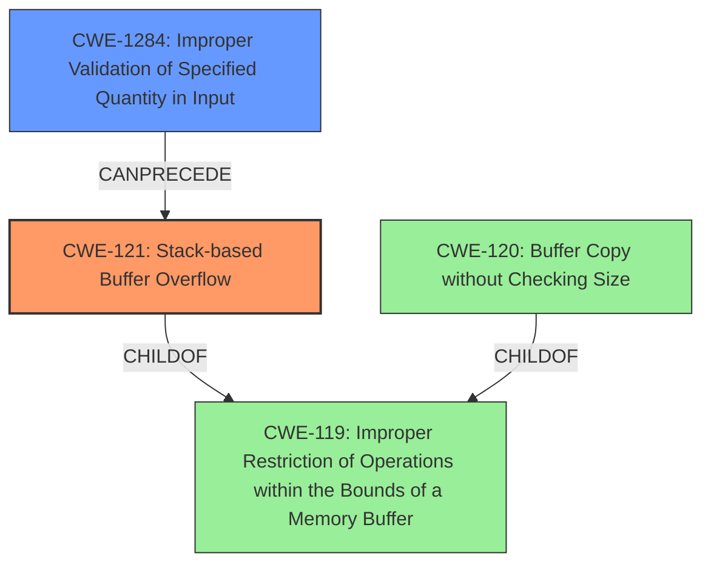

# Final Resolution for CVE-2022-32041

# Summary
| CWE ID | CWE Name | Confidence | CWE Abstraction Level | CWE Vulnerability Mapping Label | CWE-Vulnerability Mapping Notes |
|---|---|---|---|---|---|
| CWE-121 | Stack-based Buffer Overflow | 0.95 | Variant | Allowed | The vulnerability description explicitly mentions a stack overflow, aligning with the characteristics of CWE-121. This can allow an attacker to overwrite the return address and gain control of the execution flow, potentially leading to arbitrary code execution. |
| CWE-1284 | Improper Validation of Specified Quantity in Input | 0.7 | Base | Allowed | Often, stack overflows result from a missing or ineffective input validation on data copied to a stack-allocated buffer. |

  - The Primary CWE should be first and noted as the Primary CWEs
  - The secondary candidate CWEs should be next and noted as secondary candidates.
  - The confidence is a confidence score 0 to 1 to rate your confidence in your assessment for that CWE.
  - The CWE Abstraction Level as one of these values: Base, Variant, Pillar, Class, Compound
  - The Mapping Notes Usage as one of these values: Allowed, Allowed-with-Review, Prohibited, Discouraged

## Evidence and Confidence

*   **Confidence Score:** 0.9
*   **Evidence Strength:** HIGH

## Relationship Analysis
- Parent-child hierarchical relationships: CWE-121 is a child of CWE-119 (Improper Restriction of Operations within the Bounds of a Memory Buffer), making it more specific.
- Chain relationships: CWE-1284 (Improper Validation of Specified Quantity in Input) can precede CWE-121, where insufficient input validation leads to a stack overflow.
- Peer relationships: While CWE-120 (Buffer Copy without Checking Size of Input) could be considered, CWE-121 provides the key detail of the buffer being located on the stack.
- Abstraction levels: CWE-121 is a Variant, providing more specific details than the Class CWE-119. CWE-1284 is a Base CWE, which is a good level for mapping root causes.

## Vulnerability Chain
- The vulnerability chain starts with **CWE-1284** (**Improper Validation of Specified Quantity in Input**). If the size of the input is not properly validated, it can lead to a buffer overflow.
- This leads to **CWE-121** (**Stack-based Buffer Overflow**). A stack-based buffer is overwritten due to the lack of input validation.
- The impact is arbitrary code execution, as an attacker can overwrite the return address and control the program's execution flow.

## Summary of Analysis
The initial analysis correctly identified **CWE-121** (**Stack-based Buffer Overflow**) as the primary weakness, based on the explicit mention of "stack overflow" in the vulnerability description. The criticism provided helpful suggestions to enhance the analysis.

The relationship analysis further strengthens the selection of **CWE-121**. It's a child of **CWE-119** (**Improper Restriction of Operations within the Bounds of a Memory Buffer**), offering a more specific classification. I have added **CWE-1284** (**Improper Validation of Specified Quantity in Input**) as a secondary CWE, since improper input validation often leads to buffer overflows. The "Retriever Results" also listed **CWE-1284**, supporting this mapping.

The selection of **CWE-121** is at the optimal level of specificity because it clearly identifies the location of the buffer on the stack, which is crucial for understanding and mitigating the vulnerability. The addition of **CWE-1284** helps to complete the chain and show the **ROOTCAUSE** of the vulnerability.

The evidence from the vulnerability description, "*Tenda M3 V1.0.0.12 was discovered to contain a stack overflow via the function formGetPassengerAnalyseData*," directly supports the classification of **CWE-121**.