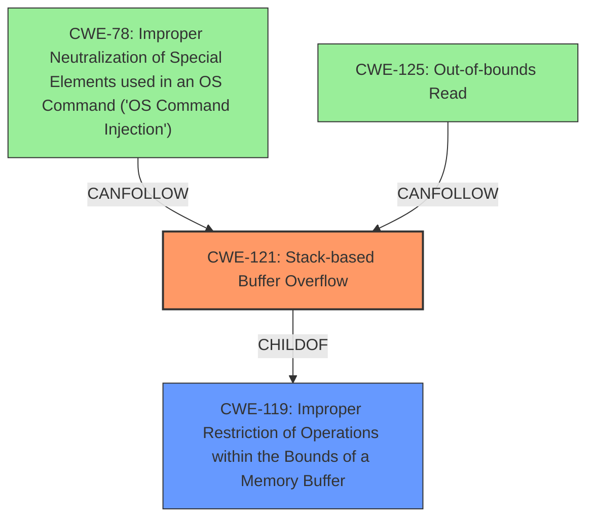

# Final Resolution for CVE-2022-32044

# Summary 
| CWE ID | CWE Name | Confidence | CWE Abstraction Level | CWE Vulnerability Mapping Label | CWE-Vulnerability Mapping Notes |
|---|---|---|---|---|---|
| CWE-121 | Stack-based Buffer Overflow | 0.9 | Variant | Primary | Allowed |
| CWE-125  | Out-of-bounds Read | 0.3 | Base | Secondary Consequence | May result during exploitation, but not the immediate cause of the vulnerability. |
| CWE-78  | Improper Neutralization of Special Elements used in an OS Command ('OS Command Injection') | 0.2 | Base | Secondary |  Potentially a consequence of successful exploitation of CWE-121, but not the immediate cause. Not Applicable unless RCE is achieved. |
| CWE-259  | Use of Hard-coded Password | 0.1 | Variant | None | Incorrectly Identified |
| CWE-190  | Integer Overflow or Wraparound | 0.1 | Base | None | Incorrectly Identified |
| CWE-191  | Integer Underflow (Wrap or Wraparound) | 0.1 | Base | None | Incorrectly Identified |
| CWE-122  | Heap-based Buffer Overflow | 0.1 | Variant | None | Incorrectly Identified |
| CWE-790  | Improper Filtering of Special Elements | 0.1 | Class | None | Incorrectly Identified |
| CWE-674  | Uncontrolled Recursion | 0.1 | Class | None | Incorrectly Identified |
| CWE-770  | Allocation of Resources Without Limits or Throttling | 0.1 | Base | None | Incorrectly Identified |

## Evidence and Confidence

*   **Confidence Score:** 0.9
*   **Evidence Strength:** HIGH

## Relationship Analysis
The primary relationship influencing the decision is the hierarchical relationship between CWE-119 (Improper Restriction of Operations within the Bounds of a Memory Buffer) and its variant CWE-121 (Stack-based Buffer Overflow). Since the vulnerability description explicitly mentions a stack overflow, CWE-121 is the more specific and appropriate choice. CWE-121 is a child of CWE-119. Other CWEs were considered, but deemed less relevant as they represent potential consequences (CWE-78, CWE-125) or unrelated issues (CWE-259, CWE-190, CWE-191, CWE-122, CWE-790, CWE-674, CWE-770).

## Vulnerability Chain
The vulnerability chain starts with the lack of bounds checking on the `password` parameter within the `FUN_00413f80` function. This **WEAKNESS** (CWE-121) allows an attacker to overwrite stack memory. A successful **EXPLOIT** of this vulnerability could potentially lead to remote code execution if the attacker can control the execution flow and inject malicious code, potentially leading to CWE-78. Also, out-of-bounds read (CWE-125) may happen during exploitation.

## Summary of Analysis
The initial analysis correctly identified CWE-121 as the primary **ROOTCAUSE**, and the criticism provides valuable refinements. The decision is based on direct evidence from the vulnerability description, which states a "stack overflow via the password parameter in the function FUN_00413f80." This aligns precisely with the definition of CWE-121. The graph relationships reinforce this decision, showing CWE-121 as a specific type of buffer overflow (child of CWE-119). The analysis also addresses potential follow-on weaknesses, such as CWE-78, which could result from successful exploitation of the primary vulnerability. The selected CWE is at the optimal level of specificity, providing a clear and accurate representation of the **ROOTCAUSE** of the vulnerability. The confidence remains high (0.9) due to the clear evidence and the specificity of the CWE.