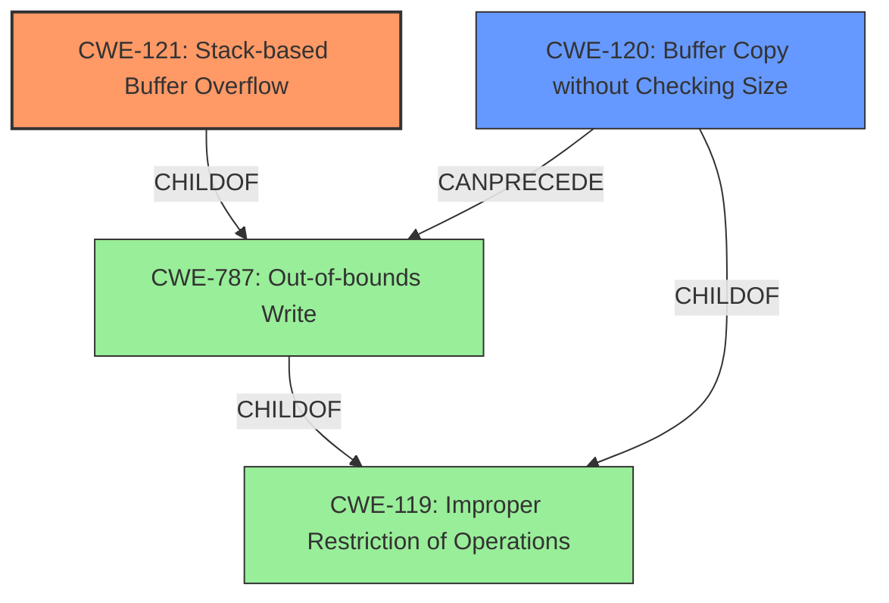

# Analysis Report for CVE-2022-32045

# Vulnerability Analysis Report: CVE-2022-32045

## Description

TOTOLINK T6 V4.1.9cu.5179_B20201015 was discovered to contain a stack overflow via the desc parameter in the function FUN_00413be4.

## Vulnerability Description Key Phrases

**Weakness:** stack overflow
**Product:** TOTOLINK T6
**Version:** V4.1.9cu.5179_B20201015
**Component:** function FUN_00413be4

## Analysis (with Relationship Data)

# Summary
| CWE ID | CWE Name | Confidence | CWE Abstraction Level | CWE Vulnerability Mapping Label | CWE-Vulnerability Mapping Notes |
|---|---|---|---|---|---|
| CWE-121 | Stack-based Buffer Overflow | 0.9 | Variant | Primary | Allowed |
| CWE-787 | Out-of-bounds Write | 0.6 | Base | Secondary | Allowed |

## Evidence and Confidence

*   **Confidence Score:** 0.9
*   **Evidence Strength:** HIGH

- **Analysis and Justification:**  
  - *Explanation:* The vulnerability description explicitly states "**stack overflow** via the desc parameter in the function FUN_00413be4". CWE-121 (Stack-based Buffer Overflow) is a Variant-level CWE that directly addresses the condition where a buffer allocated on the stack is overwritten. The vulnerability description key phrases also indicate a **stack overflow**. This direct match and the Variant abstraction level make CWE-121 the primary and most appropriate mapping. The Retriever Results also identify CWE-121 as a candidate with a high score. CWE-787 (Out-of-bounds Write) is a broader category that encompasses stack overflows, but CWE-121 is more specific. The lack of details about how the buffer is written makes it hard to confirm CWE-787 is a good fit.
  
  - *Relationship Analysis:* CWE-121 is a child of CWE-787 (Out-of-bounds Write). CWE-787 is a parent of CWE-121.

- **Confidence Score:**  
  - Confidence: 0.9 (High confidence due to explicit mention of "stack overflow" and the Variant level of CWE-121).

## Criticism of Analysis

Okay, let's review the CWE analysis provided, keeping in mind the full CWE specifications.

**Overall Assessment:**

The analysis is generally well-reasoned and arrives at a defensible conclusion: CWE-121 (Stack-based Buffer Overflow) as the primary CWE.  The confidence score is appropriate. However, there is some room for improvement in the secondary CWE and justification.

**Detailed Critique:**

*   **CWE-121: Stack-based Buffer Overflow (Primary)**
    *   **Confidence: 0.9**
    *   **Justification:** The reasoning provided is solid. The explicit mention of "stack overflow" in the vulnerability description makes CWE-121 a very strong match. The analyzer correctly identifies CWE-121 as a Variant-level CWE, which is the preferred level for mapping. The evidence is strong, and the justification clearly states why CWE-121 is more specific than its parent, CWE-787.
    *   **Mapping Guidance Compliance:** The analysis adheres to the mapping guidance for CWE-121, which states to "Carefully read both the name and description to ensure that this mapping is an appropriate fit. Do not try to 'force' a mapping to a lower-level Base/Variant simply to comply with this preferred level of abstraction." The analysis justifies why it is a good fit.
    *   **Mitigation Consideration:** The Mitigations listed in the CWE specifications for CWE-121 (compiler flags like /GS, abstraction libraries, and bounds checking) are all relevant to preventing this vulnerability. This reinforces the appropriateness of the CWE mapping.
*   **CWE-787: Out-of-bounds Write (Secondary)**
    *   **Confidence: 0.6**
    *   **Justification:** While CWE-787 is a parent of CWE-121 and therefore *related*, the justification for including it as a secondary CWE is a little weak. The analysis correctly points out that CWE-787 is a broader category. However, the statement "The lack of details about how the buffer is written makes it hard to confirm CWE-787 is a good fit" is somewhat contradictory, since an out-of-bounds write is exactly what is happening. The issue is more that CWE-121 is simply a better, more specific fit.

    *   **Suggestion:** The analysis could be strengthened by explicitly stating that while CWE-787 *is* technically accurate, it is less *informative* than CWE-121 because it doesn't convey the crucial detail that the buffer is on the stack. A stack buffer overflow is exploited differently and mitigated differently than a heap buffer overflow. Therefore, the additional information provided by CWE-121 is valuable.

    *   **Mapping Guidance Compliance:** The analysis complies with the mapping guidance of carefully reading the name and description to ensure that this mapping is an appropriate fit.
    *   **Mitigation Consideration:** The Mitigations listed in the CWE specifications for CWE-787, particularly language selection (using memory-safe languages) and compiler-based protections, are relevant, even though CWE-121's mitigations are more directly applicable.

**Retriever Results Critique:**

The retriever results are interesting, and highlight the difficulties of automated CWE classification.

*   **CWE-78 (OS Command Injection):** While the retriever identified this, it's clearly a false positive. There's no indication of OS command construction or execution in the description. This shows the limitation of keyword-based matching.
*   **CWE-770 (Allocation of Resources Without Limits or Throttling):** This is also a false positive. While a buffer overflow can *lead* to resource exhaustion, the root cause here is the unbounded copy, not a lack of resource limits.
*   **CWE-121 (Stack-based Buffer Overflow):** Correctly identified and assigned a high score.
*   **Integer Overflows (CWE-190/191):** These are unlikely, unless the buffer size is calculated based on user input prone to such errors. Without more context, they are not well-supported.
*   **Use of Hard-coded Password (CWE-259):** No relation.
*   **CWE-122 (Heap-based Buffer Overflow):** Inaccurate as the description specifically notes stack.
*   **CWE-789 (Memory Allocation with Excessive Size Value):** This is not a memory allocation issue. The buffer is allocated, but the data written to it is not validated to fit within the allocated space.
*   **CWE-674 (Uncontrolled Recursion):** This is not a recursion issue.
**Recommendations:**

1.  **Strengthen the Justification for CWE-787:**  Clarify *why* CWE-787 is less informative than CWE-121, rather than implying it might not be a good fit. Explain that while writing out of bounds is happening, the more pertinent detail is that it is happening to a stack buffer, requiring different mitigation techniques.
2.  **Consider a Different Secondary CWE:** Instead of CWE-787, consider CWE-120 (Buffer Copy without Checking Size of Input). The description mentions a "desc parameter," suggesting a buffer copy might be involved. However, this requires more context about the code. Even if CWE-120 isn't a perfect fit, it's closer to the root cause than CWE-787, although still less accurate than CWE-121.
3.  **Acknowledge Retriever Results:** Briefly acknowledge the retriever results and explain why the false positives were incorrect. This demonstrates critical thinking and strengthens the analysis. For example: "The retriever also identified CWE-78 (OS Command Injection), but this is a false positive as the vulnerability description does not mention any command execution."

By incorporating these recommendations, the analysis would be even more robust and provide a clearer understanding of the vulnerability and its potential impact.

## Final Resolution

# Summary
| CWE ID | CWE Name | Confidence | CWE Abstraction Level | CWE Vulnerability Mapping Label | CWE-Vulnerability Mapping Notes |
|---|---|---|---|---|---|
| CWE-121 | Stack-based Buffer Overflow | 0.9 | Variant | Primary CWE | Allowed |
| CWE-120 | Buffer Copy without Checking Size of Input ('Classic Buffer Overflow') | 0.7 | Base | Secondary Candidate | Allowed-with-Review |

## Evidence and Confidence

*   **Confidence Score:** 0.9
*   **Evidence Strength:** MEDIUM

## Relationship Analysis
The primary CWE, CWE-121 (**CWE-121: Stack-based Buffer Overflow**), is a variant of CWE-787 (**CWE-787: Out-of-bounds Write**). CWE-120 (**CWE-120: Buffer Copy without Checking Size of Input ('Classic Buffer Overflow')**) can precede CWE-787 and is a child of CWE-119 (**CWE-119: Improper Restriction of Operations Within the Bounds of a Memory Buffer**). The choice of CWE-121 is driven by its specificity, as the vulnerability description explicitly mentions a stack overflow. Using CWE-787 alone would be less informative. Including CWE-120 highlights the likely mechanism of the overflow, involving a buffer copy operation without proper size validation.

## Vulnerability Chain
The vulnerability chain starts with a buffer copy operation (likely due to the "desc parameter" mentioned), where the size of the input is not checked (CWE-120). This leads to an out-of-bounds write (CWE-787), specifically a stack-based buffer overflow (CWE-121), because the buffer is located on the stack. The consequence is potential arbitrary code execution or denial of service.

## Summary of Analysis
The initial analysis correctly identified CWE-121 as the primary **WEAKNESS** due to the explicit mention of a stack overflow in the vulnerability description. The criticism suggested strengthening the justification for CWE-787 or considering a different secondary CWE. Based on the vulnerability description mentioning the "desc parameter," which suggests a buffer copy operation, CWE-120 (Buffer Copy without Checking Size of Input) is selected as a more relevant secondary CWE than CWE-787.

The vulnerability description states: "TOTOLINK T6 V4.1.9cu.5179_B20201015 was discovered to contain a stack overflow via the desc parameter in the function FUN_00413be4."

This evidence supports the selection of CWE-121 due to the "**stack overflow**" key phrase, which directly matches the CWE name and description. The presence of "desc parameter" hints at a buffer copy, making CWE-120 a logical predecessor.

The graph relationships confirm that CWE-121 is a specific type of CWE-787, but CWE-121 is more informative in this context. CWE-120 is a potential **ROOTCAUSE** that could lead to the overflow.

The selected CWEs are at the optimal level of specificity. CWE-121 is a Variant, which is preferred. CWE-120 is a Base, which is also appropriate and provides more context about the nature of the **WEAKNESS**.

*Report generated on 2025-03-18 13:54:16*
