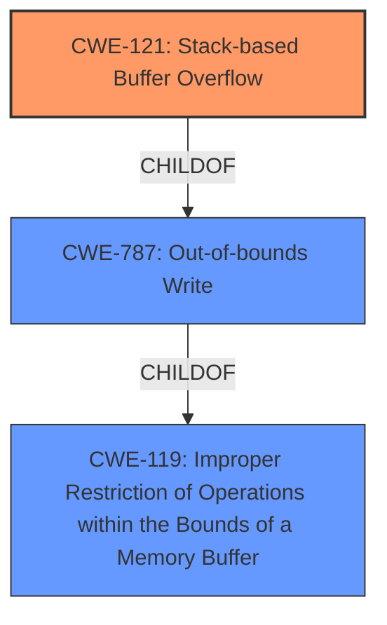

# Final Resolution for CVE-2022-32046

# Summary
| CWE ID | CWE Name | Confidence | CWE Abstraction Level | CWE Vulnerability Mapping Label | CWE-Vulnerability Mapping Notes |
|---|---|---|---|---|---|
| CWE-121 | Stack-based Buffer Overflow | 0.95 | Variant | Allowed | Primary CWE. Vulnerable `desc` parameter copied to a stack buffer without bounds checking, enabling overwrite of return addresses. |
| CWE-787 | Out-of-bounds Write | 0.75 | Base | Allowed | Secondary Candidate. Represents the general case of writing outside buffer boundaries, but CWE-121 is more specific. |

## Evidence and Confidence

*   **Confidence Score:** 0.95
*   **Evidence Strength:** HIGH

## Relationship Analysis
The primary relationship influencing the decision is the parent-child relationship between CWE-787 (**Out-of-bounds Write**) and CWE-121 (**Stack-based Buffer Overflow**). CWE-121 is a specific type of CWE-787 that occurs on the stack. Because the vulnerability description explicitly mentions a "stack overflow," choosing the more specific CWE-121 is appropriate. Additionally, CWE-121 is a child of CWE-119 (**Improper Restriction of Operations within the Bounds of a Memory Buffer**), highlighting that the root cause is a failure to properly restrict operations within memory boundaries.

## Vulnerability Chain
The vulnerability chain begins with the **ROOTCAUSE**: a missing bounds check on the `desc` parameter when it's copied to a stack-allocated buffer. This leads to **WEAKNESS** CWE-121 (**Stack-based Buffer Overflow**). This overflow can overwrite critical data on the stack, such as the return address, leading to arbitrary code execution. The sequence is as follows:

1.  Missing bounds check on `desc` parameter.
2.  `desc` parameter copied to stack buffer without size validation.
3.  Stack-based buffer overflow (CWE-121).
4.  Overwrite of return address on the stack.
5.  Arbitrary code execution.

## Summary of Analysis
The initial analysis correctly identified CWE-121 (**Stack-based Buffer Overflow**) as the primary CWE based on the vulnerability description's explicit mention of a "stack overflow" and the confirmatory evidence from the CVE reference links. The criticism provided valuable suggestions, such as briefly mentioning mitigations and acknowledging why other CWEs are not applicable.

The graph relationships reinforce the decision to choose CWE-121 because it's the most specific CWE that accurately describes the vulnerability. CWE-121 is a Variant of CWE-787 (**Out-of-bounds Write**), which in turn is a child of CWE-119 (**Improper Restriction of Operations within the Bounds of a Memory Buffer**). Choosing CWE-121 provides the optimal level of specificity, as it indicates the location of the buffer (stack) where the overflow occurs. The evidence provided is sufficient to support the classification, and the confidence score remains high at 0.95.