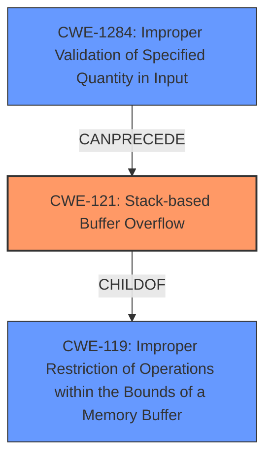

# Final Resolution for CVE-2022-32047

# Summary
| CWE ID | CWE Name | Confidence | CWE Abstraction Level | CWE Vulnerability Mapping Label | CWE-Vulnerability Mapping Notes |
|---|---|---|---|---|---|
| CWE-121 | Stack-based Buffer Overflow | 0.95 | Variant | Allowed | This CWE entry is at the Variant level of abstraction, which is a preferred level of abstraction for mapping to the root causes of vulnerabilities. Primary CWE |
| CWE-1284 | Improper Validation of Specified Quantity in Input | 0.75 | Base | Allowed | This CWE entry is at the Base level of abstraction, which is a preferred level of abstraction for mapping to the root causes of vulnerabilities. Secondary Candidate. This contributes to the vulnerability as the size of the input 'desc' is not validated, which leads to the overflow.|

## Evidence and Confidence

*   **Confidence Score:** 0.90
*   **Evidence Strength:** HIGH

## Relationship Analysis
The primary weakness is CWE-121 (**Stack-based Buffer Overflow**), which is a variant of CWE-119 (**Improper Restriction of Operations within the Bounds of a Memory Buffer**). CWE-1284 (**Improper Validation of Specified Quantity in Input**) is a contributing factor, representing the root cause of the overflow by not validating the size of the input.

## Vulnerability Chain
The vulnerability chain begins with CWE-1284 (**Improper Validation of Specified Quantity in Input**), where the size of the 'desc' parameter is not validated. This leads to CWE-121 (**Stack-based Buffer Overflow**) when the data is copied to a stack buffer without proper bounds checking. The lack of input validation is the **ROOTCAUSE**, and the stack overflow is the exploitable **WEAKNESS**.

## Summary of Analysis
The initial analysis and criticism are accurate and well-justified. The selection of CWE-121 (**Stack-based Buffer Overflow**) as the primary CWE is correct due to the explicit mention of a stack overflow in the vulnerability description: "TOTOLINK T6 V4.1.9cu.5179_B20201015 was discovered to contain a stack overflow via the desc parameter in the function FUN_00412ef4." The inclusion of CWE-1284 (**Improper Validation of Specified Quantity in Input**) as a secondary CWE is also appropriate, as it represents the root cause of the overflow.

The graph relationships support this classification, with CWE-121 being a child of CWE-119 (**Improper Restriction of Operations within the Bounds of a Memory Buffer**) and CWE-1284 preceding CWE-121.

The selected CWEs are at the optimal level of specificity, with CWE-121 being a variant that accurately describes the location of the buffer overflow and CWE-1284 being a base CWE that captures the lack of input validation.