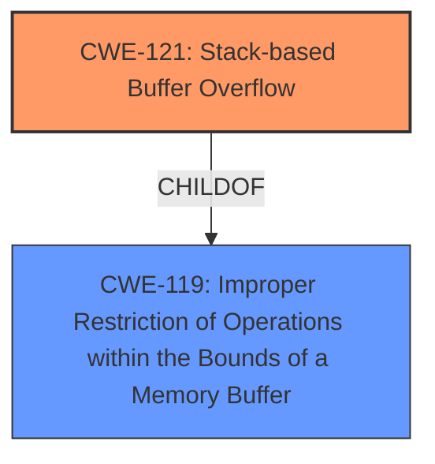

# Final Resolution for CVE-2022-32048

# Summary

| CWE ID  | CWE Name                                                                   | Confidence | CWE Abstraction Level | CWE Vulnerability Mapping Label | CWE-Vulnerability Mapping Notes                                                                                                                      |
| :-------- | :------------------------------------------------------------------------- | :---------- | :-------------------- | :------------------------------ | :----------------------------------------------------------------------------------------------------------------------------------------------------- |
| CWE-121 | Stack-based Buffer Overflow                                                | 1.0         | Variant               | Primary                         | Allowed.  Mitigations include compiler-based stack protection and explicit bounds checking on the input `command` parameter.  Missing input validation for the 'command' parameter |

## Evidence and Confidence

*   **Confidence Score:** 1.0
*   **Evidence Strength:** HIGH

## Relationship Analysis
The primary relationship influencing the decision is the child-of relationship between CWE-121 (Stack-based Buffer Overflow) and CWE-119 (Improper Restriction of Operations within the Bounds of a Memory Buffer). CWE-121 is a more specific variant of CWE-119 and is appropriate given the explicit mention of a stack overflow in the vulnerability description. While a chain analysis could incorporate CWE-20 (Improper Input Validation), it's not strictly necessary as CWE-121 directly addresses the stack-based nature of the overflow.

## Vulnerability Chain
The vulnerability chain is straightforward: A long `command` parameter is passed to the function `FUN_0041cc88`. This parameter is copied to a local stack variable without any bounds checking, leading to a **stack overflow (CWE-121)**. The root cause is the **lack of input validation** for the length of the `command` parameter. The impact is a potential for arbitrary code execution.

## Summary of Analysis
The initial analysis and the provided criticism both converge on CWE-121 (Stack-based Buffer Overflow) as the most appropriate classification. The evidence is strong, with the vulnerability description explicitly stating "stack overflow" and CVE reference confirming the stack-based nature. The analysis correctly recognizes that CWE-121 is a Variant-level CWE, offering a more precise classification than the more general CWE-119. The decision is primarily based on the provided evidence: "TOTOLINK T6 V4.1.9cu.5179_B20201015 was discovered to contain a stack overflow via the command parameter in the function FUN_0041cc88." The relationship analysis confirms that CWE-121 is a child of CWE-119, but the specificity of CWE-121 makes it the optimal choice. The selected CWE is at the optimal level of specificity because it directly addresses the stack-based nature of the overflow.