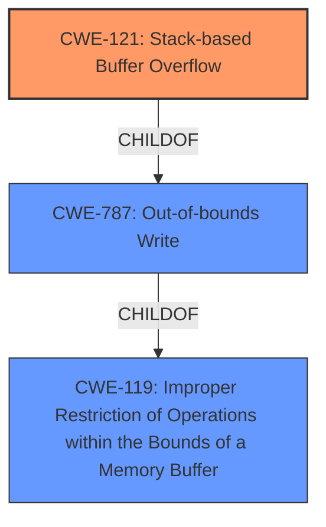

# Final Resolution for CVE-2022-32050

# Summary

| CWE ID | CWE Name | Confidence | CWE Abstraction Level | CWE Vulnerability Mapping Label | CWE-Vulnerability Mapping Notes |
|---|---|---|---|---|---|
| CWE-121 | Stack-based Buffer Overflow | 0.9 | Variant | Allowed | Primary CWE. Occurs because the `cloneMac` parameter is copied to a stack-allocated buffer without length validation. Mitigations include compiler-based buffer overflow detection and input validation. |
| CWE-787 | Out-of-bounds Write | 0.6 | Base | Allowed | Secondary Candidate. More general classification, but less specific than CWE-121. Mitigations include using memory-safe languages and vetted libraries. |

## Evidence and Confidence

*   **Confidence Score:** 0.9
*   **Evidence Strength:** HIGH

## Relationship Analysis
The selection of CWE-121 as the primary weakness is based on its specific description aligning with the stack-based nature of the buffer overflow. CWE-787 is a parent of CWE-121, indicating that CWE-787 represents a broader category of out-of-bounds write issues. The decision to prioritize CWE-121 reflects the desire for a more specific classification. Both CWE-121 and CWE-787 are children of CWE-119 (Improper Restriction of Operations within the Bounds of a Memory Buffer).

## Vulnerability Chain
The vulnerability chain starts with a lack of input validation for the `cloneMac` parameter. This leads to a **buffer overflow** on the stack (CWE-121 or CWE-787), potentially allowing an attacker to overwrite adjacent memory regions and gain control of the program execution.

## Summary of Analysis
The initial analysis correctly identified CWE-121 as the primary **weakness** due to the stack-based nature of the **buffer overflow**, supported by the vulnerability description stating a "stack overflow via the cloneMac parameter in the function FUN_0041af40." The CVE Reference Links Content Summary confirms that the **root cause** is an unchecked copy of the `cloneMac` parameter to stack-allocated local variables. The decision is also influenced by the higher specificity of CWE-121 compared to its parent CWE-787, offering more targeted remediation strategies. The relationships, especially the parent-child relationship between CWE-787 and CWE-121, solidify the classification, ensuring the chosen CWE is at the optimal level of specificity.