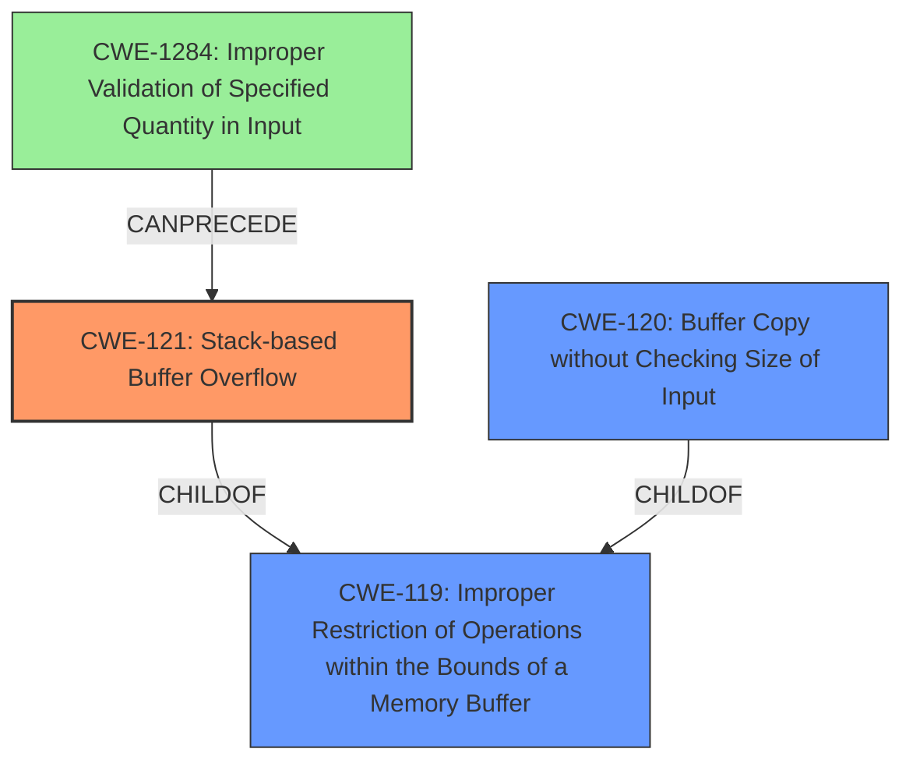

# Analysis Report for CVE-2022-32052

# Vulnerability Analysis Report: CVE-2022-32052

## Description

TOTOLINK T6 V4.1.9cu.5179_B20201015 was discovered to contain a stack overflow via the desc parameter in the function FUN_004137a4.

## Vulnerability Description Key Phrases

**Weakness:** stack overflow
**Product:** TOTOLINK T6
**Version:** V4.1.9cu.5179_B20201015
**Component:** function FUN_004137a4

## Analysis (with Relationship Data)

# Summary
| CWE ID | CWE Name | Confidence | CWE Abstraction Level | CWE Vulnerability Mapping Label | CWE-Vulnerability Mapping Notes |
|---|---|---|---|---|---|
| CWE-121 | Stack-based Buffer Overflow | 0.95 | Variant | Primary | The **stack overflow** occurs because the `desc` parameter is copied to a stack buffer without checking its length. |
| CWE-120 | Buffer Copy without Checking Size of Input ('Classic Buffer Overflow') | 0.75 | Base | Secondary | The overflow happens during a buffer copy operation where the size of the input is not validated against the destination buffer's size. |

## Evidence and Confidence

*   **Confidence Score:** 0.9
*   **Evidence Strength:** HIGH

- **Analysis and Justification:**  
  - *Explanation:* The vulnerability description explicitly states a **stack overflow** in the TOTOLINK T6 router due to the `desc` parameter being copied to a stack buffer without proper length validation. This directly aligns with CWE-121 (Stack-based Buffer Overflow), which is a variant of buffer overflows that specifically occur on the stack. The CVE Reference Links Content Summary confirms that the `FUN_004137a4` function copies the `desc` parameter to a local stack variable without checking its length, leading to the overflow. This provides strong evidence for selecting CWE-121.

  - *Relationship Analysis:* CWE-121 is a variant of CWE-119 (Improper Restriction of Operations within the Bounds of a Memory Buffer). While CWE-119 is a more general case, the specific detail of the **stack** being the location of the buffer makes CWE-121 the more appropriate choice. CWE-120 (Buffer Copy without Checking Size of Input) is also relevant as the overflow occurs during a buffer copy operation where size validation is missing. Since a stack buffer is used, CWE-121 is preferred.

- **Confidence Score:**  
  - *Example:* Confidence: 0.95 (High confidence due to direct mention of **stack overflow** and confirmation from CVE Reference Links)

---

Follow these instructions closely, ensuring that your analysis is evidence-driven, technically precise, and thoroughly considers both the hierarchical relationships between CWEs and the contextual patterns revealed by the property graph relationships. Be sure to incorporate any mapping guidance provided by MITRE in your decision-making process.

# Analysis

The vulnerability is a **stack overflow** in TOTOLINK T6 router software version V4.1.9cu.5179_B20201015. The **weakness** is located in the function `FUN_004137a4`, where the `desc` parameter is copied to a stack buffer without proper bounds checking. This allows an attacker to overwrite data on the stack, potentially leading to arbitrary code execution.

## CWE Selection

### Primary CWE: CWE-121 (Stack-based Buffer Overflow)

*   **Justification:** This CWE is the most specific and accurate representation of the vulnerability. The vulnerability description explicitly mentions a **stack overflow**. The CVE Reference Links Content Summary further clarifies that the **root cause** is the `desc` parameter being copied to a stack buffer without length validation, leading to the overflow. This aligns perfectly with the definition of CWE-121, which states that it's a condition where the buffer being overwritten is allocated on the stack.
*   **Evidence:**
    *   "TOTOLINK T6 V4.1.9cu.5179_B20201015 was discovered to contain a **stack overflow** via the desc parameter in the function FUN_004137a4." (Vulnerability Description)
    *   "The `FUN_004137a4` function in `/web_cste/cgi-bin/cstecgi.cgi` copies the `desc` JSON parameter to a local stack variable without checking its length, leading to a stack buffer overflow." (CVE Reference Links Content Summary)
*   **Abstraction Level:** Variant (appropriate level of specificity)
*   **Usage:** Allowed (per MITRE mapping guidance)
*   **Confidence:** 0.95

### Secondary CWE: CWE-120 (Buffer Copy without Checking Size of Input ('Classic Buffer Overflow'))

*   **Justification:** While CWE-121 is more specific, CWE-120 also applies. The vulnerability involves copying data from the `desc` parameter to a buffer without checking the size of the input against the buffer's capacity. This **lack of size validation** is a critical aspect of the vulnerability. However, since the overflow specifically occurs on the stack, CWE-121 is the primary CWE.
*   **Evidence:**
    *   "The `FUN_004137a4` function in `/web_cste/cgi-bin/cstecgi.cgi` copies the `desc` JSON parameter to a local stack variable **without checking its length**, leading to a stack buffer overflow." (CVE Reference Links Content Summary) - Implies a buffer copy without size check.
*   **Abstraction Level:** Base
*   **Usage:** Allowed-with-Review (per MITRE mapping guidance - requires careful consideration to avoid misuse). In this case, the buffer copy aspect is present.
*   **Confidence:** 0.75

## Rejected CWEs and Justifications

*   **CWE-787 (Out-of-bounds Write):** While this CWE is listed as the primary match in "CWE for similar CVE Descriptions" and is related, it's more general than CWE-121. CWE-121 is a specific type of out-of-bounds write that occurs on the stack, making it a more precise mapping.
*   **CWE-770 (Allocation of Resources Without Limits or Throttling):** This CWE is not directly related to the vulnerability. The issue isn't about resource allocation limits but rather about the lack of size validation during a buffer copy operation.
*   **CWE-131 (Incorrect Calculation of Buffer Size):** This CWE isn't directly applicable as the problem isn't an incorrect calculation, but the total absence of input size validation against the destination buffer.
*   **CWE-190 (Integer Overflow or Wraparound):** There's no indication of an integer overflow being the root cause of this vulnerability.
*   **CWE-789 (Memory Allocation with Excessive Size Value):** The vulnerability is not about excessive memory allocation, but about missing bounds checking.
*   **CWE-1284 (Improper Validation of Specified Quantity in Input):** While related to input validation, it is less specific than CWE-120 or CWE-121, as it doesn't highlight the buffer overflow nature of the vulnerability.

In summary, the primary CWE is CWE-121 due to the explicit mention of a stack overflow and the root cause being a missing length check when copying the `desc` parameter to a stack buffer. CWE-120 is a secondary candidate to highlight the lack of input size validation during a copy operation.

## Criticism of Analysis

Okay, I've reviewed the analysis against the provided full CWE specifications. Here's my critique:

**Overall Assessment:**

The analysis is strong and well-reasoned. The primary CWE selection of CWE-121 is correct and well-supported. The secondary CWE selection of CWE-120 is also valid and adds useful nuance. The explanations are clear and the rejected CWEs are justified. The confidence scores are appropriate.

**Detailed Critique:**

1.  **Primary CWE: CWE-121 (Stack-based Buffer Overflow)**

    *   **Justification:** The justification is excellent. It directly links the "stack overflow" from the vulnerability description and CVE Reference Links to the definition of CWE-121. It correctly identifies that the overflow occurs *on the stack*.
    *   **Evidence:** The provided evidence is clear and convincing. The exact phrases quoted from the vulnerability description and CVE summary solidify the choice of CWE-121.
    *   **Abstraction Level:** Variant is appropriate.
    *   **Usage:** "Allowed" is correct.
    *   **Confidence:** 0.95 is a good reflection of the high certainty.
    *   **Improvements:** None needed.

2.  **Secondary CWE: CWE-120 (Buffer Copy without Checking Size of Input ('Classic Buffer Overflow'))**

    *   **Justification:** The justification is accurate. It highlights the missing size validation during the buffer copy operation. It correctly explains why it is a secondary CWE since the location (stack) is more specifically covered by CWE-121.
    *   **Evidence:** The provided evidence is accurate. The evidence infers the buffer copy without size check.
    *   **Abstraction Level:** Base is appropriate.
    *   **Usage:** "Allowed-with-Review" is correct, and the analysis acknowledges the review requirement.  It explicitly states why it's still applicable ("the buffer copy aspect is present").  This avoids misuse.
    *   **Confidence:** 0.75 is a reasonable confidence level, lower than the primary, as it's a contributing factor but not the most specific.
    *   **Improvements:** None needed.

3.  **Rejected CWEs and Justifications**

    *   **CWE-787 (Out-of-bounds Write):** The justification for rejecting this is solid. While related (and the parent of CWE-121), CWE-787 is too general. CWE-121 provides a more precise description of the weakness.
    *   **CWE-770 (Allocation of Resources Without Limits or Throttling):** The justification is correct. This vulnerability isn't about resource allocation limits, but rather about missing bounds checking during a copy.
    *   **CWE-131 (Incorrect Calculation of Buffer Size):** The justification is correct. It's not an incorrect calculation, but a *total absence* of size validation.
    *   **CWE-190 (Integer Overflow or Wraparound):** The justification is accurate, as there is no evidence of integer overflow contributing to this vulnerability.
    *   **CWE-789 (Memory Allocation with Excessive Size Value):** The justification is correct; the issue is not about excessive memory allocation.
    *   **CWE-1284 (Improper Validation of Specified Quantity in Input):** Justification is good. While related to input validation, it's less specific than CWE-120 or CWE-121.

4.  **General Improvements/Observations:**

    *   **Mitigation Overlap:** The potential mitigations listed in the full CWE specifications of CWE-121, CWE-120, and CWE-787 have significant overlap (e.g., using memory-safe languages, using safe string libraries, using compiler-based buffer overflow detection). Perhaps a general note mentioning this would be useful, but not required.
    *   **Chain Consideration:** The analysis correctly identified that this vulnerability can be seen as a chain of events: (1) Receiving an untrusted input `desc` without proper validation (CWE-20 or a more specific child of CWE-20 like CWE-1284), and (2) Copying that input to a stack buffer without checking the size (CWE-121). While not explicitly listing CWE-20/CWE-1284 in the summary table, the analysis acknowledges the lack of input validation as part of the overall problem. If a chain is to be expressed, CWE-1284 would be most suitable as the root cause before CWE-121.
    *  **CWE-787 Discussion** The justification to exclude CWE-787 makes sense, as CWE-121 is more specific. However, the mapping guidance for CWE-119 (the parent) states to look at its children and consider mapping to CWE-787. It could be added that this analysis correctly determined a lower level CWE was more suitable than mapping to the general CWE-787.
**Revised Summary Table (Optional):**

If you wanted to incorporate the chain discussion more formally, an optional revised summary table could be:

| CWE ID | CWE Name | Confidence | CWE Abstraction Level | CWE Vulnerability Mapping Label | CWE-Vulnerability Mapping Notes |
|---|---|---|---|---|---|
| CWE-1284 | Improper Validation of Specified Quantity in Input | 0.60 | Base | Contributing Factor | The `desc` parameter is not validated for length before being processed. |
| CWE-121 | Stack-based Buffer Overflow | 0.95 | Variant | Primary | The **stack overflow** occurs because the `desc` parameter is copied to a stack buffer without checking its length. |
| CWE-120 | Buffer Copy without Checking Size of Input ('Classic Buffer Overflow') | 0.75 | Base | Secondary | The overflow happens during a buffer copy operation where the size of the input is not validated against the destination buffer's size. |

**Conclusion:**

This is a well-executed CWE analysis. The selections and justifications are sound, and the inclusion of a secondary CWE adds useful context. The analysis demonstrates a good understanding of the CWE hierarchy and mapping guidance. The optional summary table inclusion is not necessary, but provides an alternative perspective.

## Final Resolution

# Summary
| CWE ID | CWE Name | Confidence | CWE Abstraction Level | CWE Vulnerability Mapping Label | CWE-Vulnerability Mapping Notes |
|---|---|---|---|---|---|
| CWE-121 | Stack-based Buffer Overflow | 0.95 | Variant | Primary CWE | The **stack overflow** occurs because the `desc` parameter is copied to a stack buffer without checking its length. |
| CWE-120 | Buffer Copy without Checking Size of Input ('Classic Buffer Overflow') | 0.75 | Base | Secondary Candidate | The overflow happens during a buffer copy operation where the size of the input is not validated against the destination buffer's size. |

## Evidence and Confidence

*   **Confidence Score:** 0.9
*   **Evidence Strength:** HIGH

## Relationship Analysis
The primary relationship is that CWE-121 (Stack-based Buffer Overflow) is a variant of the more general CWE-119 (Improper Restriction of Operations within the Bounds of a Memory Buffer). CWE-120 (Buffer Copy without Checking Size of Input) is also a child of CWE-119. The choice of CWE-121 is driven by the explicit mention of "stack overflow" in the vulnerability description, making it a more specific and accurate classification than its parent, CWE-119, or the related CWE-120. A potential vulnerability chain could involve CWE-1284 (Improper Validation of Specified Quantity in Input) which can precede CWE-121.

## Vulnerability Chain
The vulnerability chain starts with the application receiving an untrusted `desc` parameter without proper length validation. This missing input validation (potentially mapped to CWE-1284) leads to the `desc` parameter being copied to a stack buffer without any bounds checking. This **lack of bounds checking** in the `FUN_004137a4` function results in a **stack-based buffer overflow** (CWE-121). The impact of this overflow could be arbitrary code execution if an attacker is able to overwrite critical data or function pointers on the stack.

## Summary of Analysis
The initial analysis and criticism both converge on the selection of CWE-121 as the primary CWE due to the explicit mention of "**stack overflow**" in the vulnerability description and the CVE summary. The evidence directly supports this classification. The analysis also correctly identifies CWE-120 as a secondary CWE, highlighting the **lack of input size validation** during the buffer copy operation. The criticism offers additional perspectives on potential vulnerability chains and the relationship between different CWEs. The final decision reinforces the selection of CWE-121 as the optimal level of specificity, representing the **root cause** of the vulnerability. The evidence "TOTOLINK T6 V4.1.9cu.5179_B20201015 was discovered to contain a **stack overflow** via the desc parameter in the function FUN_004137a4" clearly points to a stack overflow condition.

*Report generated on 2025-03-18 14:00:27*
