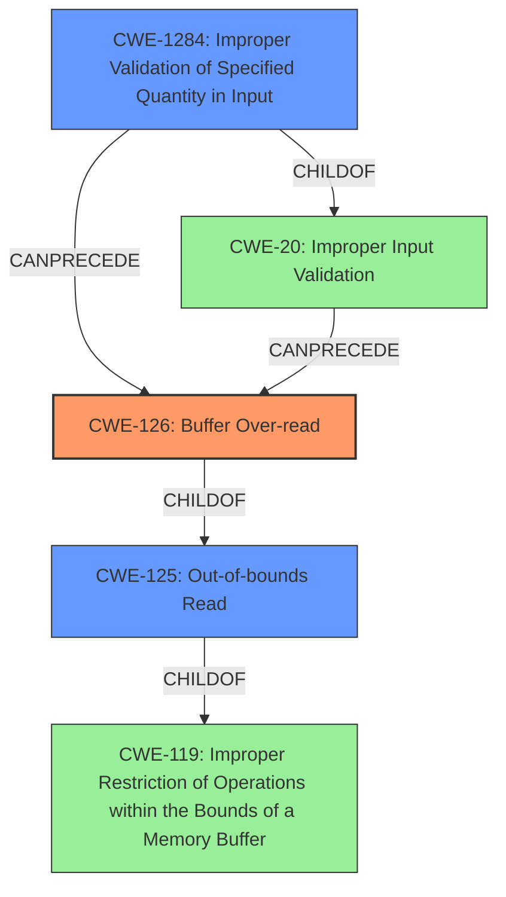

# Final Resolution for CVE-2022-32141

# Summary
| CWE ID | CWE Name | Confidence | CWE Abstraction Level | CWE Vulnerability Mapping Label | CWE-Vulnerability Mapping Notes |
|---|---|---|---|---|---|
| CWE-126 | Buffer Over-read | 0.95 | Variant | Allowed | Primary CWE |
| CWE-125 | Out-of-bounds Read | 0.70 | Base | Allowed | Secondary Candidate |
| CWE-1284 | Improper Validation of Specified Quantity in Input | 0.60 | Base | Allowed | Secondary Candidate |

## Evidence and Confidence

*   **Confidence Score:** 0.90
*   **Evidence Strength:** HIGH

## Relationship Analysis
The primary CWE is **CWE-126** [Buffer Over-read], which is a variant of **CWE-119** [Improper Restriction of Operations within the Bounds of a Memory Buffer]. **CWE-125** [Out-of-bounds Read] is a more general base-level CWE that encompasses **CWE-126**. **CWE-1284** [Improper Validation of Specified Quantity in Input] is related as the invalid offset could be due to improper input validation. The analysis correctly identifies the hierarchical relationships. **CWE-126** being a variant provides a more specific classification.

## Vulnerability Chain
The vulnerability chain starts with a request containing an invalid offset. This could be due to **CWE-1284** [Improper Validation of Specified Quantity in Input] where the offset is not properly validated. This leads to **CWE-126** [Buffer Over-read] where the software reads beyond the intended buffer, resulting in a denial-of-service. The root cause is the missing or insufficient input validation, leading to the over-read and the denial-of-service.

## Summary of Analysis
The initial analysis and the criticism both converge on **CWE-126** [Buffer Over-read] as the primary weakness, and this determination is strongly based on the vulnerability description mentioning "buffer over read". The reference links content summary in the CVE also explicitly mentions **CWE-126**.

The relationship analysis supports the selection of **CWE-126** as it is a more specific variant of **CWE-119** [Improper Restriction of Operations within the Bounds of a Memory Buffer] and **CWE-125** [Out-of-bounds Read].

The chosen CWEs are at the optimal level of specificity, with **CWE-126** providing the most accurate representation of the vulnerability, while **CWE-125** and **CWE-1284** capture contributing factors. The evidence provided, combined with the CWE relationship analysis, justifies this decision.