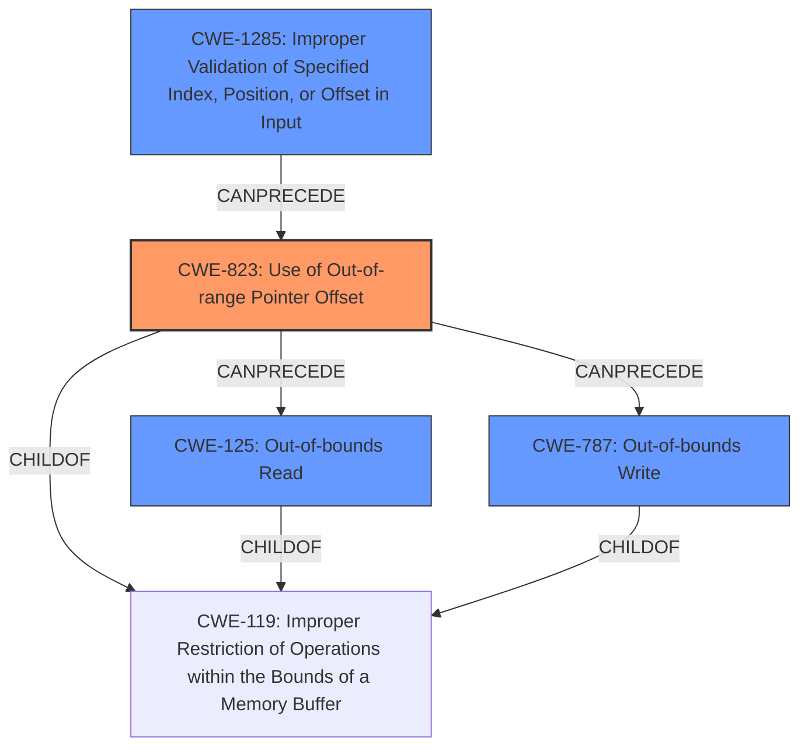

# Analysis Report for CVE-2022-32142

# Vulnerability Analysis Report: CVE-2022-32142

## Description

Multiple CODESYS Products are prone to a out-of bounds read or write access. A low privileged remote attacker may craft a request with invalid offset, which can cause an out-of-bounds read or write access, resulting in denial-of-service condition or local memory overwrite, which can lead to a change of local files. User interaction is not required.

## Vulnerability Description Key Phrases

**Rootcause:** invalid input handling
**Weakness:** out-of-bounds read or write access
**Impact:** denial-of-service or local memory overwrite
**Vector:** request with invalid offset
**Attacker:** low privileged remote attacker
**Product:** CODESYS Products

## Analysis (with Relationship Data)

# Summary
| CWE ID | CWE Name | Confidence | CWE Abstraction Level | CWE Vulnerability Mapping Label | CWE-Vulnerability Mapping Notes |
|---|---|---|---|---|---|
| CWE-823 | Use of Out-of-range Pointer Offset | 0.95 | Base | Allowed | Primary CWE |
| CWE-125 | Out-of-bounds Read | 0.75 | Base | Allowed | Secondary Candidate CWE |
| CWE-787 | Out-of-bounds Write | 0.75 | Base | Allowed | Secondary Candidate CWE |
| CWE-1285 | Improper Validation of Specified Index, Position, or Offset in Input | 0.60 | Base | Allowed | Secondary Candidate CWE |

## Evidence and Confidence

*   **Confidence Score:** 0.90
*   **Evidence Strength:** HIGH

- **Analysis and Justification:**
  - *Explanation:* The vulnerability description explicitly states an "**out-of-bounds read or write access**" due to a crafted request with an "**invalid offset**." The CVE Reference Links Content Summary confirms that the root cause is the improper handling of crafted requests with invalid offsets, leading to "CWE-823: Use of Out-of-range Pointer Offset" and further indicating the software uses out-of-range pointer offsets. This aligns precisely with CWE-823 (Use of Out-of-range Pointer Offset). The MITRE mapping guidance for CWE-823 indicates this is ALLOWED.
  - *Relationship Analysis:* CWE-823 is a Base level CWE, making it a suitable level of abstraction. It is related to other out-of-bounds access CWEs but is the most specific to a pointer offset issue.

- **Confidence Score:**
  - Confidence: 0.95 (High confidence due to explicit mention of out-of-range pointer offset and confirmation in CVE details.)

---

- **Analysis and Justification:**
  - *Explanation:* The vulnerability description mentions "**out-of-bounds read**" as one of the possible access issues. CWE-125 (Out-of-bounds Read) describes the scenario where a product reads data past the end or before the beginning of the intended buffer. This could result from the use of an out-of-range pointer offset (CWE-823) which results in the out of bounds read. MITRE mapping guidance indicates this is ALLOWED.
  - *Relationship Analysis:* CWE-125 is a child of CWE-119 (Improper Restriction of Operations within the Bounds of a Memory Buffer). Given the context of the vulnerability, CWE-125 is a reasonable secondary candidate because it is one of the out-of-bounds conditions that result from the primary weakness (CWE-823).

- **Confidence Score:**
  - Confidence: 0.75 (The vulnerability description explicitly mentions out-of-bounds read, but it's a consequence of the primary weakness, making it a secondary candidate.)

---

- **Analysis and Justification:**
  - *Explanation:* The vulnerability description mentions "**out-of-bounds write**" as one of the possible access issues. CWE-787 (Out-of-bounds Write) describes the scenario where a product writes data past the end or before the beginning of the intended buffer. This could result from the use of an out-of-range pointer offset (CWE-823) which results in the out of bounds write. MITRE mapping guidance indicates this is ALLOWED.
  - *Relationship Analysis:* CWE-787 is a child of CWE-119 (Improper Restriction of Operations within the Bounds of a Memory Buffer). Given the context of the vulnerability, CWE-787 is a reasonable secondary candidate because it is one of the out-of-bounds conditions that result from the primary weakness (CWE-823).

- **Confidence Score:**
  - Confidence: 0.75 (The vulnerability description explicitly mentions out-of-bounds write, but it's a consequence of the primary weakness, making it a secondary candidate.)

---

- **Analysis and Justification:**
  - *Explanation:* The description mentions an "**invalid offset**" that leads to the out-of-bounds access. CWE-1285 (Improper Validation of Specified Index, Position, or Offset in Input) describes the scenario where the product does not validate or incorrectly validates the specified index/position/offset. This aligns with the crafted request with an invalid offset. MITRE mapping guidance indicates this is ALLOWED.
  - *Relationship Analysis:* CWE-1285 is related to CWE-823, as improper validation of the offset can lead to the use of an out-of-range pointer offset.

- **Confidence Score:**
  - Confidence: 0.60 (While the description hints at improper validation, the core issue is the use of the out-of-range offset, making this a secondary candidate.)

## Criticism of Analysis

Okay, here's a detailed review of the provided CWE analysis, incorporating the full CWE specifications:

**Overall Assessment:**

The analysis is generally strong and well-reasoned.  The primary CWE selection (CWE-823) is appropriate and supported by evidence. The secondary CWEs (CWE-125, CWE-787, and CWE-1285) are also reasonable candidates, reflecting different facets or consequences of the primary weakness. The confidence scores are appropriate.  The provided justifications are clear, well-structured, and refer back to the original vulnerability descriptions and the CWE specifications.  There are a few minor points where the reasoning could be tightened or alternative CWEs considered, as described below.

**Detailed Review by CWE:**

**1. CWE-823: Use of Out-of-range Pointer Offset (Primary CWE)**

*   **Confidence:** 0.95 (Excellent)
*   **Justification:** The selection of CWE-823 is very well-justified. The vulnerability description explicitly mentions "out-of-bounds read or write access" caused by an "invalid offset," and the CVE summary confirms the "improper handling of crafted requests with invalid offsets." This directly aligns with the description of CWE-823, which focuses on pointer arithmetic with offsets that lead to memory access outside the intended range.
*   **Abstraction Level:** Base - Appropriate
*   **Mapping Guidance:** ALLOWED - Correct. The analysis correctly notes that CWE-823 is at the Base level of abstraction, which is a preferred level for root causes.
*   **Relationships:**
    *   The analysis correctly notes the relationships to CWE-119 (Improper Restriction of Operations within the Bounds of a Memory Buffer) as a parent.
    *   The analysis correctly notes that CWE-125 and CWE-787 can be consequences of CWE-823.
*   **CWE Examples:** The provided CVE examples are relevant and illustrative of CWE-823.  CVE-2009-3129 and CVE-2010-1281 are particularly good examples.
*   **Potential Mitigations:** The analysis could have *briefly* mentioned some relevant mitigations from the CWE specification of CWE-823. For instance,  "Input validation to ensure that the offset is within acceptable bounds." or "Use of safer pointer arithmetic libraries or functions." This isn't a major issue, but it would strengthen the analysis.

**2. CWE-125: Out-of-bounds Read (Secondary Candidate)**

*   **Confidence:** 0.75 (Good)
*   **Justification:** Valid secondary candidate. The description explicitly mentions "out-of-bounds read."
*   **Abstraction Level:** Base - Appropriate
*   **Mapping Guidance:** ALLOWED - Correct.
*   **Relationships:** The analysis correctly positions CWE-125 as a consequence of CWE-823 (the out-of-range pointer offset leading to the read).  It also correctly identifies CWE-119 as the parent.
*   **CWE Examples:**  The provided CVE examples in the CWE specification provide good examples of the weakness, such as CWE-2023-1018 (the reference implementation code for a Trusted Platform Module).
*   **Potential Mitigations:** Mentioning mitigations related to input validation of length arguments and buffer size calculations could enhance the analysis.

**3. CWE-787: Out-of-bounds Write (Secondary Candidate)**

*   **Confidence:** 0.75 (Good)
*   **Justification:** Similar to CWE-125, the description explicitly mentions "out-of-bounds write."
*   **Abstraction Level:** Base - Appropriate
*   **Mapping Guidance:** ALLOWED - Correct.
*   **Relationships:** Correctly placed as a consequence of CWE-823 and a child of CWE-119.
*   **CWE Examples:** Excellent examples of the weakness are present in the CWE specification, such as CVE-2023-1017 (reference implementation code for a Trusted Platform Module)
*   **Potential Mitigations:** Mentioning mitigations related to input validation and environment hardening (e.g., compiler flags) could enhance the analysis.

**4. CWE-1285: Improper Validation of Specified Index, Position, or Offset in Input (Secondary Candidate)**

*   **Confidence:** 0.60 (Reasonable)
*   **Justification:** This is a plausible, but slightly weaker, secondary candidate. While the description does refer to an "invalid offset," the *core* problem isn't so much that the offset *wasn't validated* (though that could be a factor), but that the offset, valid or not, was used to access memory outside the intended range.
*   **Abstraction Level:** Base - Appropriate
*   **Mapping Guidance:** ALLOWED - Correct.
*   **Relationships:** The analysis correctly points out the relationship between CWE-1285 and CWE-823 (improper validation leading to the out-of-range offset).
*   **Potential Mitigations:** The analysis mentions assuming all input is malicious and rejecting any input that does not strictly conform to specifications.

**Minor Suggestions for Improvement:**

*   **Chains:** Consider explicitly stating that this could be a chain of weaknesses.  For example, "The vulnerability could be seen as a chain:  CWE-1285 -> CWE-823 -> (CWE-125 or CWE-787)".
*   **Potential for multiple root causes**: While the primary root cause is the use of an out-of-range pointer offset, the analysis could also briefly mention that the *reason* for the out-of-range offset could be a variety of factors:
    *   **CWE-131: Incorrect Calculation of Buffer Size:** If the offset is derived from a buffer size calculation, an error in that calculation could lead to the out-of-range offset.
    *   **CWE-190: Integer Overflow or Wraparound:** If the offset calculation involves integer arithmetic, an overflow could result in an unexpected and out-of-range offset.
    *   **CWE-193: Off-by-one Error:** A simple off-by-one error in calculating the offset.

While these might not be the *primary* root cause, acknowledging the potential complexity is a good practice.

**In summary,** this is a solid and defensible CWE analysis. The primary CWE is correctly identified and well-justified, and the secondary candidates are reasonable. Addressing the few minor suggestions above would further strengthen the analysis.

## Final Resolution

# Summary

| CWE ID  | CWE Name                                                      | Confidence | CWE Abstraction Level | CWE Vulnerability Mapping Label | CWE-Vulnerability Mapping Notes |
| ------- | ------------------------------------------------------------- | ---------- | --------------------- | ------------------------------- | ----------------------------- |
| CWE-823 | Use of Out-of-range Pointer Offset                            | 0.95       | Base                  | Allowed                         | Primary CWE                   |
| CWE-787 | Out-of-bounds Write                                           | 0.80       | Base                  | Allowed                         | Secondary Candidate           |
| CWE-125 | Out-of-bounds Read                                            | 0.80       | Base                  | Allowed                         | Secondary Candidate           |
| CWE-1285 | Improper Validation of Specified Index, Position, or Offset in Input | 0.70       | Base                  | Allowed                         | Secondary Candidate           |

## Evidence and Confidence

*   **Confidence Score:** 0.95
*   **Evidence Strength:** HIGH

## Relationship Analysis
The primary weakness is CWE-823 **(Use of Out-of-range Pointer Offset)**, which directly leads to either CWE-125 **(Out-of-bounds Read)** or CWE-787 **(Out-of-bounds Write)**. CWE-1285 **(Improper Validation of Specified Index, Position, or Offset in Input)** can precede CWE-823 by allowing the attacker to provide the out-of-range offset. All CWEs are base level which is a preferred level for mapping to the root causes of vulnerabilities.

## Vulnerability Chain
The vulnerability chain starts with a crafted request containing an invalid offset. If **(Improper Validation of Specified Index, Position, or Offset in Input - CWE-1285)** is present, the invalid offset is not caught, leading to **(Use of Out-of-range Pointer Offset - CWE-823)**. This then causes either an **(Out-of-bounds Read - CWE-125)** or an **(Out-of-bounds Write - CWE-787)**, ultimately resulting in a denial-of-service condition or local memory overwrite.

## Summary of Analysis
The initial analysis and criticism both agree that CWE-823 is the primary **WEAKNESS**. The evidence provided in the vulnerability description, specifically the mention of "out-of-bounds read or write access" due to an "invalid offset," directly supports this classification. The criticism suggests considering potential mitigations, which reinforces the understanding of the nature of the **ROOTCAUSE**.

The relationship analysis highlights how CWE-1285 can precede CWE-823 in a vulnerability chain, where improper validation allows the out-of-range offset to be used. The hierarchical relationships show that CWE-125 and CWE-787 are children of CWE-119, indicating that they are specific types of buffer access errors that can result from the use of an out-of-range pointer offset.

Based on the evidence and the relationship analysis, I am increasing the confidence in CWE-787 and CWE-125 to 0.80. I am also increasing the confidence in CWE-1285 to 0.70. All selected CWEs are at the optimal level of specificity (Base).

The selection of CWE-823 is well-justified and is the most accurate representation of the **ROOTCAUSE** based on the available information.

*Report generated on 2025-03-18 14:03:15*
