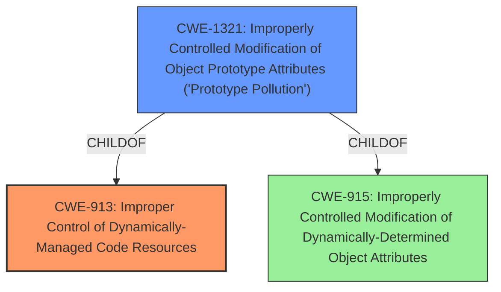

# Final Resolution for CVE-2022-3225

# Summary

| CWE ID | CWE Name | Confidence | CWE Abstraction Level | CWE Vulnerability Mapping Label | CWE-Vulnerability Mapping Notes |
|---|---|---|---|---|---|
| CWE-913 | Improper Control of Dynamically-Managed Code Resources | 0.65 | Class | Allowed-with-Review | Primary CWE |
| CWE-1321 | Improperly Controlled Modification of Object Prototype Attributes ('Prototype Pollution') | 0.5 | Variant | Allowed | Secondary Candidate |

## Evidence and Confidence

*   **Confidence Score:** 0.6
*   **Evidence Strength:** LOW

## Relationship Analysis

The initial analysis leaned towards CWE-913 as the primary **weakness** due to the vulnerability description explicitly mentioning "Improper Control of Dynamically-Managed Code Resources." The criticism correctly pointed out that CWE-913 is a Class-level CWE and a more specific Base or Variant CWE would be preferable. The criticism also suggested exploring alternative CWEs like CWE-1321 (Prototype Pollution), CWE-470 (Unsafe Reflection), and CWE-502 (Deserialization of Untrusted Data). While there isn't enough evidence to confidently pinpoint the exact **root cause**, the suggestion to investigate prototype pollution is the most compelling, given the context of dynamically-managed resources in a JavaScript environment, and the fact that the repository is related to a Javascript framework. Therefore, while keeping CWE-913 as a potential high-level classification, CWE-1321 is being added as a secondary candidate.

## Vulnerability Chain

The vulnerability chain starts with the **root cause**, which is the improper control of dynamically-managed code resources (potentially CWE-913). If the issue is related to prototype pollution (CWE-1321), then an attacker could modify object prototypes, leading to unexpected behavior or even code execution. Without more information, a precise chain cannot be established.

## Summary of Analysis

The initial analysis correctly identified CWE-913 as a potential candidate based on the vulnerability description. However, the criticism highlighted the need for a more specific classification and suggested several alternative CWEs. Given the limited information, it's difficult to pinpoint the exact **root cause** with high confidence. The decision to keep CWE-913 as the primary CWE is based on the direct match with the vulnerability description: "Improper Control of Dynamically-Managed Code Resources." However, the confidence is being reduced to 0.65 due to its high level of abstraction.

The addition of CWE-1321 as a secondary candidate is influenced by the context of the application (Budibase, a low-code platform using JavaScript) and the nature of dynamically-managed resources. Prototype pollution is a common issue in JavaScript applications and could be a more specific manifestation of the improper control. However, there is no explicit evidence to confirm this, hence the lower confidence score of 0.5.

The optimal level of specificity is difficult to achieve without more information. While CWE-913 is a Class-level CWE, it serves as a starting point. Further investigation is needed to determine if a more specific Base or Variant CWE, such as CWE-1321, is a better fit.