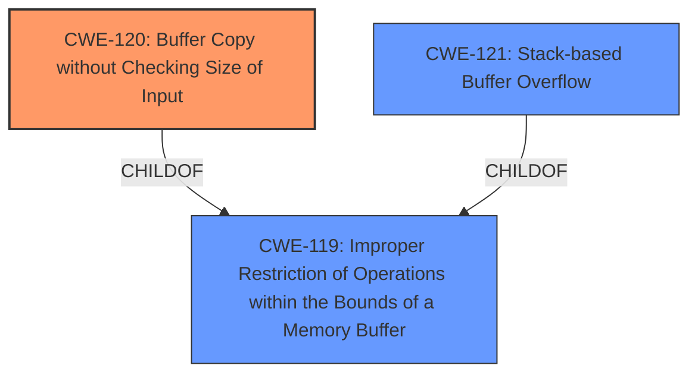

# Final Resolution for CVE-2022-32527

# Summary
| CWE ID | CWE Name | Confidence | CWE Abstraction Level | CWE Vulnerability Mapping Label | CWE-Vulnerability Mapping Notes |
|---|---|---|---|---|---|
| CWE-120 | Buffer Copy without Checking Size of Input ('Classic Buffer Overflow') | 1.0 | Base | Allowed-with-Review | Primary CWE. **Root cause** is the unchecked buffer copy. |
| CWE-121 | Stack-based Buffer Overflow | 0.6 | Variant | Allowed | Secondary Candidate. Describes the location of the overflow (stack) rather than the **root cause**. |

## Evidence and Confidence

*   **Confidence Score:** 1.0
*   **Evidence Strength:** HIGH

## Relationship Analysis
The primary relationship impacting the decision is the parent-child relationship between CWE-119 (Improper Restriction of Operations within the Bounds of a Memory Buffer) and both CWE-120 and CWE-121. CWE-120 is a specific type of buffer overflow where the size isn't checked during a copy operation, making it more precise than CWE-119. CWE-121 describes where the overflow happens (stack), not the cause. The choice of CWE-120 is further solidified by the direct mention in the vulnerability description as the **root cause**.

## Vulnerability Chain
The vulnerability chain starts with the lack of input size validation during a buffer copy operation (**CWE-120**). This leads to a buffer overflow on the stack (**CWE-121**), potentially allowing an attacker to overwrite critical data or execute arbitrary code.

## Summary of Analysis
The initial analysis correctly identifies CWE-120 as the primary **weakness** due to the explicit mention in the vulnerability description: "A **CWE-120 Buffer Copy without Checking Size of Input** vulnerability exists that could cause a stack-based buffer overflow." This direct evidence, along with the understanding that CWE-120 represents the **root cause** (unchecked buffer copy) and CWE-121 represents the location of the overflow, supports the classification.

The criticism's suggestion to address why other high-ranking CWEs (CWE-124, CWE-131, CWE-190) were not selected strengthens the analysis by demonstrating a deeper understanding of the nuances between different buffer overflow scenarios.

*   **CWE-124 (Buffer Underwrite):** Not applicable as the description indicates an overflow.
*   **CWE-131 (Incorrect Calculation of Buffer Size):** The description focuses on the absence of a check during the copy operation, rather than a miscalculation of the buffer size.
*   **CWE-190 (Integer Overflow):** There is no indication of an integer overflow in the vulnerability description.

The chosen CWEs are at the optimal level of specificity because CWE-120 accurately describes the **root cause**, and CWE-121 provides additional context about the location of the overflow. Choosing the more general CWE-119 would lose valuable information about the specific type of buffer overflow.