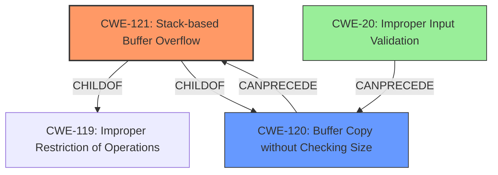

# Analysis Report for CVE-2022-32529

# Vulnerability Analysis Report: CVE-2022-32529

## Description

A CWE-120 Buffer Copy without Checking Size of Input vulnerability exists that could cause a stack-based buffer overflow, potentially leading to remote code execution when an attacker sends specially crafted log data request messages. Affected Products IGSS Data Server - IGSSdataServer.exe (Versions prior to V15.0.0.22170)

## Vulnerability Description Key Phrases

**Rootcause:** CWE-120 Buffer Copy without Checking Size of Input
**Impact:** stack-based buffer overflow
**Attacker:** attacker
**Product:** IGSS Data Server
**Version:** Versions prior to V15.0.0.22170
**Component:** IGSSdataServer.exe

## Analysis (with Relationship Data)

# Summary
| CWE ID | CWE Name | Confidence | CWE Abstraction Level | CWE Vulnerability Mapping Label | CWE-Vulnerability Mapping Notes |
|---|---|---|---|---|---|
| CWE-121 | Stack-based Buffer Overflow | 0.9 | Variant | Allowed | Primary CWE |
| CWE-120 | Buffer Copy without Checking Size of Input ('Classic Buffer Overflow') | 0.7 | Base | Allowed-with-Review | Secondary Candidate |

## Evidence and Confidence

*   **Confidence Score:** 0.9
*   **Evidence Strength:** HIGH

- **Analysis and Justification:**  
  - *Explanation:* The vulnerability description explicitly states a "**CWE-120 Buffer Copy without Checking Size of Input** vulnerability exists that could cause a stack-based buffer overflow." While the description mentions CWE-120, the fact that it results in a "stack-based buffer overflow" allows us to choose the more specific **CWE-121 Stack-based Buffer Overflow**. CWE-121 is a variant of a more general buffer overflow, so it's appropriate to use it. CWE-120 is also included because it's a contributing factor to the **rootcause**.

  - *Relationship Analysis:* CWE-121 is a variant of **CWE-119 Improper Restriction of Operations within the Bounds of a Memory Buffer**. CWE-121 is also a child of **CWE-120 Buffer Copy without Checking Size of Input**, because the copy operation without checking size can lead to a stack-based buffer overflow.

- **Confidence Score:**  
  - Confidence: 0.9 (High evidence from the vulnerability description. The description clearly indicates a stack-based buffer overflow due to a buffer copy without size checking.)

---

## Criticism of Analysis

Okay, here's a review of the CWE analysis, considering the full CWE specifications:

**Overall Assessment:**

The analysis is generally good and arrives at a reasonable conclusion. The prioritization of CWE-121 (Stack-based Buffer Overflow) as the primary CWE is appropriate given the vulnerability description.  The inclusion of CWE-120 (Buffer Copy without Checking Size of Input) as a contributing factor is also a good practice. The confidence level of 0.9 is justified due to the explicit mention of "stack-based buffer overflow" in the description.

**Specific Points and Suggestions:**

1.  **CWE-121 vs. CWE-120:**

    *   The analysis correctly points out that CWE-121 is a more specific variant of the general buffer overflow.  The justification for selecting CWE-121 as primary is solid because the vulnerability *explicitly* states "stack-based buffer overflow".
    *   The inclusion of CWE-120 as a secondary candidate to represent root cause is spot on.

2.  **Relationship Analysis:**

    *   The relationship analysis is accurate.  CWE-121 is a child of both CWE-788 (Access of Memory Location After End of Buffer) and CWE-787 (Out-of-bounds Write), representing the *location* of the overflow and the *action* taken.
    *   The parent relationship of CWE-121 and CWE-120 is correct from the perspective that an unchecked copy can *lead* to a stack overflow.

3.  **CWE Examples:**

    *   The CWE Examples section is useful for providing context. However, it could be enhanced by highlighting examples that specifically mention stack-based overflows (for CWE-121) versus general buffer overflows (for CWE-120).

4.  **CWE Specifications Review:**

    *   **CWE-121:** The mitigations listed for CWE-121 are relevant. The analysis could mention the importance of compiler-level defenses (like `/GS` in Visual Studio or `FORTIFY_SOURCE` in GCC) as a critical defense in depth strategy as it's mentioned in the spec.
    *   **CWE-120:** The analysis and mapping guidance section for CWE-120 is vital to understand because it is "Allowed-with-Review." It is important to know when *not* to use this CWE. This analysis avoids the trap of using CWE-120 just because the description uses the term "buffer overflow".  The analysis correctly identifies that this CWE is appropriate because the vulnerability stems from a buffer copy operation where size checks are absent.
    * **CWE-119:** It's good that the analysis didn't stop at CWE-119, as the mapping guidance specifically states "Discouraged" usage and suggests using lower-level children like CWE-787 and CWE-125. It is the *parent* of both CWE-120 and CWE-121, so that's a confirmation that they are related.

5.  **Other CWEs Considered by Retriever:**

    *   The Retriever results mention several other CWEs.  While the analysis doesn't need to include *all* of them, it's worth briefly considering why they are *not* appropriate to further strengthen the justification.
        *   **CWE-124 (Buffer Underwrite):** Not appropriate because the description talks about an *overflow*, writing *past* the end of a buffer, not before the start.
        *   **CWE-131 (Incorrect Calculation of Buffer Size):**  While a miscalculation *could* lead to an overflow, the description primarily focuses on the *absence* of size checking.  If the description explicitly mentioned a calculation error, this would be more relevant.
        *   **CWE-190 (Integer Overflow or Wraparound):** Similar to CWE-131, while *possible*, it is not explicitly stated or implied in the description.
        *   **CWE-125 (Out-of-bounds Read):** This analysis is focussed on *writing* past the end of the buffer.
        *   **CWE-805 (Buffer Access with Incorrect Length Value):** Although related, CWE-120 more directly addresses the absence of size checking during the copy operation. If the vulnerability report specifically mentions a situation where a length parameter was provided but incorrect, then CWE-805 would be more appropriate to consider.
        *   **CWE-787 (Out-of-bounds Write):** Although writing out of bounds will result from CWE-121 and CWE-120, CWE-787 is not *specific* as CWE-121 (stack)
        *   **CWE-130 (Improper Handling of Length Parameter Inconsistency):** More applicable if the vulnerability mentioned an *inconsistent* length parameter, not simply the absence of checking.
        *   **CWE-789 (Memory Allocation with Excessive Size Value):** Not explicitly related here.

6.  **Potential Chain:**
    * A potential chain could be: `CWE-20 -> CWE-120 -> CWE-121` Improper Input Validation leading to Buffer Copy without Checking Size of Input leading to Stack-based Buffer Overflow

**Revised Summary Table (Optional):**

| CWE ID | CWE Name | Confidence | CWE Abstraction Level | CWE Vulnerability Mapping Label | CWE-Vulnerability Mapping Notes |
|---|---|---|---|---|---|
| CWE-121 | Stack-based Buffer Overflow | 0.9 | Variant | Allowed | Primary CWE. Explicitly mentioned in vulnerability description. |
| CWE-120 | Buffer Copy without Checking Size of Input ('Classic Buffer Overflow') | 0.7 | Base | Allowed-with-Review | Secondary Candidate. Root cause leading to the stack overflow.  Unchecked buffer copy. |
| CWE-20 | Improper Input Validation | 0.3 | Class | Allowed-with-Review | Contributing factor. Could contribute to this vulnerability if there was no input validation to restrict the size of the log data request messages |

**Conclusion:**

The analysis is accurate and well-justified. It demonstrates a good understanding of the CWE specifications and the nuances of buffer overflow vulnerabilities. Considering other possible CWEs and explaining why they are less appropriate (as suggested above) would further strengthen it. It correctly emphasizes the importance of CWE-121 given the stack-based context and CWE-120 as the root cause.

## Final Resolution

# Summary
| CWE ID | CWE Name | Confidence | CWE Abstraction Level | CWE Vulnerability Mapping Label | CWE-Vulnerability Mapping Notes |
|---|---|---|---|---|---|
| CWE-121 | Stack-based Buffer Overflow | 0.9 | Variant | Allowed | Primary CWE |
| CWE-120 | Buffer Copy without Checking Size of Input ('Classic Buffer Overflow') | 0.7 | Base | Allowed-with-Review | Secondary Candidate |
| CWE-20 | Improper Input Validation | 0.3 | Class | Allowed | Contributing factor |

## Evidence and Confidence

*   **Confidence Score:** 0.9
*   **Evidence Strength:** HIGH

## Relationship Analysis
The analysis correctly identifies CWE-121 as a variant of **CWE-119 Improper Restriction of Operations within the Bounds of a Memory Buffer**, focusing on the location of the overflow (stack). The parent-child relationship between CWE-120 and CWE-121 is also accurate, as an unchecked buffer copy can lead to a stack overflow. The addition of CWE-20 highlights a potential vulnerability chain starting with improper input validation. The abstraction levels (Variant for CWE-121, Base for CWE-120, Class for CWE-20) are appropriately considered for specificity.

## Vulnerability Chain
The vulnerability chain starts with a lack of input validation (**CWE-20**), which allows an attacker to send a specially crafted log data request message. This message is then processed using a buffer copy operation without proper size checking (**CWE-120**), leading to a stack-based buffer overflow (**CWE-121**). The overflow can then allow arbitrary code execution.

## Summary of Analysis
The initial analysis and criticism both converge on the appropriateness of selecting **CWE-121 Stack-based Buffer Overflow** as the primary **WEAKNESS**, given the explicit mention of "stack-based buffer overflow" in the vulnerability description: "A **CWE-120 Buffer Copy without Checking Size of Input** vulnerability exists that could cause a stack-based buffer overflow".
The inclusion of **CWE-120 Buffer Copy without Checking Size of Input** as a secondary candidate is also justified, as it represents the **ROOTCAUSE** of the vulnerability - the unchecked buffer copy operation. Adding CWE-20 is to show the potential start of the vulnerability chain.
The graph relationships reinforce these choices, with CWE-121 being a child of both CWE-119 and CWE-120.
The selected CWEs are at an optimal level of specificity, with CWE-121 providing a more precise classification than the general **CWE-119 Improper Restriction of Operations within the Bounds of a Memory Buffer**, and **CWE-120** explaining the root cause of the vulnerability.
The confidence score is high (0.9) due to the direct evidence in the vulnerability description.

*Report generated on 2025-03-18 14:06:33*
