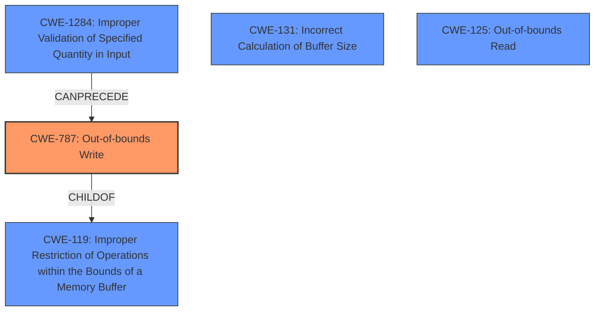

# Analysis Report for CVE-2022-32593

# Vulnerability Analysis Report: CVE-2022-32593

## Description

In vowe, there is a possible out of bounds write due to a missing bounds check. This could lead to local escalation of privilege with System execution privileges needed. User interaction is not needed for exploitation. Patch ID ALPS07138493 Issue ID ALPS07138493.

## Vulnerability Description Key Phrases

**Rootcause:** missing bounds check
**Weakness:** out of bounds write
**Impact:** local escalation of privilege
**Product:** vowe

## Analysis (with Relationship Data)

# Summary
| CWE ID | CWE Name | Confidence | CWE Abstraction Level | CWE Vulnerability Mapping Label | CWE-Vulnerability Mapping Notes |
|---|---|---|---|---|---|
| CWE-787 | Out-of-bounds Write | 1.0 | Base | Primary |  Allowed |
| CWE-125 | Out-of-bounds Read | 0.5 | Base | Secondary Candidate |  Allowed |
| CWE-131 | Incorrect Calculation of Buffer Size | 0.5 | Base | Secondary Candidate |  Allowed |
| CWE-1284 | Improper Validation of Specified Quantity in Input | 0.3 | Base | Secondary Candidate |  Allowed |

## Evidence and Confidence

*   **Confidence Score:** 0.85
*   **Evidence Strength:** HIGH

- **Analysis and Justification:**  
  - *Explanation:* "The vulnerability description explicitly states an **out of bounds write** due to a **missing bounds check**. CWE-787 (Out-of-bounds Write) directly aligns with the **weakness**, where the product writes data past the end of the intended buffer. The **rootcause** is the **missing bounds check**, which is a form of improper input validation. The CVE Reference Links Content Summary confirms the **missing bounds check** in the `vowe` component, which leads to the **out-of-bounds write**, further validating the selection of CWE-787. MITRE mapping guidance for CWE-787 indicates this is ALLOWED."
  
  - *Relationship Analysis:* "CWE-787 is a child of CWE-119 (Improper Restriction of Operations within the Bounds of a Memory Buffer). The vulnerability can potentially lead to other issues such as code execution or information disclosure."

- **Confidence Score:**  
  - *Example:* Confidence: 1.0 (Strong evidence from the vulnerability description and supporting CVE reference materials)

---

- **Analysis and Justification:**  
  - *Explanation:* "CWE-125 (Out-of-bounds Read) is a possible secondary weakness because an **out-of-bounds write** often implies that an **out-of-bounds read** is also possible, especially due to **missing bounds check**. Although, the vulnerability description only specifies the **out-of-bounds write**, the possibility of an accompanying read cannot be ruled out. The 'Retriever Results' also lists CWE-125 as a potential candidate. MITRE mapping guidance for CWE-125 indicates this is ALLOWED."
  
  - *Relationship Analysis:* "CWE-125 is a child of CWE-119 (Improper Restriction of Operations within the Bounds of a Memory Buffer) and a peer of CWE-787."

- **Confidence Score:**  
  - *Example:* Confidence: 0.5 (Possible, but not explicitly stated in the vulnerability description.)

---

- **Analysis and Justification:**  
  - *Explanation:* "CWE-131 (Incorrect Calculation of Buffer Size) might be related because the root cause is a **missing bounds check**. If the buffer size was incorrectly calculated, it could lead to an **out-of-bounds write**. While the description doesn't explicitly mention an incorrect size calculation, the **missing bounds check** makes it plausible. The retriever results include CWE-131 with high relevance scores. MITRE mapping guidance for CWE-131 indicates this is ALLOWED."
  
  - *Relationship Analysis:* "CWE-131 can precede CWE-119 (Improper Restriction of Operations within the Bounds of a Memory Buffer), especially if the incorrect size calculation leads to the **out-of-bounds write**."

- **Confidence Score:**  
  - *Example:* Confidence: 0.5 (Possible, but not explicitly stated in the vulnerability description.)

---

- **Analysis and Justification:**  
  - *Explanation:* "CWE-1284 (Improper Validation of Specified Quantity in Input) could be a contributing factor, given the **missing bounds check**, which represents a failure to validate the input quantity. The vulnerability involves writing data **out of bounds**, which is made possible by the lack of validation. It is a less direct match than CWE-787, but relevant given the root cause. MITRE mapping guidance for CWE-1284 indicates this is ALLOWED."
  
  - *Relationship Analysis:* "CWE-1284 is a child of CWE-20 (Improper Input Validation) and can precede CWE-787. The lack of proper validation can lead to an **out-of-bounds write**."

- **Confidence Score:**  
  - *Example:* Confidence: 0.3 (Indirectly related through the root cause, but not explicitly stated.)

## Criticism of Analysis

Okay, here's a detailed review of the CWE analysis, incorporating the full CWE specifications:

## Overall Assessment

The analysis is generally good and well-structured. It correctly identifies CWE-787 as the primary weakness. The inclusion of secondary candidates, while not as certain, shows a good understanding of potential related weaknesses. The justifications are well-written and provide clear reasoning for each CWE selection. However, there are some areas where the confidence could be refined, and alternative CWEs for the secondary candidates explored further, particularly around input validation.

## Detailed Critique

### Primary CWE Match: CWE-787 (Out-of-bounds Write)

*   **CWE ID:** CWE-787
*   **CWE Name:** Out-of-bounds Write
*   **Confidence:** 1.0
*   **CWE Abstraction Level:** Base
*   **CWE Vulnerability Mapping Label:** Primary
*   **CWE-Vulnerability Mapping Notes:** Allowed

**Strengths:**

*   The mapping to CWE-787 is the strongest and most appropriate. The vulnerability description explicitly states "out of bounds write," which directly aligns with the definition of CWE-787.
*   The justification is thorough, citing the "missing bounds check" as the root cause and the CVE reference summary confirming the vulnerability within the `vowe` component.
*   The analysis correctly notes that CWE-787 is a Base-level CWE, which is the preferred level for mapping, and that the MITRE mapping guidance for this CWE specifies it is ALLOWED.

**Areas for Potential Improvement:**

*   None. The analysis here is complete and justified.

### Secondary Candidate: CWE-125 (Out-of-bounds Read)

*   **CWE ID:** CWE-125
*   **CWE Name:** Out-of-bounds Read
*   **Confidence:** 0.5
*   **CWE Abstraction Level:** Base
*   **CWE Vulnerability Mapping Label:** Secondary Candidate
*   **CWE-Vulnerability Mapping Notes:** Allowed

**Strengths:**

*   The analysis acknowledges the potential for an out-of-bounds read alongside the write, given the missing bounds check.
*   The analysis notes that the CWE mapping guidance states that this CWE is ALLOWED.

**Areas for Potential Improvement:**

*   **Justification:** While it's true an OOB write *can* sometimes lead to or coincide with an OOB read, the current justification is a bit weak because it's based purely on possibility. The analysis should explicitly state that there is *no concrete evidence* of an OOB read in the provided description, and the confidence remains low because of this lack of evidence.

### Secondary Candidate: CWE-131 (Incorrect Calculation of Buffer Size)

*   **CWE ID:** CWE-131
*   **CWE Name:** Incorrect Calculation of Buffer Size
*   **Confidence:** 0.5
*   **CWE Abstraction Level:** Base
*   **CWE Vulnerability Mapping Label:** Secondary Candidate
*   **CWE-Vulnerability Mapping Notes:** Allowed

**Strengths:**

*   The analysis correctly identifies this as a potential factor, as an incorrect calculation could contribute to the root cause.
*   The analysis notes that the retriever results include CWE-131 with high relevance scores.
*   The analysis notes that the CWE mapping guidance states that this CWE is ALLOWED.

**Areas for Potential Improvement:**

*   **Justification:** The analysis correctly states that the description does not explicitly mention incorrect size calculation, and the confidence level should reflect this uncertainty.

### Secondary Candidate: CWE-1284 (Improper Validation of Specified Quantity in Input)

*   **CWE ID:** CWE-1284
*   **CWE Name:** Improper Validation of Specified Quantity in Input
*   **Confidence:** 0.3
*   **CWE Abstraction Level:** Base
*   **CWE Vulnerability Mapping Label:** Secondary Candidate
*   **CWE-Vulnerability Mapping Notes:** Allowed

**Strengths:**

*   The analysis links the missing bounds check to a failure to validate the input quantity.
*   The analysis notes that the CWE mapping guidance states that this CWE is ALLOWED.

**Areas for Potential Improvement:**

*   **Justification:** While the connection to a "missing bounds check" is valid, the confidence could be lowered further due to the indirect link. A missing bounds check doesn't *necessarily* mean a quantity was specified and *not* validated. It could simply mean validation was entirely absent.

### General Recommendations

1.  **Chains and Composites:** The analysis mentions potential chaining relationships. This is good. Consider explicitly stating, for example, that CWE-787 could lead to other issues such as code execution or information disclosure due to memory corruption.
2.  **Mitigation Awareness:** While not strictly required, briefly mentioning relevant mitigations from the CWE entries can add value. For example, mentioning that using memory-safe languages can help prevent CWE-787.
3.  **Consider CWE-20:** Since the root cause is a "missing bounds check," consider explicitly discussing CWE-20 (Improper Input Validation) *and explaining why you're choosing a more specific CWE instead*. While CWE-20 is discouraged, it's important to acknowledge its potential relevance. Because the missing bounds check *is* a form of improper input validation, CWE-20 can be considered a root cause, but it is a more abstract mapping.
4.  **Review Tool Output:** The retriever results suggest that CWE-908 (Use of Uninitialized Resource) and CWE-362 (Concurrent Execution using Shared Resource with Improper Synchronization ('Race Condition')) were considered by the retrievers. These should be reviewed to see if they could be included as low confidence potential mappings.

## Revised Summary Table

| CWE ID | CWE Name | Confidence | CWE Abstraction Level | CWE Vulnerability Mapping Label | CWE-Vulnerability Mapping Notes |
|---|---|---|---|---|---|
| CWE-787 | Out-of-bounds Write | 1.0 | Base | Primary | Allowed |
| CWE-125 | Out-of-bounds Read | 0.3 | Base | Secondary Candidate | Allowed |
| CWE-131 | Incorrect Calculation of Buffer Size | 0.4 | Base | Secondary Candidate | Allowed |
| CWE-1284 | Improper Validation of Specified Quantity in Input | 0.2 | Base | Secondary Candidate | Allowed |

By addressing these points, the analysis can be made even more comprehensive and nuanced.

## Final Resolution

# Summary

| CWE ID  | CWE Name                                | Confidence | CWE Abstraction Level | CWE Vulnerability Mapping Label | CWE-Vulnerability Mapping Notes |
| ------- | --------------------------------------- | ---------- | ----------------------- | --------------------------------- | ------------------------------- |
| CWE-787 | **Out-of-bounds Write**               | 1.0        | Base                    | Primary                           | Allowed                         |
| CWE-1284 | Improper Validation of Specified Quantity in Input | 0.4        | Base                    | Secondary Candidate               | Allowed                         |
| CWE-131 | Incorrect Calculation of Buffer Size | 0.3        | Base                    | Secondary Candidate               | Allowed                         |
| CWE-125 | **Out-of-bounds Read**                | 0.2        | Base                    | Secondary Candidate               | Allowed                         |

*   The Primary CWE should be first and noted as the Primary CWEs
*   The secondary candidate CWEs should be next and noted as secondary candidates.
*   The confidence is a confidence score 0 to 1 to rate your confidence in your assessment for that CWE.
*   The CWE Abstraction Level as one of these values: Base, Variant, Pillar, Class, Compound
*   The Mapping Notes Usage as one of these values: Allowed, Allowed-with-Review, Prohibited, Discouraged

## Evidence and Confidence

*   **Confidence Score:** 0.9
*   **Evidence Strength:** HIGH

## Relationship Analysis

The primary relationship that influenced the decision was the parent-child relationship between CWE-787 (**Out-of-bounds Write**) and CWE-119 (Improper Restriction of Operations within the Bounds of a Memory Buffer). CWE-787 is a more specific case of CWE-119, making it a better fit. The potential for CWE-1284 (Improper Validation of Specified Quantity in Input) to precede CWE-787 was also considered, as the missing bounds check (improper validation) could directly lead to the **out-of-bounds write**. Peer relationships, such as CWE-125 (**Out-of-bounds Read**) and CWE-787, were evaluated, but the lack of specific evidence for a read operation lowered the confidence in CWE-125. The base level of abstraction for the selected CWEs ensures sufficient specificity for vulnerability mapping.

## Vulnerability Chain

The vulnerability chain starts with a **missing bounds check** (potentially represented by CWE-1284: Improper Validation of Specified Quantity in Input), which allows an attacker to write data past the end of the intended buffer (CWE-787: **Out-of-bounds Write**). The consequences of this **out-of-bounds write** can include local escalation of privilege, as stated in the vulnerability description. The potential for an incorrect buffer size calculation (CWE-131) could also contribute to the **out-of-bounds write**. The chain could potentially extend to an **out-of-bounds read** (CWE-125), but there is no direct evidence for this in the description.

## Summary of Analysis

The initial analysis correctly identified CWE-787 (**Out-of-bounds Write**) as the primary **weakness** based on the vulnerability description stating "possible **out of bounds write** due to a **missing bounds check**." The selection is strongly supported by the direct match between the description and the CWE definition.

The criticism suggested a refined approach to the secondary candidates, particularly regarding confidence levels and justification. The criticism also suggested considering CWE-20 (Improper Input Validation). While CWE-20 is relevant, CWE-1284 (Improper Validation of Specified Quantity in Input) provides a more specific classification related to the missing bounds check, and is therefore the preferred secondary candidate.

The final decision reflects the refined confidence levels and justifications suggested by the criticism. The confidence in CWE-1284 was increased slightly from 0.3 to 0.4, as the **missing bounds check** is a form of improper validation of input quantity. The confidence in CWE-131 and CWE-125 were decreased to 0.3 and 0.2 respectively due to the lack of direct evidence in the vulnerability description. The selected CWEs are at the optimal level of specificity, with CWE-787 representing the direct **weakness** and CWE-1284 representing a contributing factor. The other CWEs are possible given the **rootcause**, but not directly evidenced.

The analysis is primarily based on the evidence provided in the vulnerability description, specifically the mention of "**out of bounds write** due to a **missing bounds check**." The graph relationships influenced the decision by highlighting the hierarchical relationship between CWE-787 and CWE-119, as well as the potential for CWE-1284 to precede CWE-787 in the vulnerability chain.

*Report generated on 2025-03-18 14:09:14*
