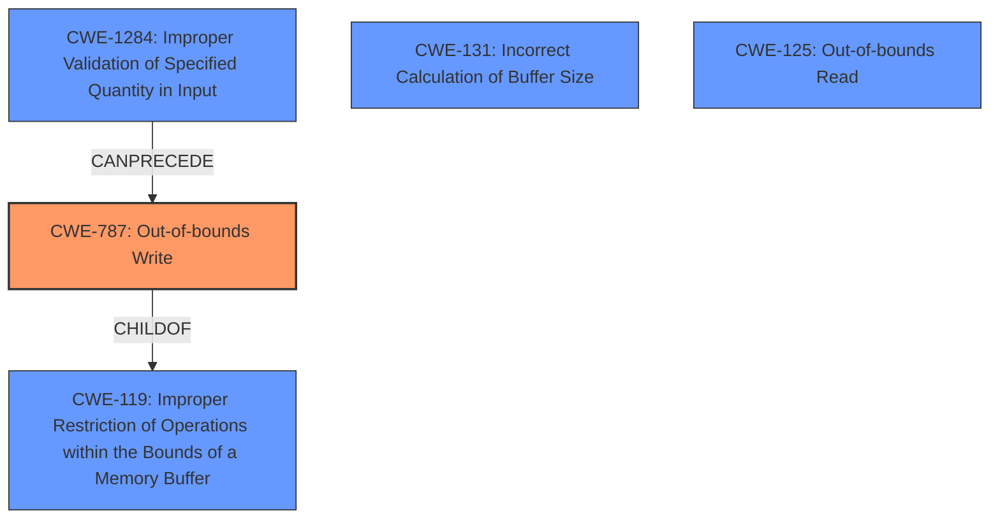

# Final Resolution for CVE-2022-32593

# Summary

| CWE ID  | CWE Name                                | Confidence | CWE Abstraction Level | CWE Vulnerability Mapping Label | CWE-Vulnerability Mapping Notes |
| ------- | --------------------------------------- | ---------- | ----------------------- | --------------------------------- | ------------------------------- |
| CWE-787 | **Out-of-bounds Write**               | 1.0        | Base                    | Primary                           | Allowed                         |
| CWE-1284 | Improper Validation of Specified Quantity in Input | 0.4        | Base                    | Secondary Candidate               | Allowed                         |
| CWE-131 | Incorrect Calculation of Buffer Size | 0.3        | Base                    | Secondary Candidate               | Allowed                         |
| CWE-125 | **Out-of-bounds Read**                | 0.2        | Base                    | Secondary Candidate               | Allowed                         |

*   The Primary CWE should be first and noted as the Primary CWEs
*   The secondary candidate CWEs should be next and noted as secondary candidates.
*   The confidence is a confidence score 0 to 1 to rate your confidence in your assessment for that CWE.
*   The CWE Abstraction Level as one of these values: Base, Variant, Pillar, Class, Compound
*   The Mapping Notes Usage as one of these values: Allowed, Allowed-with-Review, Prohibited, Discouraged

## Evidence and Confidence

*   **Confidence Score:** 0.9
*   **Evidence Strength:** HIGH

## Relationship Analysis

The primary relationship that influenced the decision was the parent-child relationship between CWE-787 (**Out-of-bounds Write**) and CWE-119 (Improper Restriction of Operations within the Bounds of a Memory Buffer). CWE-787 is a more specific case of CWE-119, making it a better fit. The potential for CWE-1284 (Improper Validation of Specified Quantity in Input) to precede CWE-787 was also considered, as the missing bounds check (improper validation) could directly lead to the **out-of-bounds write**. Peer relationships, such as CWE-125 (**Out-of-bounds Read**) and CWE-787, were evaluated, but the lack of specific evidence for a read operation lowered the confidence in CWE-125. The base level of abstraction for the selected CWEs ensures sufficient specificity for vulnerability mapping.

## Vulnerability Chain

The vulnerability chain starts with a **missing bounds check** (potentially represented by CWE-1284: Improper Validation of Specified Quantity in Input), which allows an attacker to write data past the end of the intended buffer (CWE-787: **Out-of-bounds Write**). The consequences of this **out-of-bounds write** can include local escalation of privilege, as stated in the vulnerability description. The potential for an incorrect buffer size calculation (CWE-131) could also contribute to the **out-of-bounds write**. The chain could potentially extend to an **out-of-bounds read** (CWE-125), but there is no direct evidence for this in the description.

## Summary of Analysis

The initial analysis correctly identified CWE-787 (**Out-of-bounds Write**) as the primary **weakness** based on the vulnerability description stating "possible **out of bounds write** due to a **missing bounds check**." The selection is strongly supported by the direct match between the description and the CWE definition.

The criticism suggested a refined approach to the secondary candidates, particularly regarding confidence levels and justification. The criticism also suggested considering CWE-20 (Improper Input Validation). While CWE-20 is relevant, CWE-1284 (Improper Validation of Specified Quantity in Input) provides a more specific classification related to the missing bounds check, and is therefore the preferred secondary candidate.

The final decision reflects the refined confidence levels and justifications suggested by the criticism. The confidence in CWE-1284 was increased slightly from 0.3 to 0.4, as the **missing bounds check** is a form of improper validation of input quantity. The confidence in CWE-131 and CWE-125 were decreased to 0.3 and 0.2 respectively due to the lack of direct evidence in the vulnerability description. The selected CWEs are at the optimal level of specificity, with CWE-787 representing the direct **weakness** and CWE-1284 representing a contributing factor. The other CWEs are possible given the **rootcause**, but not directly evidenced.

The analysis is primarily based on the evidence provided in the vulnerability description, specifically the mention of "**out of bounds write** due to a **missing bounds check**." The graph relationships influenced the decision by highlighting the hierarchical relationship between CWE-787 and CWE-119, as well as the potential for CWE-1284 to precede CWE-787 in the vulnerability chain.