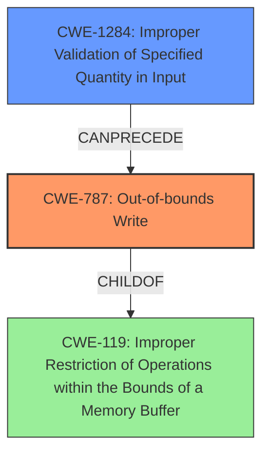

# Analysis Report for CVE-2022-32603

# Vulnerability Analysis Report: CVE-2022-32603

## Description

In gpu drm, there is a possible out of bounds write due to improper input validation. This could lead to local escalation of privilege with System execution privileges needed. User interaction is not needed for exploitation. Patch ID ALPS07310704 Issue ID ALPS07310704.

## Vulnerability Description Key Phrases

**Rootcause:** improper input validation
**Weakness:** out of bounds write
**Impact:** local escalation of privilege
**Product:** gpu drm

## Analysis (with Relationship Data)

# Summary
| CWE ID | CWE Name | Confidence | CWE Abstraction Level | CWE Vulnerability Mapping Label | CWE-Vulnerability Mapping Notes |
|---|---|---|---|---|---|
| CWE-787 | Out-of-bounds Write | 0.95 | Base | Allowed | Primary CWE |
| CWE-1284 | Improper Validation of Specified Quantity in Input | 0.75 | Base | Allowed | Secondary Candidate |

## Evidence and Confidence

*   **Confidence Score:** 0.85
*   **Evidence Strength:** HIGH

- **Analysis and Justification:**  
  - *Explanation:* The vulnerability description clearly states an **"out of bounds write"** due to **"improper input validation"** within the gpu drm component. The CVE reference summary reinforces this by stating "Out-of-bounds write due to the lack of proper input validation." This aligns directly with CWE-787 (Out-of-bounds Write), which is a base-level weakness representing a write operation outside the intended buffer boundaries. The input validation failure is a prerequisite weakness. The impact is local escalation of privilege.
  - *Relationship Analysis:* CWE-787 is a child of CWE-119 (Improper Restriction of Operations within the Bounds of a Memory Buffer). It also has several parent CWEs like CWE-121 (Stack-based Buffer Overflow), CWE-122 (Heap-based Buffer Overflow), etc., but these are too specific without evidence pointing to heap or stack overflows. CWE-787 is the most accurate base-level representation of the **out-of-bounds write**.

- **Confidence Score:**  
  - Confidence: 0.95 (High confidence due to direct statements of out-of-bounds write and improper input validation in the description and CVE summary)

---
- **Analysis and Justification:**  
  - *Explanation:* The **"improper input validation"** described in the vulnerability could be elaborated by CWE-1284 (Improper Validation of Specified Quantity in Input). Since the **out-of-bounds write** occurs in the gpu drm, it is likely that the input refers to a size or length parameter that is not properly validated. This could lead to the allocation of a buffer smaller than expected, or an index that is out of bounds. It's a plausible, though less direct, mapping.
  - *Relationship Analysis:* CWE-1284 is related to CWE-20 (Improper Input Validation), but is more specific, since it is about quantity (size, length).

- **Confidence Score:**  
  - Confidence: 0.75 (Medium Confidence, as it is a reasonable assumption based on the context, but lacks explicit details about the type of input being validated.)

## Criticism of Analysis

Okay, here's a review of the CWE analysis, incorporating the full CWE specifications.

## Overall Assessment

The analysis is generally sound and well-reasoned, showing a good understanding of the vulnerability and how it relates to CWEs. The selection of CWE-787 (Out-of-bounds Write) as the primary CWE is correct, and the rationale for including CWE-1284 (Improper Validation of Specified Quantity in Input) as a secondary candidate is also reasonable. The confidence levels assigned are appropriate.

## Detailed Critique:

### 1. CWE-787: Out-of-bounds Write

*   **Assessment:** Excellent choice as the primary CWE. The description explicitly mentions an out-of-bounds write, making this a direct and accurate mapping. The confidence score of 0.95 is justified.
*   **Justification:** The explanation clearly links the vulnerability description to the CWE definition. It also correctly identifies that it is a base-level weakness and appropriately maps to a child of CWE-119. The discussion about why specific buffer overflow types (stack/heap) were not chosen is also good.
*   **CWE Specifications Considerations:**
    *   The analysis mentions CWE-787 is a child of CWE-119.  The CWE specifications for CWE-119 state that "CWE-119 is commonly misused in low-information vulnerability reports when lower-level CWEs could be used instead."  This analysis appropriately avoids CWE-119 by selecting the more precise CWE-787.
    *   The CWE specifications correctly indicate that CWE-787 usage is "Allowed" and notes this CWE entry is at the Base level of abstraction, which is a preferred level of abstraction for mapping to the root causes of vulnerabilities.
    *   The potential mitigations provided for CWE-787 (Language Selection, Libraries/Frameworks, Environment Hardening) are all relevant and suitable for this type of vulnerability.
*   **Suggestions:** The analysis could briefly mention common causes of out-of-bounds writes (e.g., incorrect index calculation, insufficient bounds checking) to provide further context. It might also be worthwhile to note that CWE-787 is a child of CWE-118, Incorrect Access of Indexable Resource, to add some context.

### 2. CWE-1284: Improper Validation of Specified Quantity in Input

*   **Assessment:** A reasonable secondary candidate, although not as directly supported by the vulnerability description as CWE-787. The confidence score of 0.75 is appropriate.
*   **Justification:** The explanation correctly infers that the "improper input validation" likely involves a size/length parameter. The relationship to CWE-20 is also well-explained.
*   **CWE Specifications Considerations:**
    *   The analysis correctly notes that this CWE is more specific than CWE-20, Improper Input Validation.  The CWE specifications support this, stating, "Consider lower-level children such as... Specified Quantity (CWE-1284)..." when considering alternatives for CWE-20.
    *   The CWE specifications correctly indicate that CWE-1284 usage is "Allowed" and notes this CWE entry is at the Base level of abstraction, which is a preferred level of abstraction for mapping to the root causes of vulnerabilities.
    *   The mitigation strategies listed for CWE-1284, focusing on robust input validation and the "accept known good" strategy, are directly applicable.
*   **Suggestions:**
    *   The analysis could benefit from a slightly more detailed explanation of *how* the improper validation of quantity leads to the out-of-bounds write.  For example, "If the validated size is too small, then the write operation may write beyond the end of the buffer."
    *   Consider if a more specific CWE than 1284 is possible.  CWE-1285 (Improper Validation of Specified Index, Position, or Offset in Input) could be considered as an alternative depending on if the root cause is that an index/offset into the buffer is not properly checked.

### General Observations & Suggestions:

*   **Chain Analysis:**  The analysis correctly identifies that improper input validation (CWE-1284) leads to an out-of-bounds write (CWE-787). This could be more explicitly stated as a common chain:  `CWE-1284 -> CWE-787`.
*   **Mitigation Considerations:**  While the analysis mentions mitigations at the language selection level, emphasizing the importance of using memory-safe languages, it could be strengthened by explicitly suggesting runtime mitigations. ASLR, DEP, and compiler-based protections could be mentioned, though they are more of a defense-in-depth approach and not a direct fix.
*   **Retriever Results:** While not explicitly part of the analysis, it's worth noting that the retriever results include several integer-related CWEs (CWE-190, CWE-191, CWE-131). While these aren't the primary cause, integer overflows/underflows are common contributing factors in buffer overflows, so the retrievers are picking up on relevant related weaknesses.
*  **CWE-119 is too Abstract:** As the analysis notes, CWE-119 is generally too abstract and is discouraged. The analysis correctly picked the most specific CWE available.

## Revised Summary
| CWE ID | CWE Name | Confidence | CWE Abstraction Level | CWE Vulnerability Mapping Label | CWE-Vulnerability Mapping Notes |
|---|---|---|---|---|---|
| CWE-787 | Out-of-bounds Write | 0.95 | Base | Allowed | Primary CWE |
| CWE-1284 | Improper Validation of Specified Quantity in Input | 0.75 | Base | Allowed | Secondary Candidate, part of chain: CWE-1284 -> CWE-787 |

**Overall, this is a well-done analysis. The suggestions above are minor and aimed at further refining the justification and providing additional context based on the CWE specifications.**

## Final Resolution

# Summary
| CWE ID | CWE Name | Confidence | CWE Abstraction Level | CWE Vulnerability Mapping Label | CWE-Vulnerability Mapping Notes |
|---|---|---|---|---|---|
| CWE-787 | Out-of-bounds Write | 0.95 | Base | Allowed | Primary CWE |
| CWE-1284 | Improper Validation of Specified Quantity in Input | 0.75 | Base | Allowed | Secondary Candidate, part of chain: CWE-1284 -> CWE-787 |

## Evidence and Confidence

*   **Confidence Score:** 0.90
*   **Evidence Strength:** HIGH

## Relationship Analysis
The primary relationship influencing the decision is the parent-child relationship between CWE-787 and CWE-119, ensuring that the more specific CWE-787 is chosen over the more general CWE-119. The chain relationship between CWE-1284 and CWE-787 highlights the progression of the vulnerability, starting with improper input validation leading to an out-of-bounds write.

## Vulnerability Chain
The vulnerability chain starts with **CWE-1284 (Improper Validation of Specified Quantity in Input)**, where the input size or length is not properly validated. This leads to **CWE-787 (Out-of-bounds Write)**, where the program writes data beyond the allocated buffer. The consequence of this is a local escalation of privilege.

## Summary of Analysis
The initial analysis and criticism are both well-reasoned and supported by the provided evidence. The vulnerability description clearly states an **"out of bounds write"** due to **"improper input validation,"** which directly maps to **CWE-787 (Out-of-bounds Write)**. The criticism correctly points out that the analysis appropriately avoids the more abstract **CWE-119 (Improper Restriction of Operations within the Bounds of a Memory Buffer)** by selecting the more precise **CWE-787**.

The relationship analysis influenced the final selection by confirming that **CWE-787** is the most specific and appropriate base-level representation of the **out-of-bounds write**. The chain relationship between **CWE-1284** and **CWE-787** helps to understand the progression of the vulnerability. As the criticism highlights, **CWE-1284** is part of a chain where it can lead to **CWE-787**: `CWE-1284 -> CWE-787`.

The selection of **CWE-787** and **CWE-1284** is at the optimal level of specificity because they accurately represent the **rootcause** and impact of the vulnerability, based on the available evidence. Both are also base level CWEs.

*Report generated on 2025-03-18 14:10:55*
