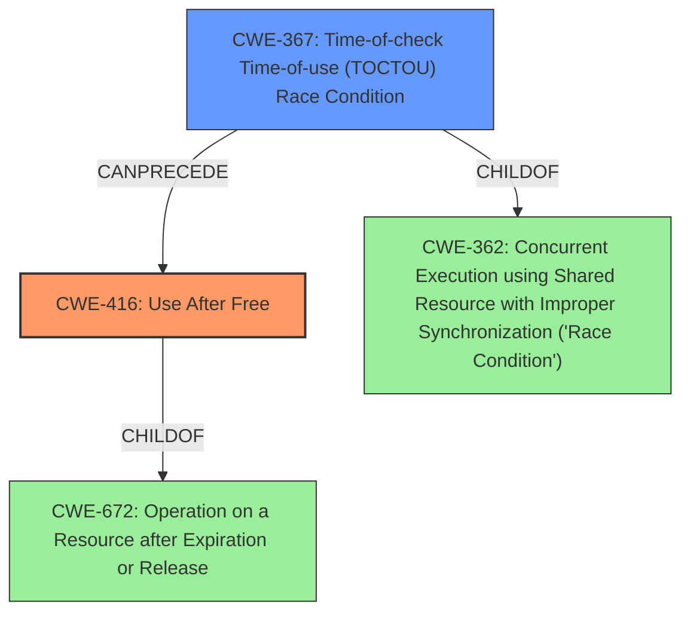

# Analysis Report for CVE-2022-32608

# Vulnerability Analysis Report: CVE-2022-32608

## Description

In jpeg, there is a possible use after free due to a race condition. This could lead to local escalation of privilege with System execution privileges needed. User interaction is not needed for exploitation. Patch ID ALPS07388753 Issue ID ALPS07388753.

## Vulnerability Description Key Phrases

**Rootcause:** race condition
**Weakness:** use after free
**Impact:** local escalation of privilege
**Product:** jpeg

## Analysis (with Relationship Data)

# Summary
| CWE ID | CWE Name | Confidence | CWE Abstraction Level | CWE Vulnerability Mapping Label | CWE-Vulnerability Mapping Notes |
|---|---|---|---|---|---|
| CWE-416 | Use After Free | 0.95 | Variant | Primary | Allowed |
| CWE-367 | Time-of-check Time-of-use (TOCTOU) Race Condition | 0.80 | Base | Secondary Candidate | Allowed |

## Evidence and Confidence

*   **Confidence Score:** 0.90
*   **Evidence Strength:** HIGH

- **Analysis and Justification:**  
  - *Explanation:* The vulnerability is a **use after free** due to a **race condition**. The CVE reference summary confirms a **TOCTOU race condition** leading to a **use-after-free**. CWE-416 (Use After Free) is a Variant level CWE, which is a preferred level of abstraction. The description of CWE-416 matches the vulnerability where memory is accessed after being freed, potentially leading to unexpected behavior. CWE-367 (Time-of-check Time-of-use (TOCTOU) Race Condition) describes the **race condition** aspect. CWE-416 is the primary weakness because the vulnerability's immediate result is the **use after free**. CWE-367 is related as the root cause enabling the **use after free**.
  
  - *Relationship Analysis:* CWE-416 is a variant of CWE-672 (Operation on ресурсе after Expiry). CWE-367 does not have any direct relationships.

- **Confidence Score:**  
  - Confidence: 0.95 (High confidence due to the clear description of the vulnerability and confirmation in the CVE reference summary)

---

## Criticism of Analysis

Okay, here's a breakdown of the analysis, incorporating the full CWE specifications and focusing on mapping guidance and mitigations.

**Overall Assessment:**

The analysis is generally strong, and the selection of CWE-416 (Use After Free) as the primary CWE, with CWE-367 (TOCTOU) as a secondary candidate, is well-justified.  The confidence scores are appropriate. The justification for the relationships between the CWEs is clear.

**Detailed Review:**

**1. CWE-416: Use After Free**

*   **Confidence:** 0.95 (Appropriate)
*   **CWE Abstraction Level:** Variant (Excellent - preferred level)
*   **Mapping Justification:**  The analysis correctly identifies that the immediate result of the vulnerability is the use of memory after it has been freed. The justification aligns with the CWE description.
*   **CWE Relationships:** correctly identifies it as a child of CWE-672 (Operation on a Resource after Expiration or Release).
*   **Mitigation Relevance:** The stated mitigations are relevant. Specifically:
    *   *Language Selection (Architecture and Design):* Using a language with automatic memory management (e.g., Java, Go, Rust) completely prevents this class of vulnerability.
    *   *Setting Pointers to NULL (Implementation):*  While helpful, this mitigation is *not* a complete solution and the note about complex data structures reducing its effectiveness is crucial. It mainly acts as a defense-in-depth measure.

**2. CWE-367: Time-of-Check Time-of-Use (TOCTOU) Race Condition**

*   **Confidence:** 0.80 (Appropriate, slightly lower than UAF as it's the root cause)
*   **CWE Abstraction Level:** Base (Good)
*   **Mapping Justification:**  The analysis correctly identifies this as the race condition that *enables* the use-after-free.  The justification is solid.
*   **CWE Relationships:** correctly identifies it as a child of CWE-362.
*   **Mitigation Relevance:** The mitigations presented in the CWE specifications are valuable.
    *   *Avoid Check Before Use (Implementation):*  While seemingly counterintuitive, this highlights that the check itself is the problem.  If you can operate directly on the resource without a prior check, you eliminate the TOCTOU window. The description acknowledges this doesn't always solve the underlying issue, which is important.
    *   *Setting effective gid/uid (Implementation):* This mitigation is specific to file operations, so it is not universally applicable to all TOCTOU vulnerabilities involving memory. It is important to be aware of this.
    *   *Limit Interleaving (Architecture and Design):*  This is a key strategy for race conditions in general.  If you can reduce the number of concurrent operations on the shared resource, you reduce the probability of the race occurring.

**3. Retriever Results Analysis**
Here is a breakdown of the top results from the retriever and why they may or may not be relevant.

*   **CWE-131: Incorrect Calculation of Buffer Size:** Less relevant, the primary cause is a race condition leading to use after free, not the size of buffers themselves. While an incorrect buffer size calculation could be *another* vulnerability, it's not central to this particular issue.
*   **CWE-367: Time-of-check Time-of-use (TOCTOU) Race Condition:** Correctly identified as relevant.
*   **CWE-416: Use After Free:** Correctly identified as relevant.
*   **CWE-366: Race Condition within a Thread:** This is a *type* of race condition and the fact that this is occuring within a thread makes sense.
*   **CWE-908: Use of Uninitialized Resource:** Less relevant. The memory is freed *after* it has been used, not *before*.
*   **CWE-362: Concurrent Execution using Shared Resource with Improper Synchronization ('Race Condition'):** Correctly identified as relevant, this is a more general form of the race condition in CWE-367.
*   **CWE-415: Double Free:** Not the primary issue, although it *could* be a related consequence in some scenarios.  Use-after-free is more direct.
*   **CWE-667: Improper Locking:** Could be related, but the core of the TOCTOU is the timing window between the check and the use, rather than necessarily a *lack* of locking (although lack of locking could contribute to a TOCTOU).
*   **CWE-662: Improper Synchronization:** Related, but too general. CWE-367 and CWE-362 are better fits.
*   **CWE-413: Improper Resource Locking:** Similar to CWE-667, could be tangentially related, but not the core problem.

**Suggestions for Improvement:**

*   **Relationship Exploration:** While the relationship to CWE-672 (Operation on a Resource after Expiration or Release) is mentioned for CWE-416, briefly explaining *why* it's a child would be helpful.  For example, "CWE-416 is a specific type of CWE-672 because the operation is a 'use' and the expiration is 'freeing' the memory."
*   **Mitigation Emphasis:** Consider adding a short sentence or two about the *most effective* mitigations. For example, "The most effective mitigation is to use languages with automatic memory management."  For TOCTOU, "Careful design to avoid unnecessary checks before using shared resources is crucial."
*   **CWE-362 Consideration:** While CWE-367 is more specific, it might be valuable to *briefly* acknowledge that CWE-362 (Concurrent Execution using Shared Resource with Improper Synchronization) is a more general Class-level CWE that encompasses this type of race condition, but CWE-367 provides more precise information.

**Revised Summary Table (incorporating suggestions):**

| CWE ID | CWE Name | Confidence | CWE Abstraction Level | CWE Vulnerability Mapping Label | CWE-Vulnerability Mapping Notes |
|---|---|---|---|---|---|
| CWE-416 | Use After Free | 0.95 | Variant | Primary | Allowed |  Caused by accessing memory after it has been freed. The most effective mitigation is using languages with automatic memory management. |
| CWE-367 | Time-of-check Time-of-use (TOCTOU) Race Condition | 0.80 | Base | Secondary Candidate | Allowed | The race condition enables the UAF by allowing a resource to be freed between a check and use. Careful design to avoid unnecessary checks before using shared resources is crucial. Also consider CWE-362 as a more general alternative, |

By incorporating these suggestions, the analysis becomes even more comprehensive and actionable.

## Final Resolution

# Summary
| CWE ID | CWE Name | Confidence | CWE Abstraction Level | CWE Vulnerability Mapping Label | CWE-Vulnerability Mapping Notes |
|---|---|---|---|---|---|
| CWE-416 | Use After Free | 0.95 | Variant | Primary | Allowed | Caused by accessing memory after it has been freed. The most effective mitigation is using languages with automatic memory management. |
| CWE-367 | Time-of-check Time-of-use (TOCTOU) Race Condition | 0.80 | Base | Secondary Candidate | Allowed | The **race condition** enables the **use after free** by allowing a resource to be freed between a check and use. Careful design to avoid unnecessary checks before using shared resources is crucial. Also consider CWE-362 (CWE-362: Concurrent Execution using Shared Resource with Improper Synchronization ('Race Condition')) as a more general alternative. |

## Evidence and Confidence

*   **Confidence Score:** 0.95
*   **Evidence Strength:** HIGH

## Relationship Analysis
The primary CWE is CWE-416 (**Use After Free**), which is a Variant of CWE-672 (Operation on a Resource after Expiration or Release). This hierarchical relationship confirms that CWE-416 is a specific case of operating on a resource that has been released. The secondary CWE, CWE-367 (**Time-of-check Time-of-use (TOCTOU) Race Condition**), represents the root cause that allows the **use-after-free** to occur. CWE-367 is a child of CWE-362 (CWE-362: Concurrent Execution using Shared Resource with Improper Synchronization ('Race Condition')), indicating that it is a specific type of **race condition**.

## Vulnerability Chain
The vulnerability chain begins with a **race condition** (CWE-367), where a check on a resource's state is invalidated by another thread before the resource is used. This leads to the resource being freed while another thread still holds a reference to it. Subsequently, the thread attempts to access the freed memory, resulting in a **use-after-free** (CWE-416). The impact is a local escalation of privilege with System execution privileges needed.

## Summary of Analysis
The initial analysis correctly identified CWE-416 (**Use After Free**) as the primary weakness and CWE-367 (**Time-of-check Time-of-use (TOCTOU) Race Condition**) as a secondary candidate. The evidence provided supports this classification, as the vulnerability description clearly states a **race condition** leading to a **use-after-free**. The graph relationships further reinforce this, with CWE-416 being a specific type of CWE-672 and CWE-367 being a specific type of CWE-362.

The decision to classify CWE-416 as primary is based on the immediate result of the vulnerability being the **use after free**. CWE-367 is a contributing factor, enabling the primary weakness. Both CWEs are at appropriate levels of abstraction (Variant and Base, respectively).

The analysis relies heavily on the provided evidence from the vulnerability description: "there is a possible **use after free** due to a **race condition**." This statement directly supports the selection of CWE-416 and CWE-367. The retriever results also support this with CWE-367 and CWE-416 as top results, along with the related CWEs CWE-366 and CWE-362.

*Report generated on 2025-03-18 14:11:37*
