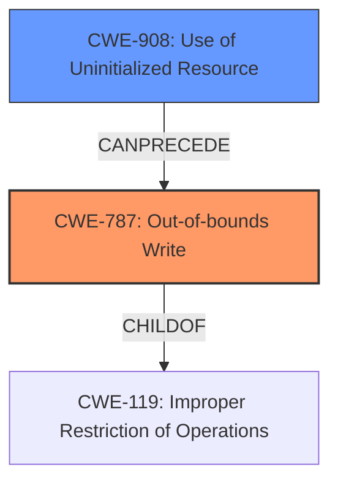

# Final Resolution for CVE-2022-32616

# Summary
| CWE ID | CWE Name | Confidence | CWE Abstraction Level | CWE Vulnerability Mapping Label | CWE-Vulnerability Mapping Notes |
|---|---|---|---|---|---|
| CWE-787 | Out-of-bounds Write | 0.9 | Base | Allowed | Primary CWE |
| CWE-908 | Use of Uninitialized Resource | 0.7 | Base | Allowed | Secondary Candidate |

## Evidence and Confidence

*   **Confidence Score:** 0.9
*   **Evidence Strength:** HIGH

## Relationship Analysis
The primary relationship influencing the decision is the CANPRECEDE relationship between CWE-908 and CWE-787. CWE-908 sets the stage for CWE-787 by providing the uninitialized data, which is then used in a way that leads to an out-of-bounds write. CWE-787 is a child of CWE-119, which describes the broader class of memory buffer errors. The base level of abstraction for both CWE-787 and CWE-908 allows for a specific and actionable classification.

## Vulnerability Chain
The vulnerability chain starts with the **ROOTCAUSE** being **CWE-908 (Use of Uninitialized Resource)**. This leads to **uninitialized data** being used in a subsequent operation, which then causes **CWE-787 (Out-of-bounds Write)**. The **out-of-bounds write** leads to local escalation of privilege.

## Summary of Analysis
The initial analysis and criticism are both accurate. The vulnerability description explicitly mentions the **out of bounds write** and **uninitialized data**, directly supporting the selection of CWE-787 and CWE-908. The graph relationships confirm that CWE-908 can precede CWE-787, strengthening the chain. The base level of abstraction is appropriate for both CWEs.

The selection of CWE-787 as the primary weakness is justified because the vulnerability's impact is the direct result of the write operation. The analysis is based on the provided evidence: "In isp, there is a possible **out of bounds write** due to **uninitialized data**".

I agree with the criticism and would add a mitigations section to the report.
*   **CWE-787 Mitigations:**
    *   Using memory-safe languages.
    *   Employing safe string handling libraries (SafeStr, Strsafe.h).
    *   Using compiler-based buffer overflow detection mechanisms (/GS flag, FORTIFY\_SOURCE).
*   **CWE-908 Mitigations:**
    *   Explicitly initializing resources before use.
    *   Carefully analyzing conditional logic to ensure all branches initialize resources.
    *   Avoiding race conditions during initialization routines.

Confidence Score: 0.9