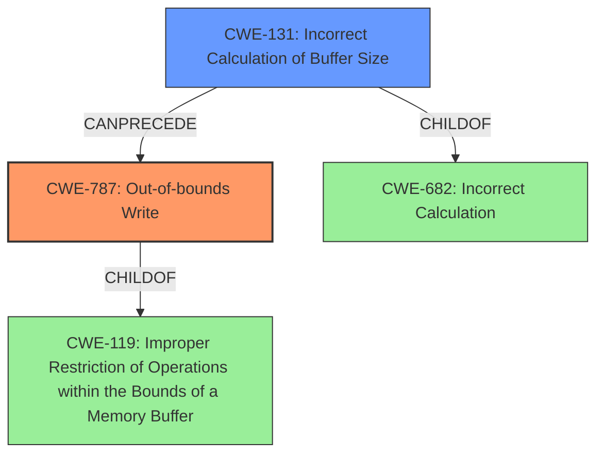

# Final Resolution for CVE-2022-32617

# Summary
| CWE ID | CWE Name | Confidence | CWE Abstraction Level | CWE Vulnerability Mapping Label | CWE-Vulnerability Mapping Notes |
|---|---|---|---|---|---|
| CWE-787 | Out-of-bounds Write | 1.0 | Base | Primary | Allowed |
| CWE-131 | Incorrect Calculation of Buffer Size | 0.9 | Base | Secondary | Allowed |

## Evidence and Confidence

*   **Confidence Score:** 0.95
*   **Evidence Strength:** HIGH

## Relationship Analysis
The primary weakness is **CWE-787 (Out-of-bounds Write)**, which is a child of **CWE-119 (Improper Restriction of Operations within the Bounds of a Memory Buffer)**. However, **CWE-119 (Improper Restriction of Operations within the Bounds of a Memory Buffer)** is discouraged due to its generality. The **ROOTCAUSE** is **CWE-131 (Incorrect Calculation of Buffer Size)**, which can precede **CWE-119 (Improper Restriction of Operations within the Bounds of a Memory Buffer)** and directly leads to **CWE-787 (Out-of-bounds Write)**. **CWE-131 (Incorrect Calculation of Buffer Size)** is also a child of the more abstract **CWE-682 (Incorrect Calculation)**, but mapping guidance discourages using the parent if a more specific child exists.

## Vulnerability Chain
The chain begins with the **ROOTCAUSE**, **CWE-131 (Incorrect Calculation of Buffer Size)**. This leads to an insufficient buffer size being allocated. Consequently, when data is written to the buffer, it results in **CWE-787 (Out-of-bounds Write)**, where data is written beyond the allocated buffer's boundaries. The vulnerability description states: "In typec, there is a possible out of bounds write due to an incorrect calculation of buffer size." The ultimate impact is a potential local escalation of privilege.

## Summary of Analysis
The initial analysis and the criticism both correctly identify **CWE-787 (Out-of-bounds Write)** and **CWE-131 (Incorrect Calculation of Buffer Size)** as the primary and secondary weaknesses, respectively. The vulnerability description provides direct evidence: "**out of bounds write** due to an **incorrect calculation of buffer size**."

The graph relationships reinforce this decision. While **CWE-787 (Out-of-bounds Write)** is a child of **CWE-119 (Improper Restriction of Operations within the Bounds of a Memory Buffer)** and **CWE-131 (Incorrect Calculation of Buffer Size)** is a child of **CWE-682 (Incorrect Calculation)**, the mapping guidance discourages using these more general parent CWEs when more specific children are available. This is because "CWE-119 is commonly misused in low-information vulnerability reports when lower-level CWEs could be used instead, or when more details about the vulnerability are available." and CWE-682 documentation says that it should be `Discouraged` and that its children should be used instead.

The selected CWEs are at the optimal level of specificity, providing a clear understanding of the vulnerability's **ROOTCAUSE** and resulting impact.