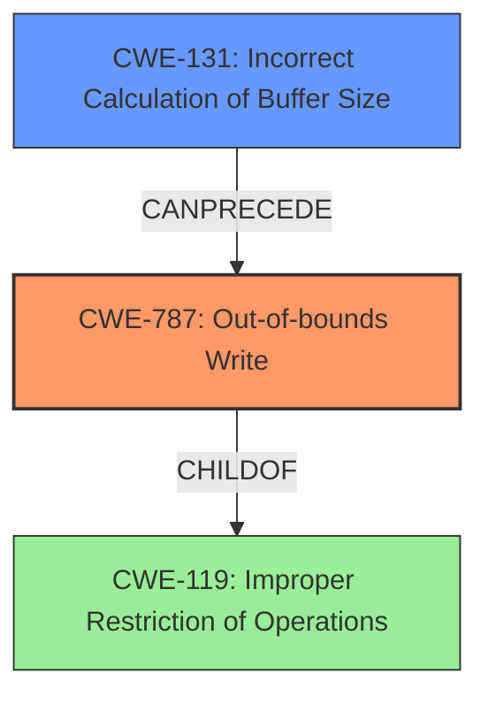

# Analysis Report for CVE-2022-32618

# Vulnerability Analysis Report: CVE-2022-32618

## Description

In typec, there is a possible out of bounds write due to an incorrect calculation of buffer size. This could lead to local escalation of privilege, for an attacker who has physical access to the device, with no additional execution privileges needed. User interaction is not needed for exploitation. Patch ID ALPS07262454 Issue ID ALPS07262454.

## Vulnerability Description Key Phrases

**Rootcause:** incorrect calculation of buffer size
**Weakness:** out of bounds write
**Impact:** local escalation of privilege
**Attacker:** attacker who has physical access to the device

## Analysis (with Relationship Data)

# Summary
| CWE ID | CWE Name | Confidence | CWE Abstraction Level | CWE Vulnerability Mapping Label | CWE-Vulnerability Mapping Notes |
|---|---|---|---|---|---|
| CWE-787 | Out-of-bounds Write | 1.0 | Base | Allowed | Primary CWE |
| CWE-131 | Incorrect Calculation of Buffer Size | 0.9 | Base | Allowed | Secondary Candidate |

## Evidence and Confidence

*   **Confidence Score:** 0.95
*   **Evidence Strength:** HIGH

- **Analysis and Justification:**  
  - *Explanation:* The vulnerability description clearly states an "**out of bounds write**" due to an "**incorrect calculation of buffer size**". This aligns directly with CWE-787 (Out-of-bounds Write), where a product writes data past the end or before the beginning of the intended buffer. The "**incorrect calculation of buffer size**" is the root cause, which aligns with CWE-131 (Incorrect Calculation of Buffer Size). The primary weakness is CWE-787 because it is the direct consequence of the incorrect calculation. CWE-131 can be considered a contributing factor or prerequisite. MITRE mapping guidance for both CWE-787 and CWE-131 indicates that they are ALLOWED for these types of vulnerabilities. The CVE Reference Links Content Summary confirms both the "**out-of-bounds write**" vulnerability and the "**incorrect calculation of buffer size**" **rootcause**.
  
  - *Relationship Analysis:* CWE-787 is a child of CWE-119 (Improper Restriction of Operations within the Bounds of a Memory Buffer). CWE-131 can precede CWE-119 as the incorrect size calculation can lead to out-of-bounds writes.

- **Confidence Score:**  
  - Confidence: 1.0 (High confidence due to direct evidence from the vulnerability description and supporting information from CVE reference materials)

---

## Criticism of Analysis

Okay, I've reviewed your CWE analysis for the provided vulnerability description and related data, including the full CWE specifications. Here's a critique of your analysis, focusing on accuracy, completeness, and adherence to CWE guidelines:

**Overall Assessment:**

The analysis is generally well-reasoned and accurate. The primary CWE selection of CWE-787 (Out-of-bounds Write) is correct and well-justified. The secondary CWE selection of CWE-131 (Incorrect Calculation of Buffer Size) is also appropriate as the root cause.  The Confidence scores are suitably high given the information available.

**Detailed Review:**

1.  **CWE-787: Out-of-bounds Write (Primary CWE)**

    *   **Accuracy:** The choice of CWE-787 is excellent. The vulnerability description explicitly mentions an "out of bounds write," making this a direct and accurate mapping. The complete CWE spec supports this because CWE-787 is at the Base level, which is preferred for mapping. It is also the *direct* result of a problem with memory operations, matching the vulnerability.

    *   **Justification Strength:** The justification is strong. You correctly point out that CWE-787 describes writing data past the end or before the beginning of a buffer. The 'Allowed' usage rationale from the CWE spec is also correctly referenced.

    *   **Completeness:** The analysis acknowledges that CWE-787 is a child of CWE-119. This is a good observation that shows a deeper understanding of the CWE hierarchy.

2.  **CWE-131: Incorrect Calculation of Buffer Size (Secondary CWE/Root Cause)**

    *   **Accuracy:** Selecting CWE-131 is also accurate.  The phrase "**incorrect calculation of buffer size**" in the vulnerability description directly corresponds to the definition of CWE-131. The included CWE spec shows it is a Base level CWE, suitable for mapping.

    *   **Justification Strength:** The justification explains the causal relationship between CWE-131 and CWE-787. Incorrect calculation of buffer size *leads to* the out-of-bounds write. You have correctly identified this cause-and-effect relationship.

    *   **Completeness:** You have noted that CWE-131 can precede CWE-119. This demonstrates an understanding of the relationship between the root cause, the broader memory corruption category, and the specific out-of-bounds write.

3. **Confidence Scores:**

    * The confidence scores are appropriately high. A score of 1.0 for CWE-787 is justifiable given the explicit mention of "out of bounds write" in the description. The 0.9 for CWE-131 is reasonable.

4.  **Retriever Results:**

    *   The Retriever Results are useful supporting information, and your analysis correctly considers them. They reinforce the initial selection of CWE-787 and CWE-131.

5.  **CWE Examples from Database:**

    * Including CVE examples for CWE-131 is a valuable addition. It provides real-world context and reinforces the applicability of the CWE. The provided examples are relevant and help illustrate how CWE-131 manifests in actual vulnerabilities.

6. **Other Considerations**

    * **CWE-119: Improper Restriction of Operations within the Bounds of a Memory Buffer** While you correctly note that CWE-787 is a child of CWE-119, it's crucial to *avoid* mapping to CWE-119 directly.  The mapping guidance for CWE-119 explicitly *discourages* its use when more specific CWEs (like CWE-787) are applicable. You've followed this guidance correctly.

    * **Alternative CWEs Considered by Retriever:** The Retriever results suggest several other CWEs. It's important to understand why these *aren't* the best fit:

        *   **CWE-190/191 (Integer Overflow/Underflow):** These are possible if the *calculation* of the buffer size involves an integer overflow or underflow.  Without more details from the vulnerability description, it's difficult to say if this is happening. However, CWE-131 is more direct to the described 'incorrect calculation', so 190/191 are not as direct.

        *   **CWE-908 (Use of Uninitialized Resource):** This is less likely, as the problem is with the *size* of the buffer, not the *contents* being written.

        *   **CWE-125 (Out-of-bounds Read):** Not relevant since the primary vulnerability is a write.

        *   **CWE-1284 (Improper Validation of Specified Quantity in Input):** This could be relevant if the buffer size is derived from user input that isn't validated. If that's the case, it would make sense as a tertiary CWE. But again, without more information, it is not as direct as CWE-131.

        *   **CWE-248 (Uncaught Exception):** Irrelevant to the vulnerability.

        *   **CWE-770 (Allocation of Resources Without Limits or Throttling):** The issue isn't uncontrolled *allocation*, but the *incorrect calculation* of a single buffer.

        *   **CWE-1021 (Improper Restriction of Rendered UI Layers or Frames):** Not at all relevant to this vulnerability.

**Recommendations:**

1.  **Minor Detail:** In the Evidence and Confidence section, consider adding a sentence explicitly stating why you *rejected* some of the other CWEs suggested by the Retriever results. This further strengthens your argument.

2. **Consider Input Validation**: If more details become available, investigate whether the buffer size calculation relies on any externally provided input that isn't validated. If so, add CWE-20 or a more specific child like CWE-1284 as a contributing factor.

**Revised Summary Table:**

| CWE ID | CWE Name | Confidence | CWE Abstraction Level | CWE Vulnerability Mapping Label | CWE-Vulnerability Mapping Notes |
|---|---|---|---|---|---|
| CWE-787 | Out-of-bounds Write | 1.0 | Base | Allowed | Primary CWE |
| CWE-131 | Incorrect Calculation of Buffer Size | 0.9 | Base | Allowed | Root cause leading to CWE-787 |

Overall, your analysis is excellent. You've correctly identified the key CWEs, provided strong justifications, and considered the relevant CWE specifications. By incorporating the minor recommendations, you can further enhance the completeness and clarity of your analysis.

## Final Resolution

# Summary
| CWE ID | CWE Name | Confidence | CWE Abstraction Level | CWE Vulnerability Mapping Label | CWE-Vulnerability Mapping Notes |
|---|---|---|---|---|---|
| CWE-787 | Out-of-bounds Write | 1.0 | Base | Allowed | Primary CWE |
| CWE-131 | Incorrect Calculation of Buffer Size | 0.9 | Base | Allowed | Root cause leading to CWE-787 |

## Evidence and Confidence

*   **Confidence Score:** 0.95
*   **Evidence Strength:** HIGH

## Relationship Analysis
The primary relationship identified is that **CWE-131 (Incorrect Calculation of Buffer Size)** can precede **CWE-787 (Out-of-bounds Write)**. This accurately reflects the vulnerability description, where an incorrect size calculation is the **rootcause** of the out-of-bounds write. **CWE-787** is a child of **CWE-119 (Improper Restriction of Operations within the Bounds of a Memory Buffer)**, but mapping directly to **CWE-119** is discouraged when a more specific CWE like **CWE-787** applies. No peer relationships significantly influenced the decision. The abstraction levels (Base for both **CWE-787** and **CWE-131**) are appropriate for direct mapping of the vulnerability.

## Vulnerability Chain
The vulnerability chain starts with **CWE-131 (Incorrect Calculation of Buffer Size)**. This **rootcause** leads directly to **CWE-787 (Out-of-bounds Write)**, where data is written beyond the allocated buffer. The consequence is a potential local escalation of privilege. The vulnerability description provides clear evidence for this chain.

## Summary of Analysis
The initial analysis and the criticism both correctly identified **CWE-787** as the primary weakness and **CWE-131** as the **rootcause**. The assessment is heavily based on the provided evidence, specifically the phrases "**out of bounds write**" and "**incorrect calculation of buffer size**" from the vulnerability description. The graph relationships reinforce this decision, showing how **CWE-131** can precede **CWE-787**. The selected CWEs are at the optimal level of specificity (Base level), providing a clear and accurate representation of the vulnerability. The suggestion in the criticism to consider input validation (**CWE-20** or **CWE-1284**) is valid, but there is no evidence in the vulnerability description to support it, therefore I will not add it.

*Report generated on 2025-03-18 14:14:32*
