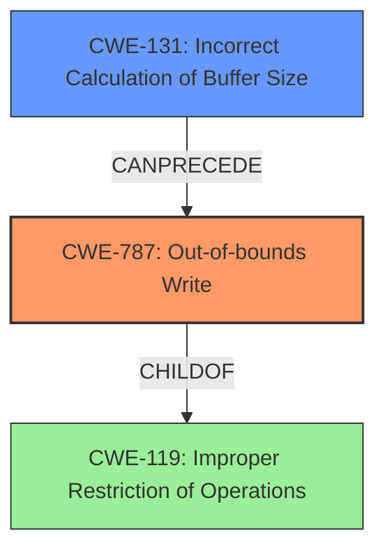

# Final Resolution for CVE-2022-32618

# Summary
| CWE ID | CWE Name | Confidence | CWE Abstraction Level | CWE Vulnerability Mapping Label | CWE-Vulnerability Mapping Notes |
|---|---|---|---|---|---|
| CWE-787 | Out-of-bounds Write | 1.0 | Base | Allowed | Primary CWE |
| CWE-131 | Incorrect Calculation of Buffer Size | 0.9 | Base | Allowed | Root cause leading to CWE-787 |

## Evidence and Confidence

*   **Confidence Score:** 0.95
*   **Evidence Strength:** HIGH

## Relationship Analysis
The primary relationship identified is that **CWE-131 (Incorrect Calculation of Buffer Size)** can precede **CWE-787 (Out-of-bounds Write)**. This accurately reflects the vulnerability description, where an incorrect size calculation is the **rootcause** of the out-of-bounds write. **CWE-787** is a child of **CWE-119 (Improper Restriction of Operations within the Bounds of a Memory Buffer)**, but mapping directly to **CWE-119** is discouraged when a more specific CWE like **CWE-787** applies. No peer relationships significantly influenced the decision. The abstraction levels (Base for both **CWE-787** and **CWE-131**) are appropriate for direct mapping of the vulnerability.

## Vulnerability Chain
The vulnerability chain starts with **CWE-131 (Incorrect Calculation of Buffer Size)**. This **rootcause** leads directly to **CWE-787 (Out-of-bounds Write)**, where data is written beyond the allocated buffer. The consequence is a potential local escalation of privilege. The vulnerability description provides clear evidence for this chain.

## Summary of Analysis
The initial analysis and the criticism both correctly identified **CWE-787** as the primary weakness and **CWE-131** as the **rootcause**. The assessment is heavily based on the provided evidence, specifically the phrases "**out of bounds write**" and "**incorrect calculation of buffer size**" from the vulnerability description. The graph relationships reinforce this decision, showing how **CWE-131** can precede **CWE-787**. The selected CWEs are at the optimal level of specificity (Base level), providing a clear and accurate representation of the vulnerability. The suggestion in the criticism to consider input validation (**CWE-20** or **CWE-1284**) is valid, but there is no evidence in the vulnerability description to support it, therefore I will not add it.